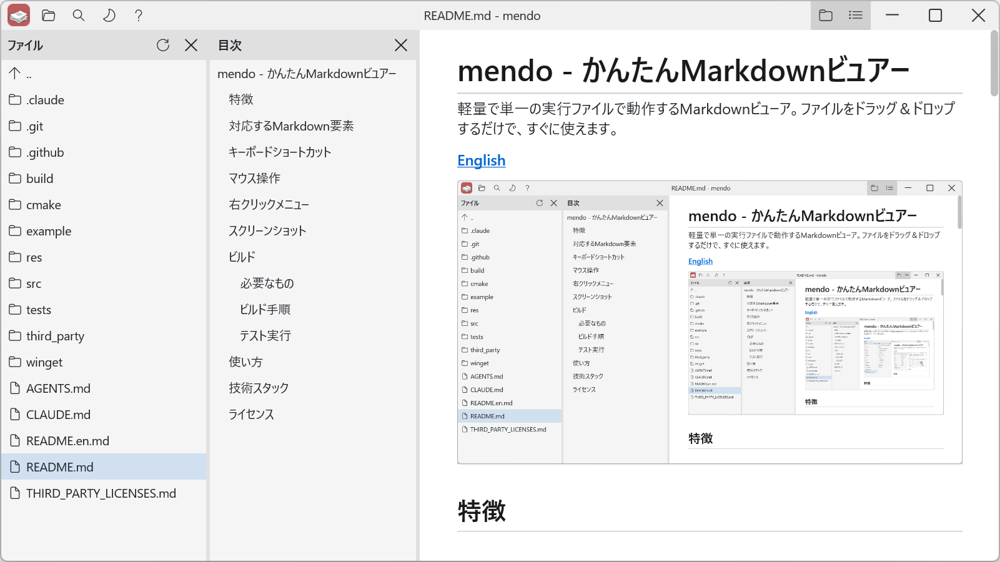
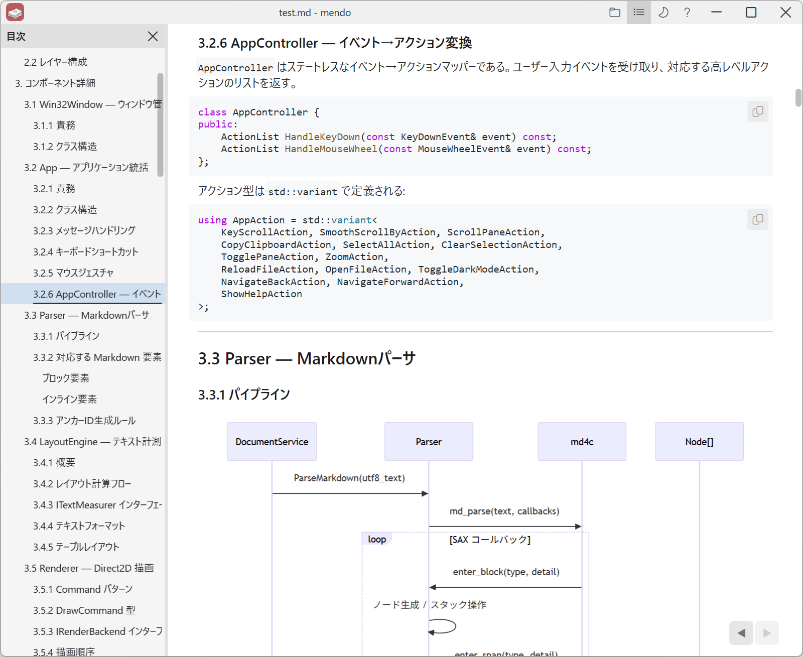
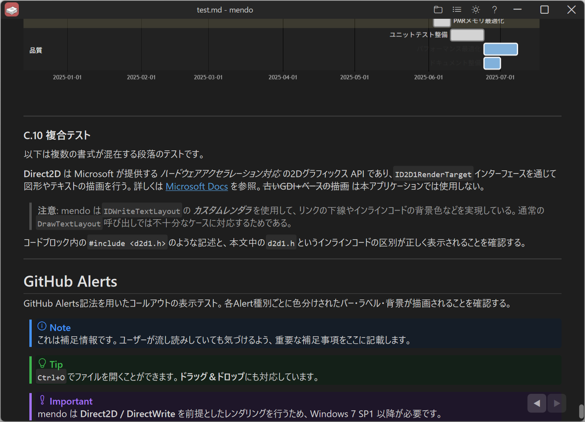

# mendo - かんたんMarkdownビュアー

軽量で単一の実行ファイルで動作するMarkdownビューア。ファイルをドラッグ＆ドロップするだけで、すぐに使えます。

**[English](README.en.md)**



## 特徴

- **ブラウザレス描画** — Direct2D + DirectWrite による自前レンダリング
- **単一EXE** — CRTを静的リンクし、ランタイム不要でそのまま動作
- **3ペインレイアウト** — ファイルエクスプローラー / 目次 / Markdownコンテンツの3ペイン構成
- **ファイルエクスプローラー** — 同ディレクトリのファイル・フォルダを一覧表示し、クリックで開く
- **目次 (TOC)** — 見出しを自動抽出し、クリックで該当箇所にジャンプ。ホバーハイライト対応
- **Mermaidダイアグラム** — `mermaid` コードブロックを図として表示（WebView2によるオフスクリーンレンダリング）
- **ダークモード** — ライト/ダークテーマを切り替え
- **シンタックスハイライト** — C++, Python, JavaScript, Go, Rust, pwsh, bash, cmd のコードブロックを色分け表示
- **ナビゲーション履歴** — `Alt+←` / `Alt+→` / マウスサイドボタン / マウスジェスチャー / タッチパッドスワイプでブラウザスタイルの戻る/進む。スクロール位置も復元
- **画像表示** — PNG, JPEG, BMP等の画像をMarkdown内に表示
- **ズーム** — `Ctrl++` / `Ctrl+-` / `Ctrl+マウスホイール` で0.25x〜5.00xの17段階ズーム
- **ファイル監視** — 編集中のファイルを自動検出してライブリロード
- **ドラッグ&ドロップ** — `.md` ファイルをウィンドウにドロップするだけで表示
- **設定の永続化** — ダークモード・ズームレベル・最後に開いたファイル等を `%LOCALAPPDATA%\mendo\` に保存

## 対応するMarkdown要素

| 要素 | 対応状況 |
|---|---|
| 見出し (H1-H6) | ✅ |
| 段落 | ✅ |
| 太字 / 斜体 / 取り消し線 | ✅ |
| インラインコード | ✅ |
| コードブロック (フェンス) | ✅ シンタックスハイライト付き |
| 画像 (PNG / JPEG / BMP) | ✅ 非同期読み込み |
| Mermaidダイアグラム | ✅ WebView2でレンダリング |
| GitHub Alerts | ✅ Note / Tip / Important / Warning / Caution |
| リンク (外部 / ページ内アンカー) | ✅ |
| 順序付きリスト / 箇条書き | ✅ ネスト対応 |
| タスクリスト | ✅ |
| 引用 (Blockquote) | ✅ |
| テーブル | ✅ アライメント対応 |
| 水平線 | ✅ |

## キーボードショートカット

| キー | 操作 |
|---|---|
| `Ctrl+O` | ファイルを開く |
| `Ctrl+C` | 選択テキストをコピー |
| `Ctrl+A` | 全選択 |
| `Ctrl+1` | ファイルエクスプローラーの表示/非表示 |
| `Ctrl+2` | 目次の表示/非表示 |
| `Ctrl++` / `Ctrl+-` | ズームイン / ズームアウト |
| `Ctrl+0` | ズームをリセット (100%) |
| `Ctrl+マウスホイール` | ズームイン / ズームアウト |
| `Alt+←` | 戻る |
| `Alt+→` | 進む |
| `F1` | 操作ガイドを表示 |
| `F5` | 再読み込み |
| `↑` `↓` | スクロール |
| `Page Up` `Page Down` | ページスクロール |
| `Home` `End` | 先頭/末尾へ移動 |
| `Esc` | 選択解除 |

## マウス操作

| 操作 | 動作 |
|---|---|
| ドラッグ | テキスト範囲選択 |
| ダブルクリック | 単語選択 |
| 右クリック+左右ドラッグ | マウスジェスチャーで戻る/進む |
| タッチパッド水平スワイプ | 戻る / 進む |
| サイドボタン | 戻る / 進む |
| スプリッタードラッグ | ペイン幅の調整 |
| リンクをクリック | 外部リンクをブラウザで開く / ページ内アンカーにジャンプ |
| コードブロックのコピーボタン | コードブロックの内容をクリップボードにコピー |

## 右クリックメニュー

| 項目 | 操作 |
|---|---|
| ← → ボタン | 戻る / 進む |
| エディタで開く | 現在のファイルを既定のエディタで開く |
| コピー | 選択テキストをコピー（テキスト選択時のみ） |
| ダークモード | ライト/ダークテーマの切り替え |

## スクリーンショット





## ビルド

### 必要なもの

- Windows 10 以降
- Visual Studio 2022 (MSVC, C++23対応)
- CMake 3.20+

### ビルド手順

```
cmake -B build
cmake --build build --config Release
```

生成される実行ファイル: `build/Release/mendo.exe`

テストなしでビルドする場合:

```
cmake -B build -DMENDO_BUILD_TESTS=OFF
cmake --build build --config Release
```

### テスト実行

```
cmake --build build --config Release
build/tests/Release/mendo_tests.exe
```

## 使い方

```
mendo.exe [ファイルパス]
```

引数なしで起動した場合は、`Ctrl+O` またはドラッグ&ドロップでファイルを開けます。

## 技術スタック

| レイヤー | 技術 |
|---|---|
| 言語 | C++23 (MSVC) |
| GUI | Win32 API |
| 2D描画 | Direct2D (`ID2D1HwndRenderTarget`) |
| テキスト描画 | DirectWrite (`IDWriteTextLayout`) |
| ダイアグラム | WebView2 + [Mermaid.js](https://mermaid.js.org/) |
| Markdownパーサ | [md4c](https://github.com/mity/md4c) (SAX型コールバック) |
| テスト | Google Test v1.17.0 |
| ビルド | CMake 3.20+ |

## ライセンス

[MIT](LICENSE)

サードパーティライブラリのライセンスについては [THIRD_PARTY_LICENSES.md](THIRD_PARTY_LICENSES.md) を参照してください。
