# mendo ソフトウェア詳細仕様書

## 1. はじめに

### 1.1 本文書の目的

本文書は **mendo** の詳細なソフトウェア仕様を記述する。本アプリケーションは、Webブラウザを使わず **Direct2D / DirectWrite** による自前レンダリングで高速なMarkdown表示を実現するWindows向けネイティブビュアーである。

### 1.2 対象読者

- 開発者・コントリビュータ
- テスト担当者
- プロジェクト管理者

### 1.3 用語定義

| 略語 | 正式名称 | 説明 |
|:-----|:---------|:-----|
| D2D | Direct2D | Microsoftの2Dグラフィックス API |
| DWrite | DirectWrite | テキストレイアウト・描画 API |
| md4c | Markdown for C | SAX型コールバック方式のCパーサ |
| WIC | Windows Imaging Component | 画像デコード・エンコードAPI |
| DPI | Dots Per Inch | 画面解像度の単位 |
| DIP | Device Independent Pixel | 論理ピクセル単位 |
| TOC | Table of Contents | 目次 |
| SAX | Simple API for XML | イベント駆動型パーサ方式 |
| PMR | Polymorphic Memory Resource | C++17 のアロケータ抽象 |
| LRU | Least Recently Used | キャッシュエビクションポリシー |

---

## 2. システム概要

### 2.1 アーキテクチャ全体像

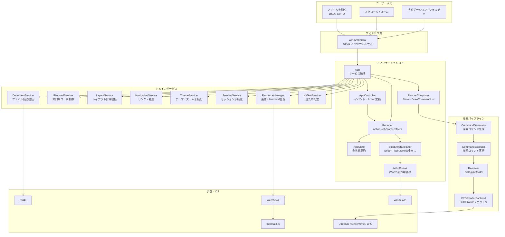

### 2.2 アーキテクチャ原則

mendo は **状態と振る舞いを明確に分離** する設計を採用している。

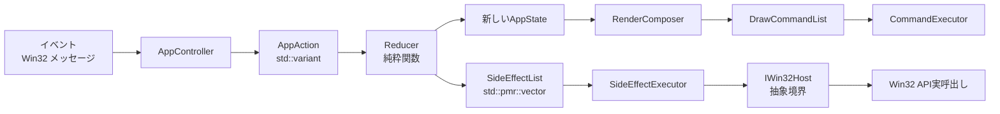

| 設計原則 | 実装場所 |
|:---------|:--------|
| **状態の単一の真実源** | `AppState`（`src/app/app_state.h`） |
| **アクション駆動** | `AppAction = std::variant<...>`（`src/app/app_events.h`） |
| **副作用の明示化** | `SideEffect`（二段variant、`src/app/side_effect.h`） |
| **Win32の抽象化** | `IWin32Host`（`src/app/win32_host.h`） |
| **ロジックとUI層の分離** | `mendo_core`（テスト可能）vs `mendo`（Win32/D2D具象） |

---

## 3. コンポーネント詳細

### 3.1 Win32Window — ウィンドウ管理

#### 3.1.1 責務

`Win32Window` はWin32 APIの薄いラッパーとして、以下を担当する。

1. **ウィンドウ生成** — `WNDCLASSEXW` の登録、`CreateWindowExW` によるウィンドウ作成
2. **メッセージループ** — `GetMessageW` / `TranslateMessage` / `DispatchMessageW`
3. **メッセージルーティング** — Win32メッセージを `App` のイベントハンドラに委譲
4. **NC領域処理** — `WM_NCCALCSIZE` / `WM_NCHITTEST` でカスタムタイトルバーを実装

#### 3.1.2 クラス構造

```cpp
class Win32Window {
public:
    bool Create(HINSTANCE hInstance, int nCmdShow);
    int  RunMessageLoop();

    void LoadMarkdownFile(std::wstring_view path);
    void LoadHelpDocument();
    std::pmr::wstring LoadLastFilePath() const;
    void ShowDirectory(std::wstring_view dir_path);
    void RestoreScrollPosition();

private:
    static LRESULT CALLBACK WndProc(HWND, UINT, WPARAM, LPARAM);
    LRESULT HandleMessage(UINT msg, WPARAM wParam, LPARAM lParam);
    LRESULT OnNcCalcSize(WPARAM wParam, LPARAM lParam);
    LRESULT OnNcHitTest(LPARAM lParam);
    void HandleMouseMessage(UINT msg, WPARAM wp, LPARAM lp);
    LRESULT HandleAppNotification(UINT msg, WPARAM wp, LPARAM lp);
    void UpdateDwmFrame();
    static LRESULT CALLBACK SearchEditProc(HWND, UINT, WPARAM, LPARAM, UINT_PTR, DWORD_PTR);

    HWND hwnd_ = nullptr;
    App  app_;
};
```

### 3.2 App — アプリケーション統括

#### 3.2.1 責務

`App` はアプリケーション全体の統括を担う。状態は `AppState` に集約し、振る舞いはサービス群に委譲する。

1. **サービス所有** — 各種サービスの生成・接続・ライフサイクル管理
2. **イベントディスパッチ** — Win32イベントを `AppController` 経由で `AppAction` に変換、`Reducer` に渡す
3. **副作用実行** — `Reducer` が返した `SideEffectList` を `SideEffectExecutor` に渡す
4. **描画起点** — `OnPaint` で `RenderComposer` を駆動し `Renderer` に描画コマンドを渡す

#### 3.2.2 クラス構造

```cpp
class App {
public:
    bool Init(HWND hwnd);
    void LoadMarkdownFile(std::wstring_view path);
    void LoadHelpDocument();
    std::pmr::wstring LoadLastFilePath() const;
    void ShowDirectory(std::wstring_view dir_path);

    // Win32Window から呼ばれるイベントハンドラ
    void OnPaint();
    void OnResize(UINT width, UINT height);
    void OnMouseWheel(int px, int py, short delta, bool ctrl = false);
    void OnMouseHWheel(short delta);
    void OnKeyDown(WPARAM key);
    void OnDropFiles(HDROP hDrop);
    void OnDpiChanged(UINT dpi, const RECT* suggested);

    void OnLButtonDown(int px, int py);
    void OnLButtonUp(int px, int py);
    void OnLButtonDblClk(int px, int py);
    void OnMouseMove(int px, int py);
    void OnMouseHover(int px, int py);
    void OnMouseLeave() { Dispatch(MouseLeaveAction{}); }
    void OnContextMenu(int screen_x, int screen_y);
    bool OnRButtonDown(int px, int py);
    bool OnRButtonUp(int px, int py);
    void OnRButtonMove(int px, int py);
    void OnXButtonBack()    { Dispatch(NavigateBackAction{}); }
    void OnXButtonForward() { Dispatch(NavigateForwardAction{}); }

    HANDLE GetFileWatchEvent() const noexcept;
    void OnFileWatchEvent();

    void HandleTimer(UINT_PTR timer_id);
    void OnAppLoadFile();
    void OnAppReloadFile();
    void OnAppImageLoaded();
    void OnParseComplete();
    void OnCaptureChanged();
    void OnDestroy();
    void OnEnterSizeMove() { Dispatch(EnterSizeMoveAction{}); }
    void OnExitSizeMove()  { Dispatch(ExitSizeMoveAction{}); }
    void OnActivate(bool active) { Dispatch(ActivateAction{ active }); }

    // 検索コールバック (Win32Windowから呼ばれReducer経由で状態更新)
    void OnSearchTextChanged(std::wstring_view text);
    void OnSearchClose();
    void OnSearchNext();
    void OnSearchPrev();
    bool IsSearchBarVisible() const noexcept;
    void OnToggleCaseSensitive();
    void OnToggleHighlight();
    void SetSearchSelection(int start, int end);
    void SetImeComposition(std::wstring_view comp);
    RECT GetSearchEditRect();

private:
    void Dispatch(const AppAction& action);

    template <typename T>
    void EmitEffect(T&& e); // 単発 effect のヘルパー

    // Win32 ハンドル
    HWND hwnd_ = nullptr;
    CursorManager cursors_;

    // コアサービス
    Renderer           renderer_;
    TaskScheduler      scheduler_;
    MermaidFileCache   file_cache_;
    MermaidRenderer    mermaid_renderer_;
    ImageLoader        image_loader_;
    FileWatcher        file_watcher_;
    DocumentService    doc_service_{ file_watcher_ };
    AppController      controller_;
    ConfigService      config_;
    ThemeService       theme_service_{ config_ };
    SessionService     session_{ config_ };
    FileLoadService    file_load_service_{ doc_service_ };

    // 全状態集約
    AppState state_;

    // 振る舞い (純粋ロジックや副作用境界)
    HitTestService               hit_test_;
    std::optional<LayoutService> layout_service_;
    ResourceManager              resource_manager_;
    Win32Host                    win32_host_;
    SideEffectExecutor           effect_executor_;
};
```

#### 3.2.3 ファイル構成

`App` は責務ごとにファイル分割されている。

| ファイル | 担当 |
|:---------|:-----|
| `app.cpp` | コアロジック（`Dispatch`, レイアウト, テーマ適用） |
| `app_init.cpp` | `Init()` と各サービスの初期化 |
| `app_file.cpp` | `LoadMarkdownFile`, `BeginAsyncLoad`, `OnParseComplete` |
| `app_scroll.cpp` | スクロール関連ヘルパー |
| `app_mouse.cpp` | マウス入力ハンドラ |
| `app_mouse_click.cpp` | マウスクリック処理 |
| `app_mouse_hover.cpp` | ホバー処理 |
| `app_navigate.cpp` | リンクナビゲーション |
| `app_context_menu.cpp` | カスタムコンテキストメニュー処理 |
| `app_clipboard.cpp` | クリップボード・画像保存 |

#### 3.2.4 メッセージハンドリング

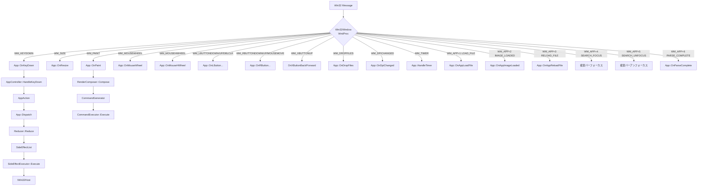

#### 3.2.5 キーボードショートカット

`AppController::HandleKeyDown()` がキー入力を `AppAction` に変換する。

| キー | アクション | 備考 |
|:-----|:-----------|:-----|
| `F1` | `ShowHelpAction` | 内蔵ヘルプ表示 |
| `F3` | `SearchNextAction` | 次の検索結果 |
| `Shift+F3` | `SearchPrevAction` | 前の検索結果 |
| `F5` | `ReloadFileAction` | 再読み込み |
| `Esc` | `ClearSelectionAction` | 選択解除 |
| `Ctrl+O` | `OpenFileAction` | OpenFileDialog |
| `Ctrl+A` | `SelectAllAction` | 全選択 |
| `Ctrl+C` | `CopyClipboardAction` | プレーンテキストコピー |
| `Ctrl+Shift+C` | `CopyFormattedClipboardAction` | 書式付きコピー (HTML) |
| `Ctrl+F` | `OpenSearchBarAction` | 検索バー表示 |
| `Ctrl+G` | `SearchNextAction` | 次の検索結果 |
| `Ctrl+Shift+G` | `SearchPrevAction` | 前の検索結果 |
| `Ctrl+1` | `TogglePaneAction(File)` | ファイルペイン切替 |
| `Ctrl+2` | `TogglePaneAction(Toc)` | TOCペイン切替 |
| `Ctrl++` / `Ctrl+=` | `ZoomAction(In)` | ズームイン |
| `Ctrl+-` | `ZoomAction(Out)` | ズームアウト |
| `Ctrl+0` | `ZoomAction(Reset)` | ズーム100% |
| `Ctrl+ホイール` | `ZoomAction(In/Out)` | ホイール方向で増減 |
| `Alt+←` | `NavigateBackAction` | 戻る |
| `Alt+→` | `NavigateForwardAction` | 進む |
| `↑` / `↓` | `KeyScrollAction(LineUp/Down)` | 1行スクロール |
| `Home` / `End` | `KeyScrollAction(Home/End)` | 先頭/末尾 |
| `PageUp` / `PageDown` | `KeyScrollAction(PageUp/Down)` | 1ページ |

#### 3.2.6 マウスジェスチャ

| 操作 | 動作 | 実装 |
|:-----|:-----|:-----|
| 右ドラッグ左 | ナビゲーション戻る | `MouseGesture`（30px以上の水平移動） |
| 右ドラッグ右 | ナビゲーション進む | 同上 |
| 右クリック（移動なし） | コンテキストメニュー | `ContextMenu` |
| Xボタン戻る/進む | ナビゲーション戻る/進む | `WM_XBUTTONUP` |
| ダブルクリック | 単語選択 | `OnLButtonDblClk` |
| タッチパッド水平スワイプ | ナビゲーション戻る/進む | `SwipeDetector`（`WM_MOUSEHWHEEL`） |

#### 3.2.7 AppController — イベント→アクション変換

`AppController` はステートレスなマッパーである。Win32 / D2D 依存なし、完全にテスト可能。

```cpp
class AppController {
public:
    AppAction HandleKeyDown(const KeyDownEvent& event) const;
    AppAction HandleMouseWheel(const MouseWheelEvent& event) const;
};
```

`KeyDownEvent` は `key`, `ctrl`, `shift`, `alt` フラグを持ち、Win32 の `GetKeyState` 確認結果をバンドルする。

---

### 3.3 AppState — アプリケーション状態の集約

#### 3.3.1 概要

`AppState` はアプリケーションの **すべての状態** を保持する単一構造体。サブグループ別にネストされる。

```cpp
struct AppState {
    DocumentState    document;     // ドキュメント + LayoutCache
    ViewState        view;         // ViewportManager + PaneController + ScrollRestoration + NavHistory
    InteractionState interaction;  // MouseGesture + SwipeDetector + Tooltip + ToastNotifier ...
    SearchGroup      search;       // SearchState + SearchBarController
    WindowState      window;       // TitleBar + DPI + テーマ定数キャッシュ

    FileExplorer     file_explorer;
    ContextMenu      ctx_menu;
    int              active_toc_index = -1;

    size_t           reload_diff_pos       = std::string_view::npos;
    bool             pending_prefix_shrink = false;

    std::pmr::wstring cached_title_text = L"mendo";
    PaneLayout        cached_pane_layout{};
    float             cached_window_width_for_layout = 0.0f;
    bool              pane_layout_valid = false;
};
```

#### 3.3.2 サブグループ詳細

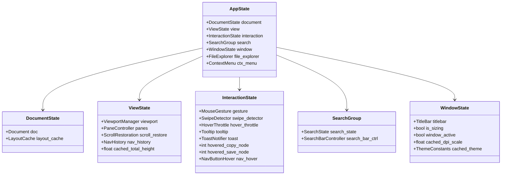

---

### 3.4 Reducer / SideEffect — 状態更新と副作用

#### 3.4.1 Reducer

```cpp
struct ReduceResult {
    AppState        new_state;
    SideEffectList  effects;
};

ReduceResult Reduce(const AppState& state, const AppAction& action,
                    const ReducerEnv& env);
```

`Reducer` は **純粋関数** として `AppState` と `AppAction` を取り、新しい `AppState` と副作用リストを返す（環境定数 `ReducerEnv` を経由してテーマ・DPI・ペインレイアウト等を参照する）。

#### 3.4.2 AppAction

`AppAction` は `std::variant` で約65種類のアクションを保持する。

```cpp
using AppAction = std::variant<
    // コマンド系
    NoOpAction, KeyScrollAction, DirectScrollByAction, ScrollPaneAction,
    CopyClipboardAction, CopyFormattedClipboardAction,
    SelectAllAction, ClearSelectionAction,
    TogglePaneAction, ZoomAction,
    ReloadFileAction, OpenFileAction, ToggleDarkModeAction,
    NavigateBackAction, NavigateForwardAction,
    ShowHelpAction,
    OpenSearchBarAction, CloseSearchBarAction,
    SearchNextAction, SearchPrevAction,
    // マウス・ドラッグ系
    MouseLeaveAction, MdPaneNavHoverAction, MdPaneButtonHoverChangedAction,
    SplitterDragStartedAction, SplitterDragMovedAction, SplitterDragEndedAction,
    SearchInputDragStartedAction, SearchInputDragMovedAction, SearchInputDragEndedAction,
    MdScrollbarDragStartedAction, MdScrollbarDragMovedAction, MdScrollbarDragEndedAction,
    PaneScrollbarDragStartedAction, PaneScrollbarDragMovedAction, PaneScrollbarDragEndedAction,
    TextSelectionStartedAction, TextSelectionMovedAction, TextSelectionEndedAction,
    RightClickGestureStartedAction, RightClickGestureMovedAction, RightClickGestureCompletedAction,
    FilePaneDirectoryClickedAction, FilePaneFileClickedAction,
    TocItemClickedAction, NavigateAnchorAction,
    RestoreScrollAfterLoadAction, HWheelAction, DropFilesAction,
    UpdateTooltipAction, ClearTooltipAction,
    // システム
    ResizeAction, DpiChangedAction, ActivateAction,
    EnterSizeMoveAction, ExitSizeMoveAction, CaptureChangedAction, DestroyAction,
    // タイマー・非同期
    TimerAction, FileWatchAction, ParseCompleteAction, ImageLoadedAction,
    // 検索
    SearchTextChangedAction, ToggleCaseSensitiveAction, ToggleHighlightAction,
    SearchSelectionAction, ImeCompositionAction
>;
```

#### 3.4.3 SideEffect — 二段variant

`SideEffect` はドメイン別の二段 variant 構造により、新機能追加時に同期点を局所化する。

```cpp
using UiEffect          = std::variant<InvalidateWindow, SetCursor, ClipboardWrite,
                                       ShowTooltip, ShowToast, ShowContextMenu, /*...*/>;
using WindowEffect      = std::variant<ShowWindowCmd, PostMessage, SetWindowTitle,
                                       ApplyDarkMode, ApplyThemeChange, RendererResize, /*...*/>;
using NavigationEffect  = std::variant<ShellOpen, LoadFile, ReloadFile, OpenFileDialog>;
using LayoutEffect      = std::variant<DeferredLayout, MermaidBatch, BitmapManage,
                                       InvalidatePaneCache, RefreshPaneLayout,
                                       SyncTocActive, ViewportLayout, SyncMaxScroll>;
using ResourceEffect    = std::variant<LoadImages, RequestMermaidRenders, CancelMermaidBatch,
                                       NotifyImageLoaded, ClearFileCache,
                                       StartFileWatch, StopFileWatch, ResumeFileWatch,
                                       CheckFileChanges>;
using TimerEffect       = std::variant<SetTimer, KillTimer, ProcessDeferredLayout,
                                       TickLoadingAnimation, ProcessMermaidBatchTimer,
                                       ProcessBitmapManage, MermaidInitRetry>;
using LifecycleEffect   = std::variant<SaveConfig, Destroy, HandleParseComplete>;

using SideEffect = std::variant<
    UiEffect, WindowEffect, NavigationEffect, LayoutEffect,
    ResourceEffect, TimerEffect, LifecycleEffect>;

using SideEffectList = std::pmr::vector<SideEffect>;
```

`PushEffect<T>(effects, e)` ヘルパーが、effect 型を該当ドメイン variant に自動でラップする。

#### 3.4.4 SideEffectExecutor / IWin32Host

`SideEffectExecutor` は `SideEffectList` を受け取り、各副作用を `IWin32Host` 経由で実行する。`IWin32Host` は Win32 の境界インターフェースで、テスト時にはモックに差し替え可能。

```cpp
class IWin32Host {
public:
    virtual void Invalidate() = 0;
    virtual void InvalidateRect(const PaneRect&) = 0;
    virtual void SetCapture() = 0;
    virtual void ReleaseCapture() = 0;
    virtual void SetCursor(CursorType) = 0;
    virtual void SetTimer(UINT_PTR id, UINT ms) = 0;
    virtual void KillTimer(UINT_PTR id) = 0;
    virtual void PostMessage(UINT msg, WPARAM, LPARAM) = 0;
    virtual void ShellOpen(std::wstring_view url) = 0;
    virtual void OpenFileDialog() = 0;
    virtual void WriteClipboardText(std::wstring_view) = 0;
    virtual void WriteClipboardHtml(std::wstring_view html, std::wstring_view plain) = 0;
    virtual void ShowToast(std::wstring_view) = 0;
    virtual void ShowContextMenu(int sx, int sy) = 0;
    virtual void RecomputeLayout(bool anchored) = 0;
    virtual void ApplyDarkMode(bool) = 0;
    virtual void ApplyTheme() = 0;
    virtual void HandleParseComplete() = 0;
    // ... 他
};
```

---

### 3.5 RenderComposer — 描画ステート構築

`RenderComposer` は `AppState` から描画に必要な情報を抽出し、`CommandGenerator` を駆動して `DrawCommandList` を組み立てる純粋ロジック。Win32/D2D 依存なし（mendo_core 配置）。

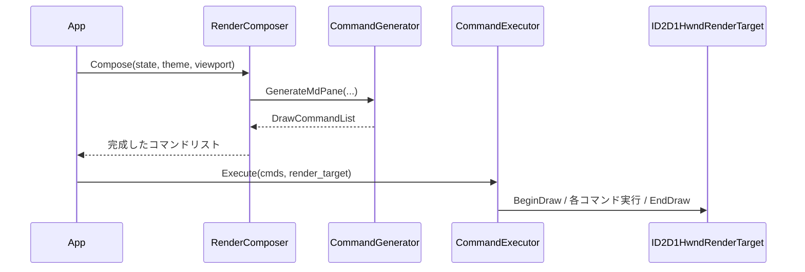

---

### 3.6 Parser — Markdownパーサ

#### 3.6.1 パイプライン

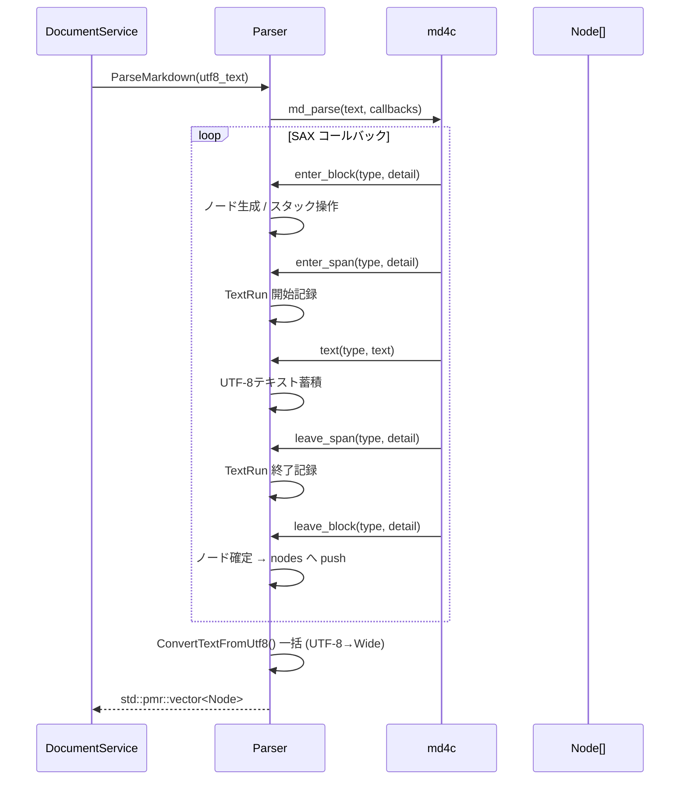

#### 3.6.2 対応する Markdown 要素

##### ブロック要素

- **見出し** (`# H1` 〜 `###### H6`) — 6段階、アンカーID自動生成
- **段落** — 通常テキスト
- **コードブロック** — フェンス記法 (```), 言語指定対応
- **引用** (`>`) — ネスト対応、GitHub Alerts記法対応
- **水平線** (`---`, `***`, `___`)
- **順序付きリスト** (`1.`, `2.`, ...)
- **順序なしリスト** (`-`, `*`, `+`)
- **タスクリスト** (`- [ ]`, `- [x]`)
- **テーブル** — GFM拡張、列アライメント対応

##### インライン要素

- **太字** (`**bold**`)
- **斜体** (`*italic*`)
- **取り消し線** (`~~strike~~`)
- **インラインコード** (`` `code` ``)
- **リンク** (`[text](url)`)
- **画像** (``) — 非同期読み込み
- **太字+斜体** (`***both***`)

#### 3.6.3 アンカーID生成（GitHub互換）

```cpp
// 1. 全角英数字 → 半角英数字
// 2. 大文字 → 小文字
// 3. スペース・アンダースコア → ハイフン
// 4. 英数字・ハイフン・CJK文字以外を除去
// 5. 連続ハイフンを単一ハイフンに圧縮
// 6. 先頭・末尾のハイフンを除去
//
// 例:
// "Hello World"     → "hello-world"
// "C++ コード例"    → "c-コード例"
// "第1章: 概要"     → "第1章-概要"
```

#### 3.6.4 GitHub Alerts記法

引用ブロック先頭の `[!NOTE]` `[!TIP]` `[!IMPORTANT]` `[!WARNING]` `[!CAUTION]` を検出し、Alert ノードに変換する。`parser_alerts.cpp` が専用処理を担当する。

---

### 3.7 LayoutEngine / LayoutService — テキスト計測

#### 3.7.1 概要

`LayoutEngine` は `ITextMeasurer` インターフェース経由で各ノードを計測し、`LayoutCache` に格納する。`LayoutService` がレイアウト全体の統括を行う。

```cpp
class ITextMeasurer {
public:
    virtual bool Init(const Theme& theme) = 0;
    virtual bool RecreateFormats() = 0;
    virtual void UpdateTheme(const Theme& theme) noexcept = 0;
    virtual void MeasureNode(Node&, NodeLayoutEntry&, float max_width) = 0;
    virtual void MeasureTable(Node&, NodeLayoutEntry&, float max_width) = 0;
};
```

本番実装は `DWriteMeasurer`（DirectWrite を使用）。テスト時はモックに差し替えられる。

#### 3.7.2 レイアウト計算フロー

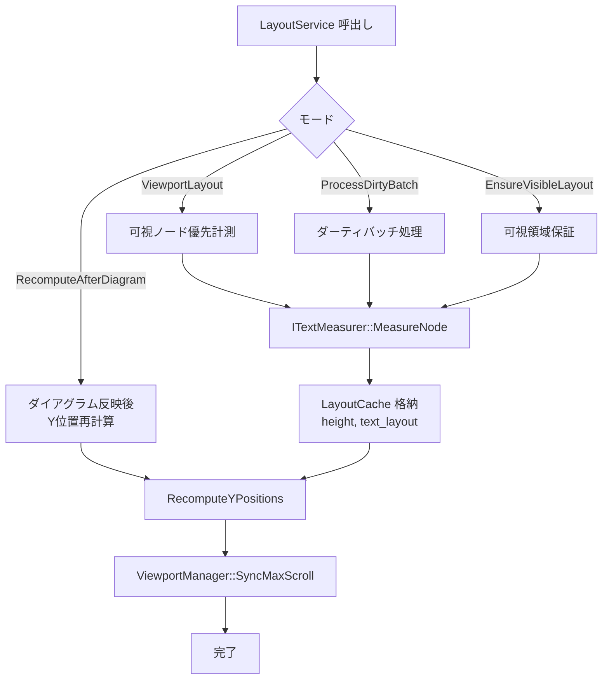

#### 3.7.3 テキストフォーマット

| 用途 | フォントファミリ | 既定サイズ (DIP) |
|:-----|:----------------|:-----------------|
| H1 | Yu Gothic UI | 32 |
| H2 | Yu Gothic UI | 26 |
| H3 | Yu Gothic UI | 22 |
| H4 | Yu Gothic UI | 18 |
| H5 | Yu Gothic UI | 16 |
| H6 | Yu Gothic UI | 14 |
| 本文 | Yu Gothic UI | 16 |
| コード | Consolas | 14 |

> **Note**: すべてのフォントサイズはズーム倍率 (`Theme::zoom`) で乗算される。

---

### 3.8 Renderer — Direct2D 描画

#### 3.8.1 Command パターン

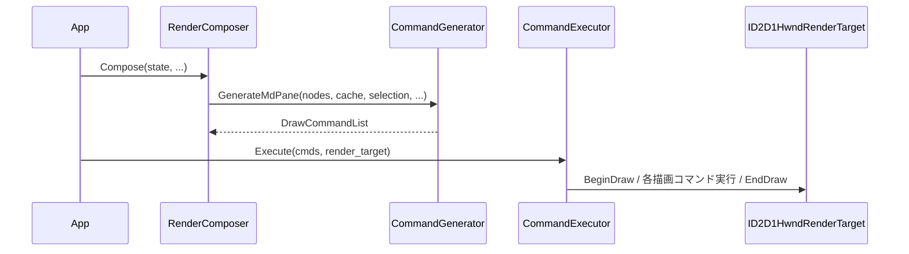

#### 3.8.2 DrawCommand 型

```cpp
using DrawCommand = std::variant<
    ClearCmd,
    FillRectCmd,
    FillRoundedRectCmd,
    DrawLineCmd,
    DrawTextLayoutCmd,
    DrawTextCmd,
    DrawBitmapCmd,
    FillEllipseCmd,
    DrawEllipseCmd,
    PushClipCmd,
    PopClipCmd,
    SetTransformCmd
>;

using DrawCommandList = std::pmr::vector<DrawCommand>;
```

各コマンドは値型で、`IDWriteTextLayout*` や `ID2D1Bitmap*` などのポインタは **非所有**（ライフタイムは `LayoutCache` などが管理）。

#### 3.8.3 IRenderBackend インターフェース

Direct2D / DirectWrite ファクトリ・レンダーターゲット・DPI管理を抽象化。

```cpp
class IRenderBackend {
public:
    virtual bool Init(HWND hwnd) = 0;
    virtual void Resize(UINT width, UINT height) = 0;
    virtual void SetDpi(float dpi) = 0;
    virtual float GetDpi() const noexcept = 0;
    virtual bool RecreateRenderTarget() = 0;
    virtual ID2D1Factory* GetD2DFactory() const noexcept = 0;
    virtual ID2D1HwndRenderTarget* GetRenderTarget() const noexcept = 0;
    virtual IDWriteFactory* GetDWriteFactory() const noexcept = 0;
    virtual HWND GetHwnd() const noexcept = 0;
};
```

本番実装は `D2DRenderBackend`。

#### 3.8.4 Renderer ファイル構成

| ファイル | 担当 |
|:---------|:-----|
| `renderer.cpp` | Markdown ペイン描画統括 |
| `renderer_resources.cpp` | ブラシ・フォーマット管理 |
| `renderer_pane.cpp` | ファイル/TOC ペイン描画 |
| `renderer_titlebar.cpp` | タイトルバー描画 |
| `renderer_overlay.cpp` | オーバーレイ（ジェスチャトレイル等） |
| `renderer_search.cpp` | 検索バー描画 |

#### 3.8.5 描画レイヤー順

1. 背景クリア
2. Markdownコンテンツ
   - コードブロック背景 → テキスト → シンタックスハイライト
   - 引用ブロック左バー
   - テーブルグリッド線
   - 水平線 / リスト記号 / タスクチェックボックス
   - Mermaidダイアグラムビットマップ
3. テキスト選択ハイライト
4. ファイルペイン / TOCペイン（オフスクリーンキャッシュ経由）
5. スプリッタ / スクロールバー
6. ナビゲーションボタン（戻る/進むオーバーレイ）
7. コピーボタン（コードブロックホバー時）
8. 保存ボタン（Mermaidダイアグラムホバー時）
9. マウスジェスチャトレイル
10. スワイプオーバーレイ
11. 検索バー（下部ドッキング）
12. カスタムタイトルバー
13. コンテキストメニュー（モーダルポップアップ）
14. トースト通知
15. ローディングアニメーション

---

### 3.9 Theme — テーマシステム

#### 3.9.1 テーマ構造

```cpp
struct Theme {
    // カラーパレット
    D2D1_COLOR_F bg_color, text_color, heading_color;
    D2D1_COLOR_F code_bg_color, code_text_color;
    D2D1_COLOR_F link_color, hr_color;
    D2D1_COLOR_F blockquote_bar_color, blockquote_text_color;

    // GitHub Alerts (Note, Tip, Important, Warning, Caution の5種)
    D2D1_COLOR_F alert_color[ALERT_TYPE_COUNT];     // バー・ラベル色
    D2D1_COLOR_F alert_bg_color[ALERT_TYPE_COUNT];  // 背景色

    // シンタックスハイライト
    D2D1_COLOR_F syntax_keyword, syntax_type;
    D2D1_COLOR_F syntax_string, syntax_number;
    D2D1_COLOR_F syntax_comment, syntax_preprocessor;
    D2D1_COLOR_F syntax_function;

    // タイトルバー
    D2D1_COLOR_F titlebar_bg_color, titlebar_text_color;
    D2D1_COLOR_F titlebar_button_hover_color, titlebar_button_active_color;

    // ペイン
    D2D1_COLOR_F pane_bg_color, splitter_color;
    D2D1_COLOR_F pane_item_hover_color, pane_item_active_color;

    // 検索バー
    D2D1_COLOR_F search_bar_bg_color, search_bar_border_color;
    D2D1_COLOR_F search_input_bg_color, search_input_text_color;
    D2D1_COLOR_F search_highlight_color;
    D2D1_COLOR_F search_highlight_current_color;
    D2D1_COLOR_F search_no_match_bg_color;

    // フォント
    std::wstring font_family;     // "Yu Gothic UI"
    std::wstring monospace_font;  // "Consolas"

    // フォントサイズ (DIP)
    float font_size_body;
    float font_size_h[6];
    float font_size_code;

    // スペーシング
    float margin_left, margin_right, margin_top;
    float paragraph_spacing, list_item_spacing;
    float heading_spacing_above;
    float heading_spacing_below;       // h3〜h6 の下マージン
    float heading_spacing_below_h1h2;  // h1/h2 の下マージン (下線+次行余白を確保)
    float code_block_spacing_above, code_block_padding;
    float indent_width, blockquote_bar_width;
    float list_bullet_offset, hr_thickness, h2_underline_thickness;

    // ペインレイアウト
    float pane_item_height;
    float pane_header_height;
    float splitter_width;
    float pane_font_size;

    // ズーム (1.0 = 100%)
    float zoom = 1.0f;

    constexpr float ContentWidth(float viewport_width) const noexcept;
    float GetHeadingSize(int level) const noexcept;
    constexpr float GetHeadingUnderlineThickness(int level) const noexcept;
    constexpr bool IsDark() const noexcept;
    ThemeConstants ToReducerConstants() const noexcept;
    void ApplyZoom(float new_zoom) noexcept;
};
```

`ThemeConstants` は Reducer がテーマ寸法を参照するための軽量キャッシュ。

#### 3.9.2 ThemeService — テーマ管理サービス

```cpp
class ThemeService {
public:
    explicit ThemeService(ConfigService& config) noexcept;
    bool IsDarkMode() const noexcept;
    Theme CreateTheme() const;
    Theme CreateTheme(int zoom_index) const;
    bool ToggleDarkMode();
    void SaveDarkMode();
    void LoadDarkMode();
    void SaveZoomLevel(int zoom_index);
    int  LoadZoomIndex() const;
};
```

#### 3.9.3 ズームシステム

17段階の離散的なズームレベル（`theme.h::ZOOM_STEPS`）。

| インデックス | 倍率 | インデックス | 倍率 |
|:------------|:------|:------------|:------|
| 0 | 0.25x | 9 | 1.25x |
| 1 | 0.33x | 10 | 1.50x |
| 2 | 0.50x | 11 | 1.75x |
| 3 | 0.67x | 12 | 2.00x |
| 4 | 0.75x | 13 | 2.50x |
| 5 | 0.80x | 14 | 3.00x |
| 6 | 0.90x | 15 | 4.00x |
| 7 | **1.00x** (default) | 16 | 5.00x |
| 8 | 1.10x | | |

`ZOOM_DEFAULT_INDEX = 7`、`ZOOM_STEP_COUNT = 17`。

---

### 3.10 Syntax — シンタックスハイライト

#### 3.10.1 対応言語

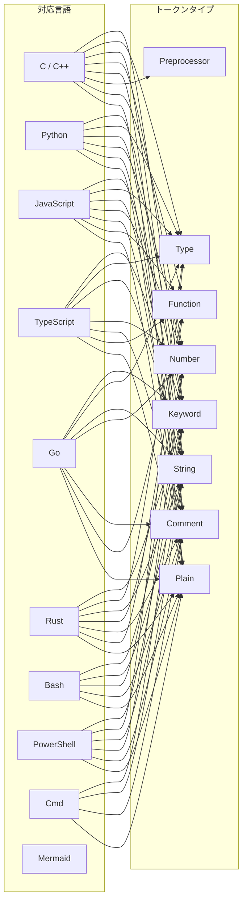

キーワードリストは `syntax_keywords.h` に集約され、各言語ごとに `std::array<std::string_view, N>` で持つ。`flat_map` ベースの線形検索を使用する。

---

### 3.11 ファイルI/O — FileLoader / FileWatcher / DocumentService / FileLoadService

#### 3.11.1 ファイル読み込み

```mermaid
flowchart LR
    OPEN[CreateFileW<br>GENERIC_READ<br>FILE_SHARE_*] --> READ[ReadFile<br>UTF-8バイト列]
    READ --> BOM{BOM付き？}
    BOM -->|Yes| STRIP[BOM除去 (3バイト)]
    BOM -->|No| PASS[そのまま]
    STRIP --> OUT[std::pmr::string]
    PASS --> OUT
```

- 共有モード: `FILE_SHARE_READ | FILE_SHARE_WRITE | FILE_SHARE_DELETE`
- 他プロセスが編集中でも読み取り可能

#### 3.11.2 FileWatcher — ファイル変更監視

`ReadDirectoryChangesW` による非同期ディレクトリ監視。対象ファイルの親ディレクトリを監視し、ファイル名一致で変更を検出する。

```cpp
class FileWatcher {
public:
    using ChangeCallback = std::function<void()>;
    void StartWatching(const std::pmr::wstring& file_path, ChangeCallback callback);
    void StopWatching() noexcept;
    void CheckForChanges();
    void ResumeWatching();
    HANDLE GetWaitHandle() const noexcept;
};
```

`MsgWaitForMultipleObjects` で `WaitHandle` を監視し、変化時に `WM_APP+3 RELOAD_FILE` メッセージをポストする。デバウンスは `app_timer::FILE_RELOAD_DEBOUNCE`（200ms、`FILE_RELOAD_DEBOUNCE_MS`）。

#### 3.11.3 DocumentService — 読み込みオーケストレーション

```cpp
class DocumentService {
public:
    explicit DocumentService(FileWatcher& watcher) noexcept;

    bool LoadFile(const std::pmr::wstring& path, Document& doc);
    bool ReloadFile(Document& doc);
    void StartWatching(const std::pmr::wstring& path, FileWatcher::ChangeCallback cb);
    void StopWatching() noexcept;
    void CheckForChanges();
    HANDLE GetFileWatchEvent() const noexcept;
    void ResetDebounceTick() noexcept;
    static bool NeedsLoadingAnimation(const std::pmr::wstring& path) noexcept;
};
```

#### 3.11.4 FileLoadService — 非同期ロード制御 + アニメーション

```cpp
class FileLoadService {
public:
    explicit constexpr FileLoadService(DocumentService& doc_service) noexcept;

    bool IsLoading() const noexcept;
    float GetLoadingAngle() const noexcept;
    void StartLoading(std::wstring_view path);
    void StopLoading() noexcept;
    void TickLoadingAnimation() noexcept;
    bool ExecuteLoad(Document& doc, LayoutCache& cache);
    std::wstring_view GetLoadingPath() const noexcept;
    void SetLoadingPath(std::wstring_view path);
};
```

#### 3.11.5 対応ファイル形式

| フィルタ名 | 拡張子 |
|:----------|:-------|
| Markdown files | `*.md`, `*.markdown`, `*.mkd` |
| Text files | `*.txt` |
| All files | `*.*` |

---

### 3.12 MermaidRenderer / MermaidLifecycle / MermaidFileCache

#### 3.12.1 アーキテクチャ

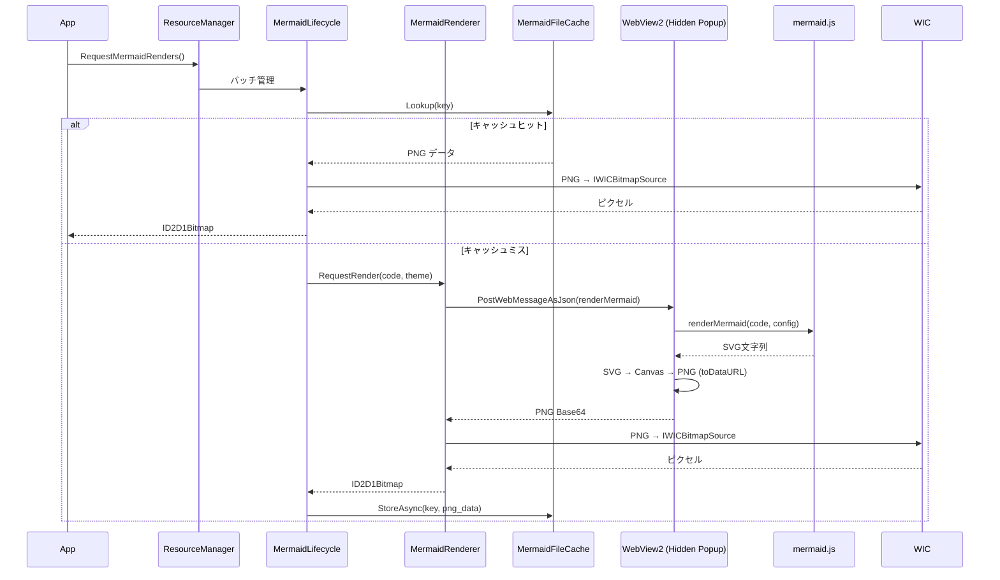

#### 3.12.2 IMermaidRenderer インターフェース

```cpp
class IMermaidRenderer {
public:
    virtual void RequestRender(uint64_t key, std::string_view code, ...) = 0;
    virtual void CancelAll() = 0;
    virtual bool IsReady() const = 0;
    // ...
};
```

`mendo_core` には `MermaidLifecycle`（純粋ロジック）と `IMermaidRenderer` 抽象のみが入り、WebView2 を呼び出す具象 `MermaidRenderer` は `mendo` 実行ファイル側に分離されている。

#### 3.12.3 MermaidFileCache — 永続キャッシュ

```cpp
class MermaidFileCache {
public:
    void Init(float current_dpr, TaskScheduler& scheduler);
    bool Lookup(uint64_t key, CacheEntry& entry, std::vector<uint8_t>& png_data);
    bool LookupDimensions(uint64_t key, CacheEntry& entry) const noexcept;
    void StoreAsync(uint64_t key, float css_width, float css_height,
                    std::vector<uint8_t> png_data);
    void SaveIndex();
    void ClearAll();
    void SetCacheDir(std::wstring_view dir);
    void SetLimits(size_t max_entries, uint64_t max_total_size);
    void Shutdown();
    size_t EntryCount() const noexcept;
    uint64_t TotalSize() const noexcept;

    static constexpr uint32_t MAGIC   = 0x4D454D43u;  // "MEMC"
    static constexpr uint32_t VERSION = 1;
    static constexpr size_t   DEFAULT_MAX_ENTRIES    = 4096;
    static constexpr uint64_t DEFAULT_MAX_TOTAL_SIZE = 1ULL * 1024 * 1024 * 1024; // 1GB
};
```

DPR（デバイスピクセル比）の不一致を検出した場合、キャッシュ全体をクリアする。書き込みは `TaskScheduler` のワーカースレッドで非同期実行される。

#### 3.12.4 初期化

1. 非表示ポップアップウィンドウを作成
2. WebView2環境を非同期初期化
3. gzip圧縮された `mermaid.min.js` をリソースから展開
4. HTMLテンプレートに埋め込み、`NavigateToString()` で読み込み

---

### 3.13 NavigationService / NavHistory — ナビゲーション

#### 3.13.1 NavigationService

ブラウザスタイルの戻る/進むナビゲーションを提供する。

```cpp
class NavigationService {
public:
    explicit NavigationService(NavHistory& history) noexcept;

    struct NavigateResult {
        enum class Type { None, Anchor, ExternalUrl, LoadFile };
        Type type = Type::None;
        std::pmr::wstring target;
        int   node    = -1;
        float offset  = 0.0f;
    };

    NavigateResult HandleLinkClick(std::wstring_view url,
                                   std::wstring_view current_file);
    NavigateResult GoBack(const NavEntry& current);
    NavigateResult GoForward(const NavEntry& current);
    void PushHistory(const NavEntry& entry);
    bool CanGoBack() const noexcept;
    bool CanGoForward() const noexcept;
};
```

#### 3.13.2 NavHistory — 履歴スタック

```cpp
struct NavEntry {
    std::pmr::wstring file_path;
    int   node   = -1;     // ノードインデックス（位置の安定基準）
    float offset = 0.0f;   // ノード先頭からのピクセルオフセット
};

class NavHistory {
public:
    void Push(const NavEntry& current);
    bool GoBack(const NavEntry& current, NavEntry& out);
    bool GoForward(const NavEntry& current, NavEntry& out);
    bool CanGoBack() const noexcept;
    bool CanGoForward() const noexcept;
    size_t BackSize() const noexcept;
    size_t ForwardSize() const noexcept;
    void Clear() noexcept;
    size_t InternedPathCount() const noexcept;

    static constexpr size_t MAX_HISTORY = 1024;
};
```

ファイルパスはインターン化（`std::pmr::deque<PathSlot>` + 参照カウント）され、同一ファイルを多数履歴に積んでもメモリ消費が増えない。位置はノード単位で表現するため、ファイルが編集されて絶対 y 座標が変わっても同一ノードに戻れる。

#### 3.13.3 ナビゲーションフロー

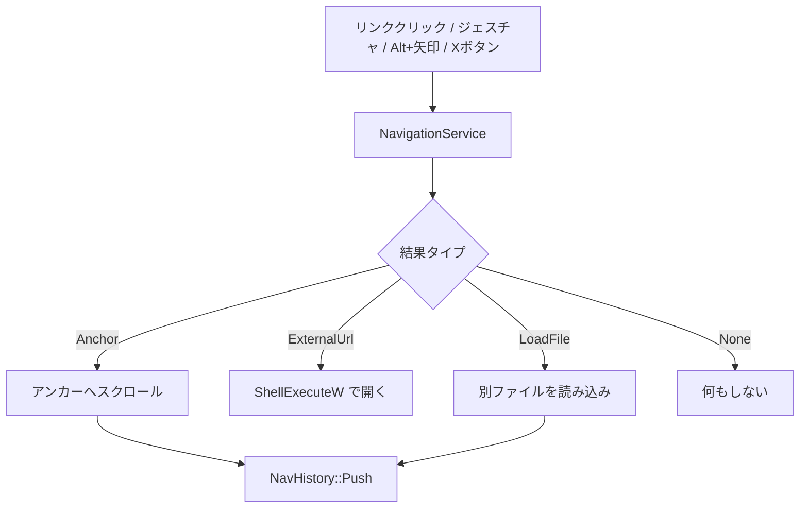

---

### 3.14 MouseGesture — マウスジェスチャ

#### 3.14.1 状態遷移

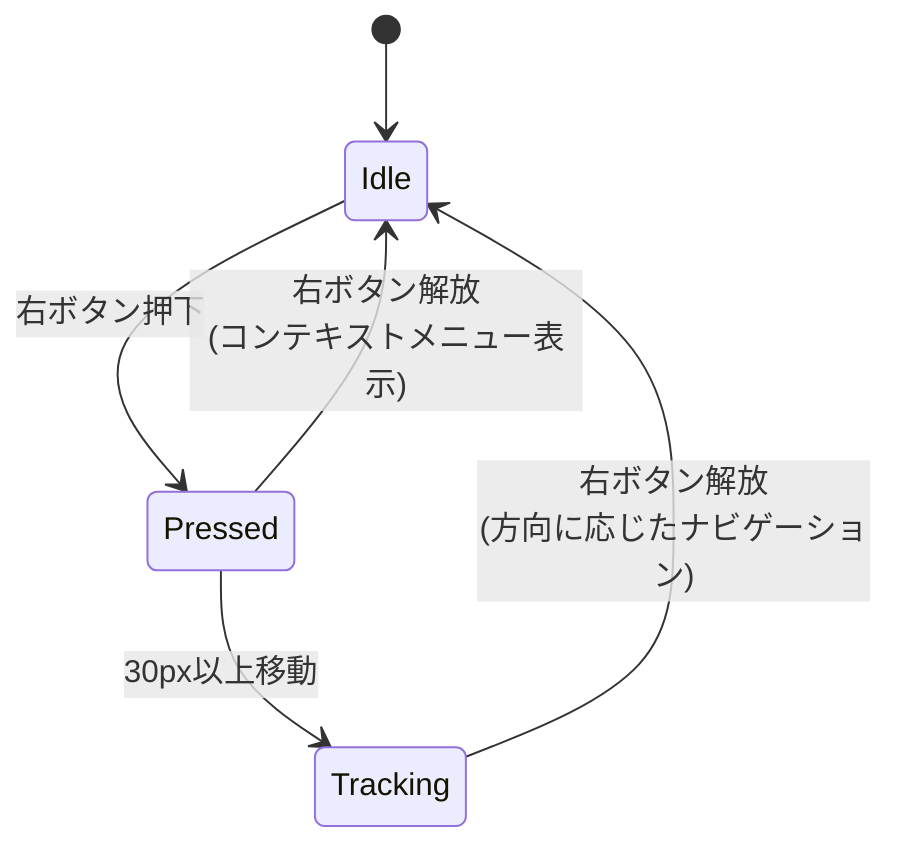

#### 3.14.2 パラメータ

| パラメータ | 値 | 説明 |
|:----------|:---|:-----|
| `GESTURE_THRESHOLD` | 30.0f (DIP) | ジェスチャ開始の移動距離閾値 |
| `MIN_POINT_DISTANCE` | 2.0f | トレイル軌跡のサンプリング最小距離 |
| `TRAIL_MAX_POINTS` | 512 | トレイル軌跡の最大ポイント数 |

---

### 3.15 SwipeDetector — タッチパッドスワイプ検出

`WM_MOUSEHWHEEL` の累積デルタに基づくスワイプ検出。

```cpp
enum class SwipeResult { None, Back, Forward };

class SwipeDetector {
public:
    void OnHWheel(int delta, uint64_t now_ms) noexcept;
    SwipeResult Commit() noexcept;
    void NotifyVScroll(uint64_t now_ms) noexcept;
    void Reset() noexcept;
    constexpr bool IsOverlayVisible() const noexcept;
    constexpr int GetOverlayDirection() const noexcept;
    constexpr float GetOverlayAlpha() const noexcept;
    constexpr int GetAccumulatedDelta() const noexcept;

    static constexpr int      TRIGGER_THRESHOLD = 400;
    static constexpr uint64_t AXIS_LOCK_MS      = 200;
    static constexpr uint64_t RESET_TIMEOUT_MS  = 500;
    static constexpr uint64_t COMMIT_TIMEOUT_MS = 150;
};
```

| パラメータ | 値 | 説明 |
|:----------|:---|:-----|
| `TRIGGER_THRESHOLD` | 400 | 発火の累積デルタ閾値（WHEEL_DELTA単位） |
| `AXIS_LOCK_MS` | 200ms | 縦スクロール後の軸ロック期間 |
| `RESET_TIMEOUT_MS` | 500ms | 入力なしで蓄積をリセットするタイムアウト |
| `COMMIT_TIMEOUT_MS` | 150ms | 指を離してから発火までの待機 |

---

### 3.16 ViewportManager — ビューポート管理

スクロール・選択・ズームの純粋な状態管理。Win32依存なし。

```cpp
struct ScrollTarget {
    int   node   = -1;
    float offset = 0.0f;
    constexpr bool IsValid() const noexcept;
};

class ViewportManager {
public:
    // スクロール
    constexpr float GetScrollY() const noexcept;
    constexpr float GetMaxScroll() const noexcept;
    constexpr void  ScrollTo(float position) noexcept;
    constexpr void  DirectScrollBy(float delta) noexcept;
    constexpr void  SyncMaxScroll(float total_h, float viewport_h) noexcept;
    constexpr int   FindFirstVisibleNode(const LayoutCache& cache, size_t count) const noexcept;

    // ScrollTarget — ノード相対位置によるスクロール復元
    constexpr void SetScrollTarget(int node, float offset) noexcept;
    constexpr void ClearScrollTarget() noexcept;
    constexpr bool HasScrollTarget() const noexcept;
    constexpr void ApplyScrollTarget(const LayoutCache& cache) noexcept;
    constexpr void EnsureScrollTarget(const LayoutCache& cache, size_t count) noexcept;

    // 選択
    constexpr const TextSelection& GetSelection() const noexcept;
    constexpr TextSelection& GetSelectionMut() noexcept;
    constexpr void SelectAll(const std::pmr::vector<Node>& nodes) noexcept;
    constexpr void ClearSelection() noexcept;
    // anchor / drag 状態など

    // ズーム
    constexpr int   GetZoomIndex() const noexcept;
    constexpr void  SetZoomIndex(int idx) noexcept;
    constexpr float GetCurrentZoom() const noexcept;
    constexpr float ZoomIn() noexcept;
    constexpr float ZoomOut() noexcept;
    constexpr float ZoomReset() noexcept;
};
```

`ScrollTarget` は **「ノード i の先頭から offset ピクセル下」** という相対位置を保持する。ファイル再読み込み・ズーム・DPI 変更でレイアウトが変わっても、同じノードに戻ることで「見ている位置を保つ」を実現する。

---

### 3.17 PaneController — ペイン管理

3ペイン（File / TOC / Markdown）の表示状態・幅・スクロール・ホバー・ドラッグを統合管理する。Win32依存なし。

```cpp
class PaneController {
public:
    enum class DragTarget {
        None, Splitter1, Splitter2,
        FileScrollbar, TocScrollbar, MdScrollbar
    };

    // 表示切替
    constexpr bool IsFilePaneVisible() const noexcept;
    constexpr bool IsTocPaneVisible() const noexcept;
    constexpr void ToggleFilePane() noexcept;
    constexpr void ToggleTocPane() noexcept;

    // 幅
    constexpr float GetFilePaneWidth() const noexcept;
    constexpr float GetTocPaneWidth() const noexcept;
    constexpr void  SetFilePaneWidth(float w) noexcept;
    constexpr void  SetTocPaneWidth(float w) noexcept;

    // スクロール
    bool ScrollFilePaneBy(float delta, float max_scroll) noexcept;
    bool ScrollTocPaneBy(float delta, float max_scroll) noexcept;

    // ホバー / ドラッグ
    bool SetHoveredFileIndex(int idx) noexcept;
    bool SetHoveredTocIndex(int idx) noexcept;
    constexpr void StartDrag(DragTarget t) noexcept;
    constexpr void EndDrag() noexcept;
    void DragSplitter1To(float dip_x, float total_w, float splitter_w) noexcept;
    void DragSplitter2To(float dip_x, float total_w, float splitter_w) noexcept;

    void ApplyZoom(float ratio) noexcept;

    PaneLayout ComputeLayout(float total_w, float total_h, float splitter_w,
                             float top_offset = 0.0f) const noexcept;
    PaneZone DetectZone(float dip_x, float total_w, float total_h, float splitter_w) const noexcept;

    static constexpr float PANE_DEFAULT_WIDTH = 220.0f;
    static constexpr float PANE_MIN_WIDTH     = 100.0f;
    static constexpr float MD_PANE_MIN_WIDTH  = 200.0f;
};
```

#### 3.17.1 ペイン構成

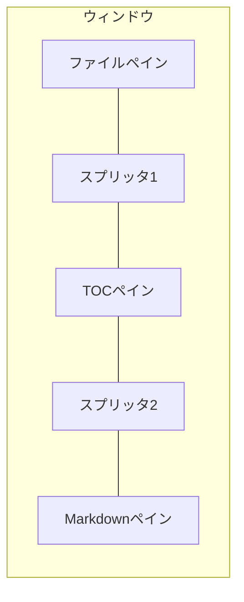

| ペイン | 既定幅 | 最小幅 | 内容 |
|:-------|:-------|:-------|:-----|
| ファイルペイン | 220px | 100px | ディレクトリ内のファイル一覧 |
| TOCペイン | 220px | 100px | 見出しベースの目次 |
| Markdownペイン | 残り全幅 | 200px | Markdownコンテンツ |
| スプリッタ | テーマ依存（`Theme::splitter_width`） | — | ペイン間の境界線 |

---

### 3.18 HitTestService — ヒットテスト

```cpp
class HitTestService {
public:
    struct HitResult {
        int node_index = -1;
        uint32_t text_pos = 0;
    };

    HitResult HitTest(const std::pmr::vector<Node>&, const LayoutCache&, ...) const noexcept;
    HitResult HitTestTable(const Node&, const NodeLayoutEntry&, ...) const noexcept;

    enum class NavButtonHover { None, Back, Forward };
    NavButtonHover NavButtonHitTest(float dip_x, float dip_y,
                                    const PaneRect& md_rect) const noexcept;

    // コードブロックコピーボタン / Mermaid保存ボタンのヒットテスト
    int CopyButtonHitTest(...) const noexcept;
    int SaveButtonHitTest(const std::pmr::vector<Node>&, const LayoutCache&, ...) const noexcept;
};
```

---

### 3.19 ConfigStore / ConfigService / SessionService — 設定永続化

#### 3.19.1 保存先・形式

```
%LOCALAPPDATA%\mendo\settings.ini
```

`IniParser` で読み書きし、セクション+キーの2階層でアクセスする。書き込みは `*.tmp` → `MoveFileExW(MOVEFILE_REPLACE_EXISTING)` の原子的差し替え。

#### 3.19.2 保存項目

| セクション | キー | 型 | 既定値 | 説明 |
|:-----------|:-----|:---|:------|:-----|
| `General` | `Language` | `wstring` | （OS自動判定） | UI言語 (`ja` / `en`) |
| `View` | `DarkMode` | `bool` | `false` | ダークモード |
| `View` | `ZoomLevel` | `int` | `7` (1.00x) | ズームインデックス |
| `Pane` | `ShowFile` | `bool` | `true` | ファイルペイン表示 |
| `Pane` | `ShowToc` | `bool` | `true` | TOCペイン表示 |
| `Pane` | `FileWidth` | `int` | `220` (DIP) | ファイルペイン幅 |
| `Pane` | `TocWidth` | `int` | `220` (DIP) | TOCペイン幅 |
| `Session` | `LastFile` | `wstring` | 空文字列 | 最後に開いたファイルパス |
| `Session` | `ScrollNode` | `int` | `-1` | スクロール位置（ノードインデックス） |
| `Session` | `ScrollOffset` | `int` | `0` | スクロール位置（ノード内オフセット） |

#### 3.19.3 ConfigStore（名前空間関数）

```cpp
namespace config {
    void SetConfigDirOverride(const std::filesystem::path& dir); // テスト用
    std::filesystem::path GetConfigDir();
    std::filesystem::path GetConfigPath(std::wstring_view filename);

    void Load();
    void Save();
    void Clear() noexcept;

    void SetBool(std::string_view section, std::string_view key, bool value);
    bool GetBool(std::string_view section, std::string_view key, bool default_value = false);
    void SetInt(std::string_view section, std::string_view key, int value);
    int  GetInt(std::string_view section, std::string_view key, int default_value, int min_val, int max_val);
    void SetWString(std::string_view section, std::string_view key, std::wstring_view value);
    std::pmr::wstring GetWString(std::string_view section, std::string_view key);
}
```

#### 3.19.4 ConfigService

`ConfigStore` の名前空間関数を `class` でラップし、テスト時のモック差し替えを可能にする。

```cpp
class ConfigService {
public:
    void SaveBool(std::string_view section, std::string_view key, bool value);
    bool LoadBool(std::string_view section, std::string_view key, bool default_value = false) const;
    void SaveInt(std::string_view section, std::string_view key, int value);
    int  LoadInt(std::string_view section, std::string_view key, int def, int min_v, int max_v) const;
    void SaveWString(std::string_view section, std::string_view key, std::wstring_view value);
    std::pmr::wstring LoadWString(std::string_view section, std::string_view key) const;
    void Flush();
};
```

#### 3.19.5 SessionService

セッション状態（最後に開いたファイル、ペイン構成、スクロール位置）の永続化を担当する。

```cpp
class SessionService {
public:
    explicit SessionService(ConfigService& config) noexcept;

    void              SaveLastFilePath(std::wstring_view path);
    std::pmr::wstring LoadLastFilePath() const;

    void SavePaneState(const PaneController& panes);
    void LoadPaneState(PaneController& panes, float client_width);

    struct ScrollPosition {
        int node   = -1;
        int offset = 0;
    };
    void           SaveScrollPosition(int node, int offset);
    ScrollPosition LoadScrollPosition() const;
};
```

---

### 3.20 TitleBar — カスタムタイトルバー

#### 3.20.1 概要

Win32 標準タイトルバーを `WM_NCCALCSIZE` で非表示にし、Direct2D で自前描画したカスタムタイトルバーに置き換える。ファイルを開く・検索・テーマ切替・ヘルプ・ペイントトグル・最小化/最大化/閉じるボタンを含む。

```cpp
enum class TitleBarHitZone {
    None, Caption, Icon,
    OpenFile, Help, ThemeToggle, Search,
    FileToggle, TocToggle,
    Minimize, Maximize, Close,
};

struct TitleBarButton {
    DipRect rect{};
    bool hovered = false;
};

class TitleBar {
public:
    static constexpr float BASE_HEIGHT       = 32.0f;
    static constexpr float BUTTON_WIDTH      = 32.0f;
    static constexpr float ICON_LEFT_MARGIN  = 8.0f;
    static constexpr float ICON_SIZE         = 24.0f;
    static constexpr float ICON_RIGHT_GAP    = 4.0f;
    static constexpr float BUTTON_GAP        = 2.0f;
    static constexpr float CAPTION_BTN_WIDTH = 46.0f;

    constexpr float GetHeight() const noexcept;
    void UpdateLayout(float window_width_dip) noexcept;
    TitleBarHitZone HitTest(float dip_x, float dip_y) const noexcept;
    bool SetHovered(TitleBarHitZone zone) noexcept;
    constexpr TitleBarHitZone GetHovered() const noexcept;

    // 各ボタンへのアクセサ
    constexpr const TitleBarButton& GetOpenFileButton() const noexcept;
    constexpr const TitleBarButton& GetHelpButton() const noexcept;
    constexpr const TitleBarButton& GetThemeToggleButton() const noexcept;
    constexpr const TitleBarButton& GetSearchButton() const noexcept;
    constexpr const TitleBarButton& GetFileToggleButton() const noexcept;
    constexpr const TitleBarButton& GetTocToggleButton() const noexcept;
    constexpr const TitleBarButton& GetMinimizeButton() const noexcept;
    constexpr const TitleBarButton& GetMaximizeButton() const noexcept;
    constexpr const TitleBarButton& GetCloseButton() const noexcept;
    constexpr const DipRect& GetIconRect() const noexcept;
    constexpr const DipRect& GetTitleTextRect() const noexcept;
};
```

#### 3.20.2 ボタン配置

```
┌────────────────────────────────────────────────────────────────────┐
│ [Icon] [Open] [Search] [Theme] [Help] ←タイトル→ [File] [TOC] [─][□][×]│
│  左側グループ                                        右側グループ        │
└────────────────────────────────────────────────────────────────────┘
```

- **左側**（アイコンの右から）: OpenFile → Search → ThemeToggle → Help
- **右側**（右端から）: Close ← Maximize ← Minimize ← TocToggle ← FileToggle
- **タイトルテキスト**: 左側グループの右端から FileToggle の左端まで

---

### 3.21 SearchState / SearchBarController — 検索

#### 3.21.1 SearchState（ドメインロジック）

```cpp
struct SearchMatch {
    int node_index;
    uint32_t start;
    uint32_t length;
    int table_row = -1;
    int table_col = -1;
};

class SearchState {
public:
    bool IsVisible() const noexcept;
    void Show() noexcept;
    void Hide() noexcept;
    void Reset() noexcept;

    const std::wstring& GetQuery() const noexcept;
    const std::vector<SearchMatch>& GetMatches() const noexcept;
    int GetCurrentMatchIndex() const noexcept;
    int GetMatchCount() const noexcept;

    bool IsCaseSensitive() const noexcept;
    void ToggleCaseSensitive() noexcept;
    bool IsHighlightEnabled() const noexcept;
    void ToggleHighlightEnabled() noexcept;

    void SetQuery(std::wstring_view query);
    void ExecuteSearch(const std::pmr::vector<Node>& nodes);
    bool NextMatch() noexcept;   // ラップ時 true
    bool PrevMatch() noexcept;   // ラップ時 true
    void SetCurrentMatchNear(float scroll_y, const LayoutCache& cache) noexcept;

    static constexpr size_t MAX_MATCHES = 10000;
};
```

#### 3.21.2 SearchBarController（UI制御）

検索バーのUI状態（フォーカス、キャレット、ドラッグ選択、ホバー）を管理する。Win32 操作はコールバック経由で App に委譲する。

```cpp
class SearchBarController {
public:
    enum class HoverZone : uint8_t {
        None, Up, Down, Close, CaseSensitive, Highlight
    };

    struct Callbacks {
        std::function<void()>           invalidate;
        std::function<void()>           invalidate_search_bar;
        std::function<void(UINT_PTR, UINT)> set_timer;
        std::function<void(UINT_PTR)>   kill_timer;
        std::function<void()>           focus_select_all;
        std::function<void(int)>        focus_set_caret;
        std::function<void(int, int)>   focus_set_selection;
        std::function<void()>           unfocus;
        std::function<float()>          get_md_pane_height;
        std::function<void(float)>      on_scroll_changed;
    };

    static constexpr UINT_PTR TIMER_CARET    = 7;
    static constexpr UINT_PTR TIMER_DEBOUNCE = 9;
};
```

#### 3.21.3 検索バーUI

下部にドッキングされ、以下のコントロールを含む。

- テキスト入力（IME対応）
- 前へ / 次へボタン
- 大文字小文字区別トグル
- ハイライト切替トグル
- 閉じるボタン
- 一致件数表示（`X / Y`）

| 対象 | 色 | アルファ |
|:-----|:---|:--------|
| 現在の一致 | オレンジ系 (`search_highlight_current_color`) | 60% |
| その他の一致 | 黄色系 (`search_highlight_color`) | 40% |
| 一致なし入力背景 | 薄赤 (`search_no_match_bg_color`) | — |

---

### 3.22 ContextMenu — カスタムコンテキストメニュー

`ContextMenu` は Win32 のシステムメニューの代わりに、Direct2D で自前描画するカスタムコンテキストメニュー。`context_menu_logic.cpp`（mendo_core 入り、純粋ロジック）と `context_menu.cpp`（D2D 描画）に分離されている。

```cpp
struct ContextMenuParams {
    int   screen_x = 0;
    int   screen_y = 0;
    float dpi_scale = 1.0f;
    bool  can_go_back = false;
    bool  can_go_forward = false;
    bool  has_file = false;
    bool  has_selection = false;
    bool  dark_mode_checked = false;
    bool  file_pane_checked = false;
    bool  toc_pane_checked = false;
    bool  show_file_items = false;  // MdPaneの場合のみtrue
    const Theme* theme = nullptr;
};

class ContextMenu {
public:
    enum class ItemType { NavRow, Separator, Text };

    void Init(ID2D1Factory* d2d_factory, IDWriteFactory* dwrite_factory);
    int  Show(HWND owner, const ContextMenuParams& params);
    int  HitTest(float x, float y) const;
    int  NavHitTest(float x, float y) const;
};
```

#### 3.22.1 メニュー構成

```
┌──────────────────────────────────┐
│ ← [戻る]  [進む] →               │  NavRow（横並び）
├──────────────────────────────────┤
│ エディタで開く                    │  ※ MdPaneのみ
├──────────────────────────────────┤
│ コピー                           │  ※ 選択あり時のみ有効
├──────────────────────────────────┤
│ 書式付きコピー                    │  ※ HTML形式
├──────────────────────────────────┤
│ ☑ ダークモード                    │
├──────────────────────────────────┤
│ ☑ ファイルペイン                  │
├──────────────────────────────────┤
│ ☑ 目次ペイン                     │
└──────────────────────────────────┘
```

---

### 3.23 ImageLoader — 非同期画像読み込み

WIC を使用した非同期画像読み込み。ワーカースレッドでデコードし、UIスレッドで `ID2D1Bitmap` に変換する。

```cpp
class ImageLoader {
public:
    void Init(ID2D1RenderTarget* rt);
    void InitAsync(HWND hwnd, UINT msg_id);
    bool LoadImage(const std::wstring& path, DiagramEntry& out);
    bool GetCachedImage(const std::wstring& path, DiagramEntry& out);
    void RequestLoadAsync(const std::wstring& path);
    void ProcessCompletedDecodes();
    void CancelPending();
    void ClearCache();
    void Shutdown();
};
```

| 形式 | 拡張子 |
|:-----|:------|
| PNG | `.png` |
| JPEG | `.jpg`, `.jpeg` |
| BMP | `.bmp` |

その他、WIC が対応する形式すべてをデコード可能。

---

### 3.24 ToastNotifier — トースト通知

短期間表示されるフェードアウト型の通知。

```cpp
class ToastNotifier {
public:
    static constexpr float INITIAL_ALPHA = 2.5f;
    static constexpr float FADE_SPEED    = 0.03f;

    void Show(std::wstring_view message);
    bool Tick() noexcept;
    void Reset() noexcept;
    bool IsVisible() const noexcept;
    float GetRenderAlpha() const noexcept;
    std::wstring_view GetMessage() const noexcept;
};
```

初期アルファ値 2.5（1.0 を超える部分は完全不透明を維持する猶予時間）から `FADE_SPEED` ずつ減算し、0 以下で非表示になる。描画時のアルファは `clamp(0, 1)` で適用される。

---

### 3.25 Tooltip — ツールチップ

Win32 の `TOOLTIPS_CLASS` を `TTF_TRACK` モードでラップし、マウスホバー時のツールチップを表示する。

```cpp
struct TooltipTarget {
    enum class Zone : uint8_t {
        None, TitleBarButton, SearchBarButton, FilePaneItem,
        FilePaneButton, TocPaneItem, TocPaneButton, MdLink,
        MdImage, CopyButton, SaveButton, NavButton
    };
    Zone zone = Zone::None;
    std::wstring text;
    bool operator==(const TooltipTarget&) const = default;
    bool IsEmpty() const noexcept;
};

class Tooltip {
public:
    void Init(HWND parent);
    bool Update(const TooltipTarget& target, POINT screen_pos);
    void Show();
    void Hide();
    void ApplyDarkMode(bool dark);
    void ResetTarget() noexcept;
};
```

最大幅 600px、カーソルから 20px 下にオフセット、DPI スケーリング対応。

---

### 3.26 ResourceManager — 画像・Mermaidリソース管理

App から画像読み込み、Mermaidバッチ処理、ビットマップ解放の責務を分離する。

```cpp
class ResourceManager {
public:
    struct Callbacks {
        std::function<void()>             invalidate;
        std::function<void(UINT_PTR, UINT)> set_timer;
        std::function<void(UINT_PTR)>     kill_timer;
        std::function<float()>            get_content_width;
        std::function<float()>            get_viewport_height;
        std::function<float()>            get_indent_width;
        std::function<void()>             recompute_layout;
        std::function<void()>             recompute_layout_anchored;
    };

    static constexpr UINT_PTR TIMER_MERMAID_BATCH = 10;
    static constexpr UINT_PTR TIMER_BITMAP_MANAGE = 11;
    static constexpr float    EVICT_BUFFER_SCREENS    = 5.0f;
    static constexpr float    PREFETCH_BUFFER_SCREENS = 3.0f;
    static constexpr int      BATCH_TIME_BUDGET_US    = 6000;
};
```

`Mermaid` はバッチ単位でレンダリングし、可視範囲外のビットマップを LRU 的に解放する。

---

### 3.27 補助コンポーネント

#### 3.27.1 ScrollRestoration — スクロール位置復元

```cpp
struct ScrollRestoration {
    int   pending_restore_node    = -1;
    int   pending_restore_offset  = 0;

    bool HasNodeRestore() const noexcept;
    void SetNodeRestore(int node, int offset) noexcept;
    void ClearNodeRestore() noexcept;
};
```

セッション復元・ファイル切替時のスクロール復元情報を保持する。

#### 3.27.2 CursorManager — カーソルハンドルキャッシュ

```cpp
class CursorManager {
public:
    void Init() noexcept;
    HCURSOR Arrow() const noexcept;
    HCURSOR Hand() const noexcept;
    HCURSOR IBeam() const noexcept;
    HCURSOR SizeWE() const noexcept;
};
```

`LoadCursorW` の呼び出しを初期化時に一度だけ行う。

#### 3.27.3 HoverThrottle — ホバースロットリング

```cpp
struct HoverThrottle {
    POINT last_md_hit_pos;
    bool  last_md_cursor_hand;
    POINT last_copy_hit_pos;
    POINT last_save_hit_pos;
    void  Reset() noexcept;
};
```

マウス位置が一定距離（`HOVER_THROTTLE_DISTANCE_SQ = 16` ピクセル²）以上動いた場合のみヒットテストを再実行する。

---

### 3.28 ユーティリティ

#### 3.28.1 LruCache — 汎用LRUキャッシュ

```cpp
template <typename Key, typename Value>
class LruCache {
public:
    explicit LruCache(size_t max_entries);
    Value* Find(const Key& key);
    void   Insert(const Key& key, Value value);
    void   Erase(const Key& key);
    void   Clear();
    size_t Size() const noexcept;
};
```

#### 3.28.2 UniqueResource — RAII ハンドルラッパー

ポリシーベースの汎用 RAII リソースラッパー。

```cpp
template<typename Traits>
class UniqueResource {
public:
    explicit UniqueResource(handle_t h) noexcept;
    explicit operator bool() const noexcept;
    handle_t get() const noexcept;
    handle_t release() noexcept;
    void reset(handle_t h = Traits::invalid()) noexcept;
};

// 定義済み
using UniqueHandle      = UniqueResource<HandleTraits>;       // CloseHandle
using UniqueEventHandle = UniqueResource<EventHandleTraits>;  // CloseHandle (nullptr)
using UniqueFindHandle  = UniqueResource<FindHandleTraits>;   // FindClose
using UniqueGlobalLock  = UniqueResource<GlobalLockTraits>;   // GlobalUnlock
using UniqueGlobalMem   = UniqueResource<GlobalMemTraits>;    // GlobalFree
```

クリップボードユーティリティ関数（`WriteClipboardText`, `BuildCfHtmlPayload`, `WriteClipboardHtml`）も `win_handle.h` に同梱されている。

#### 3.28.3 TaskScheduler — ワーカースレッドプール

```cpp
class TaskScheduler {
public:
    void Init(int thread_count);
    void Post(std::move_only_function<void()> task);  // スレッドセーフ
    void Shutdown();
};
```

各ワーカースレッドは `CoInitializeEx(COINIT_MULTITHREADED)` を自動呼び出しする。`MermaidFileCache` の非同期書き込み、`FileLoadService` のバックグラウンドロードなどに使用される。

#### 3.28.4 MemoryResource — PMRメモリ管理

```cpp
std::pmr::synchronized_pool_resource& GetGlobalPoolResource();
void InitGlobalMemoryResource();

class MonotonicResource {
public:
    explicit MonotonicResource(std::size_t initial_size = 16 * 1024);
    std::pmr::memory_resource* resource() noexcept;
    void Reset();
};
```

`std::pmr::wstring` / `std::pmr::vector` の使用により、頻繁なヒープアロケーションを抑制している。

#### 3.28.5 IniParser — INIファイルパーサ

ヘッダオンリーの軽量パーサ。`[Section]` と `Key=Value` 形式をサポートし、`;` / `#` コメントを無視する。

```cpp
namespace ini {
    using IniData = std::map<std::string,
                             std::map<std::string, std::string, std::less<>>,
                             std::less<>>;

    IniData     Parse(std::string_view text);
    std::string Serialize(const IniData& data);
}
```

#### 3.28.6 i18n — 国際化

UI文字列のローカライズ。日本語 (`ja`) / 英語 (`en`) の2言語をサポート。

```cpp
namespace i18n {
    enum class Lang : uint8_t { Ja, En };
    struct Strings { /* 文字列フィールド多数 */ };

    void Init(std::wstring_view config_lang) noexcept;
    const Strings& S() noexcept;
    std::wstring_view GetLangKey() noexcept;
}
```

`config_lang` が `"ja"` / `"en"` なら直接選択、空または未知の場合は `GetUserDefaultUILanguage()` から自動判定する。

#### 3.28.7 StringConvert — 文字列変換ユーティリティ

UTF-8 ↔ ワイド文字変換のヘッダオンリーユーティリティ。

```cpp
namespace string_convert {
    void Utf8ToWide(std::string_view utf8, std::pmr::wstring& out);
    std::pmr::wstring Utf8ToWide(std::string_view utf8);
    std::string WideToUtf8(std::wstring_view wide);
}
```

#### 3.28.8 FlatMap — 線形検索ベースの順序マップ

少数エントリ向けに最適化された順序付きマップ。`syntax_keywords.h` などで使用する。

#### 3.28.9 Profiler — パフォーマンス計測

```cpp
class ScopedProfileTimer {
    explicit ScopedProfileTimer(const wchar_t* label) noexcept;
    ~ScopedProfileTimer() noexcept; // 経過時間を OutputDebugString に出力
};

#define MENDO_PROFILE(label) ScopedProfileTimer ...
```

`MENDO_PROFILE_ENABLED = 0`（Releaseビルド時）で完全に無効化される。

---

### 3.29 UIConstants / DipRect

#### 3.29.1 UIConstants

`ui_constants.h` には UI 全体で共有される定数とヘルパー関数を集約する。

| 定数グループ | 内容 |
|:------------|:-----|
| Spinner | ローディングスピナーの半径・ドット数・回転速度 |
| Table | セルパディング・ボーダー幅 |
| NavButton | 戻る/進むボタンのサイズ・マージン・角丸 |
| CopyButton | コードブロックコピーボタンのサイズ・マージン |
| ScrollSnap | ピクセルスナップ関数 |
| PaneButton | ペイン閉じる/更新ボタンの矩形計算 |
| MouseScroll | `MOUSE_WHEEL_SCROLL_MULTIPLIER` などのホイール倍率 |

#### 3.29.2 DipRect

```cpp
struct DipRect {
    float left, top, right, bottom;
    constexpr float Width() const noexcept;
    constexpr float Height() const noexcept;
    constexpr bool  Contains(float x, float y) const noexcept;
};
```

タイトルバーボタンなど、DIP 単位の矩形計算に使用する。

---

## 4. データ構造

### 4.1 Node

ドメイン中核となるパース出力。レイアウト情報は `LayoutCache` に分離されている。

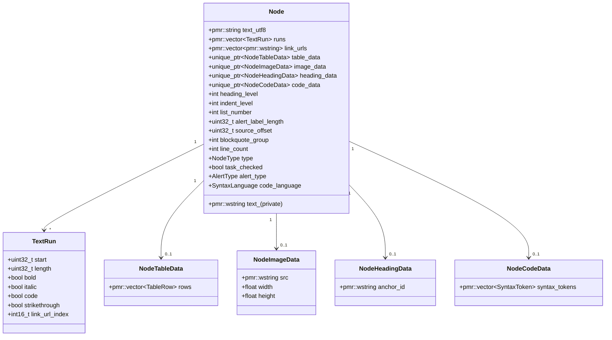

`NodeHeadingData` / `NodeCodeData` などは該当ノードのみで `unique_ptr` 確保し、メモリ消費を抑える。`text_utf8` はパース中の蓄積領域で、パース完了後 `ConvertTextFromUtf8()` で `text_`（Wide）に変換される。

### 4.2 LayoutCache

レイアウト情報を Node から分離して管理する。

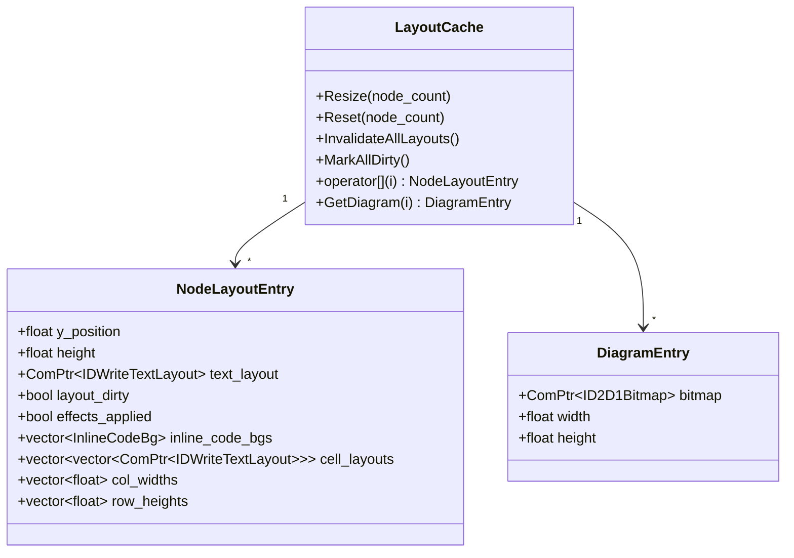

### 4.3 Document

```cpp
class Document {
public:
    static Document FromMarkdown(const std::string& utf8, std::pmr::wstring path);

    const std::pmr::vector<Node>& GetNodes() const noexcept;
    std::pmr::vector<Node>& GetNodesMut() noexcept;
    const std::pmr::wstring& GetFilePath() const noexcept;
    const TableOfContents& GetToc() const noexcept;
    bool IsEmpty() const noexcept;
    std::pmr::wstring GetDirectory() const;

    void ReplaceContent(std::pmr::vector<Node> new_nodes);
    void ReplaceFromMarkdown(const std::string& utf8);
};
```

### 4.4 NodeType / AlertType

```cpp
enum class NodeType : uint8_t {
    Heading, Paragraph, CodeBlock, HorizontalRule,
    ListItem, BlockQuote, Table, TaskListItem, Image
};

enum class AlertType : uint8_t {
    None = 0, Note = 1, Tip = 2, Important = 3, Warning = 4, Caution = 5
};
inline constexpr size_t ALERT_TYPE_COUNT = 5;
```

### 4.5 TextSelection

```cpp
struct TextSelection {
    int      start_node = -1;
    uint32_t start_pos  = 0;
    int      end_node   = -1;
    uint32_t end_pos    = 0;
    bool     active     = false;

    constexpr void Clear() noexcept;
    static constexpr TextSelection MakeOrdered(
        int node_a, uint32_t pos_a,
        int node_b, uint32_t pos_b) noexcept;
};
```

---

## 5. 処理フロー

### 5.1 アプリケーション起動

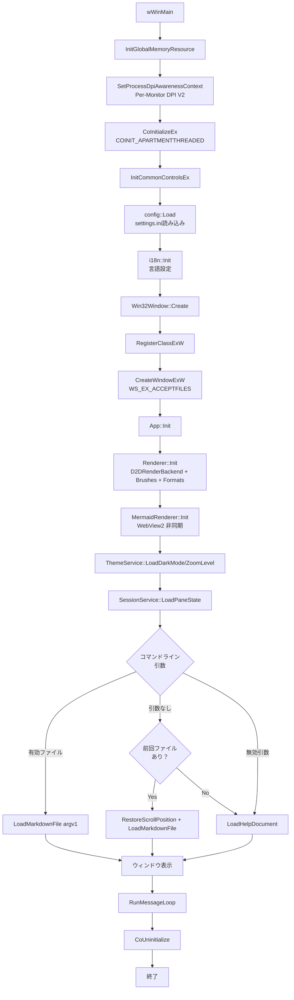

### 5.2 ファイル読み込みから描画まで

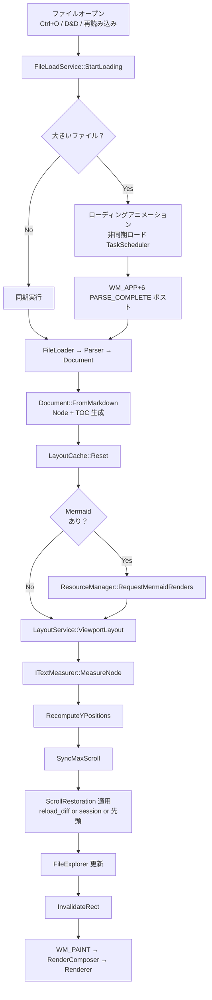

### 5.3 描画フロー

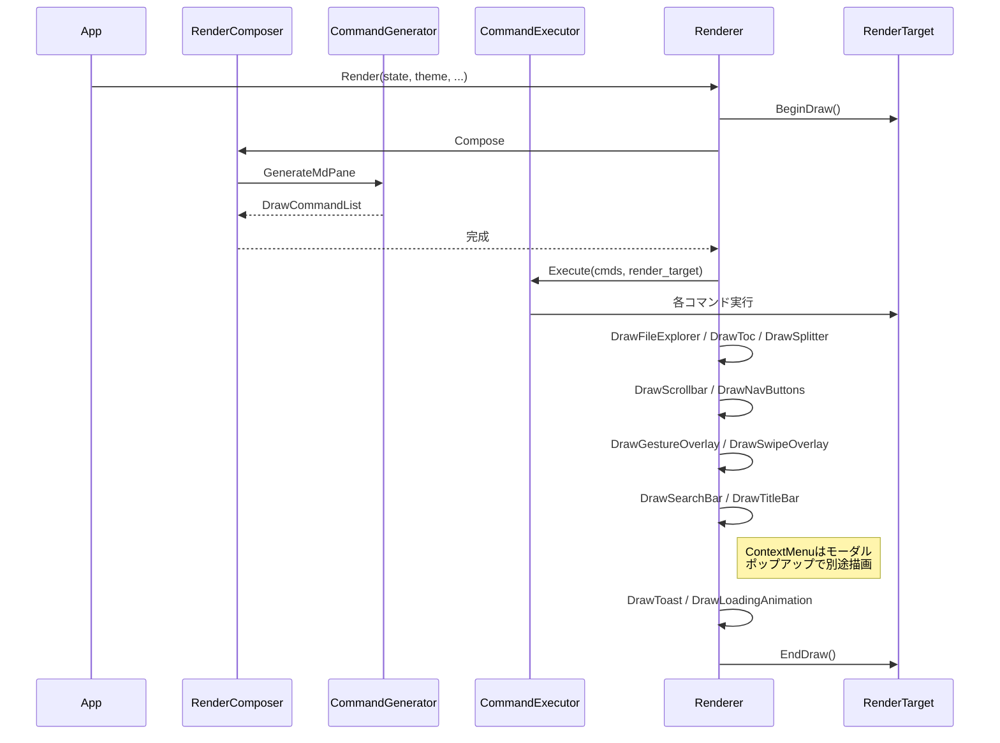

---

## 6. ビルドシステム

### 6.1 CMake 構成

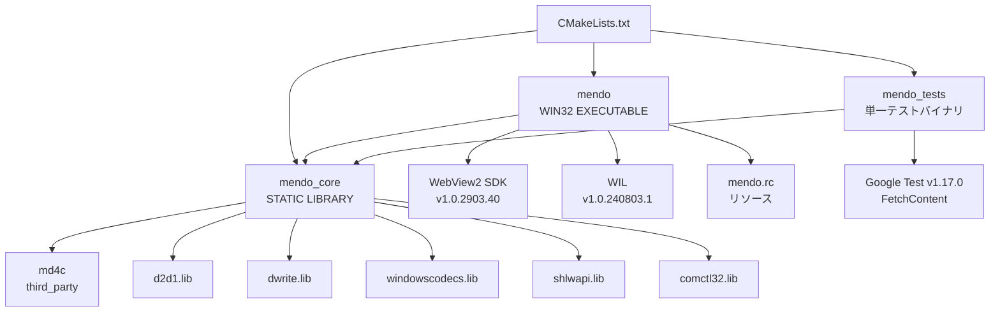

### 6.2 ビルドコマンド

**通常ビルド:**

```bash
cmake -B build
cmake --build build --config Release
```

**テストなしビルド:**

```bash
cmake -B build -DMENDO_BUILD_TESTS=OFF
cmake --build build --config Release
```

**テスト実行:**

```bash
ctest --test-dir build --output-on-failure -C Release
# または
build/tests/Release/mendo_tests.exe --gtest_brief=1
```

### 6.3 ビルドターゲット

| ターゲット | 種別 | 説明 |
|:-----------|:-----|:-----|
| `md4c` | 静的ライブラリ | サードパーティ Markdown パーサ |
| `mendo_core` | 静的ライブラリ | テスト可能なコアロジック（WinMain・ウィンドウ・レンダラ実装を含まない） |
| `mendo` | 実行ファイル (WIN32) | メインアプリケーション |
| `mendo_tests` | テスト | 全テストを含む単一バイナリ |

`mendo_core` には **Win32/Direct2D/WebView2 抽象化越し** のサービスが入る — `IWin32Host` / `IRenderBackend` / `IMermaidRenderer` などを通して、具象実装は `mendo` 実行ファイル側に分離されている。

### 6.4 mermaid.min.js gzip 圧縮

配布 EXE のサイズを削減するため、`mermaid.min.js` はビルド時に gzip 圧縮される（`cmake/gzip.ps1`）。実行時にメモリ上で展開し、WebView2 に渡す。

### 6.5 MSVC ビルド最適化

| オプション | 用途 |
|:----------|:-----|
| `/MP` | マルチプロセッサコンパイル |
| `/GL` | Whole Program Optimization (Release) |
| `/Gy` | Function-Level Linking (Release) |
| `/LTCG` | Link-Time Code Generation (Release) |
| `/OPT:REF` | 未参照関数/データの除去 (Release) |
| `/OPT:ICF` | 同一COMDATの統合 (Release) |
| `/MT` | CRT静的リンク（単一exe配布のため） |

---

## 7. テスト仕様

### 7.1 テストフレームワーク

- **Google Test** v1.17.0（FetchContentで自動取得）
- 単一テストバイナリ `mendo_tests` に全テストをリンク
- `gtest_add_tests` で CTest に登録

### 7.2 テスト対象範囲

```mermaid
pie title テストカバレッジ（ファイル数ベース）
    "テスト済みモジュール" : 60
    "UIコード（テスト対象外）" : 9
```

> **テスト対象外**: `main.cpp`, `window.cpp`, `app.cpp` および app_*.cpp の Win32/D2D ハンドラ実装, `renderer*.cpp`, `d2d_render_backend.cpp`, `mermaid.cpp`, `win32_host_impl.cpp` は Win32 / Direct2D / WebView2 依存のためユニットテスト対象外。これらの責務はインターフェース（`IWin32Host` 等）越しに mendo_core 側でテストされる。

### 7.3 テストソース一覧（抜粋）

| テストファイル | 対象モジュール |
|:--------------|:-------------|
| `test_parser.cpp` | Markdownパーサ |
| `test_layout.cpp` | レイアウトエンジン |
| `test_layout_cache.cpp` | LayoutCache |
| `test_text_measurer.cpp` | ITextMeasurer |
| `test_measurer_parity.cpp` | DWriteMeasurer 整合性 |
| `test_syntax.cpp` | シンタックスハイライト |
| `test_theme.cpp` | テーマ定義 |
| `test_theme_service.cpp` | ThemeService |
| `test_document.cpp` | Document |
| `test_document_service.cpp` | DocumentService |
| `test_document_utils.cpp` | テキスト操作 |
| `test_anchor.cpp` | アンカーID生成 |
| `test_toc.cpp` | 目次生成 |
| `test_types.cpp` | 型・データ構造 |
| `test_file_loader.cpp` | FileLoader |
| `test_file_io.cpp` | ファイルI/O ユーティリティ |
| `test_file_load_service.cpp` | FileLoadService |
| `test_file_explorer.cpp` | FileExplorer |
| `test_session_service.cpp` | SessionService |
| `test_config_store.cpp` | 設定永続化 |
| `test_ini_parser.cpp` | IniParser |
| `test_locale.cpp` | i18n ロケール |
| `test_string_convert.cpp` | UTF-8 ↔ Wide 変換 |
| `test_pane_layout.cpp` | ペインレイアウト計算 |
| `test_pane_controller.cpp` | PaneController |
| `test_viewport_manager.cpp` | ViewportManager |
| `test_scroll_restoration.cpp` | ScrollRestoration |
| `test_hit_test_service.cpp` | HitTestService |
| `test_hover_throttle.cpp` | HoverThrottle |
| `test_mouse_gesture.cpp` | MouseGesture |
| `test_swipe_detector.cpp` | SwipeDetector |
| `test_nav_history.cpp` | NavHistory |
| `test_navigation_service.cpp` | NavigationService |
| `test_nav_button_format.cpp` | ナビゲーションボタン定数 |
| `test_titlebar.cpp` | TitleBar |
| `test_context_menu.cpp` | ContextMenu |
| `test_search_state.cpp` | SearchState |
| `test_search_bar_controller.cpp` | SearchBarController |
| `test_toast_notifier.cpp` | ToastNotifier |
| `test_tooltip_target.cpp` | TooltipTarget |
| `test_ui_constants.cpp` | UIConstants |
| `test_copy_button.cpp` | コピーボタン矩形 |
| `test_image.cpp` | ImageLoader |
| `test_help.cpp` | ヘルプドキュメント |
| `test_mermaid_util.cpp` | Mermaidユーティリティ |
| `test_mermaid_lifecycle.cpp` | MermaidLifecycle |
| `test_mermaid_file_cache.cpp` | MermaidFileCache |
| `test_app_controller.cpp` | AppController |
| `test_reducer.cpp` | Reducer |
| `test_render_composer.cpp` | RenderComposer |
| `test_side_effect_executor.cpp` | SideEffectExecutor |
| `test_resource_manager.cpp` | ResourceManager |
| `test_command_executor.cpp` | CommandExecutor |
| `test_command_generator_frame.cpp` | CommandGenerator フレーム描画 |
| `test_draw_command.cpp` | DrawCommand |
| `test_lru_cache.cpp` | LruCache |
| `test_flat_map.cpp` | FlatMap |
| `test_memory_eviction.cpp` | メモリエビクション |
| `test_task_scheduler.cpp` | TaskScheduler |
| `test_utility.cpp` | ユーティリティ関数 |

### 7.4 主要テストケース

#### Parser テスト

- [x] 見出し（H1〜H6）
- [x] 段落・太字・斜体・取り消し線・インラインコード
- [x] リンクとURL抽出
- [x] コードブロック（言語指定あり/なし）
- [x] 順序付き/なしリスト（ネスト）
- [x] タスクリスト
- [x] テーブル（アライメント）
- [x] 引用ブロック / GitHub Alerts
- [x] 水平線
- [x] Mermaidコードブロック検出

#### Reducer / Effect テスト

- [x] 各 `AppAction` に対する状態遷移
- [x] Effect 発行の妥当性（`HasEffect<T>`, `GetEffect<T>`）
- [x] スクロール／ズーム／ナビゲーションの結合動作

#### NavHistory テスト

- [x] Push / GoBack / GoForward
- [x] 履歴上限（MAX_HISTORY = 1024）
- [x] パスインターン化と参照カウント
- [x] ファイル切替時の履歴保持

#### MermaidFileCache テスト

- [x] キャッシュの保存と読み込み（バイナリ形式 `MEMC` v1）
- [x] LRU エビクション（4096エントリ / 1GB上限）
- [x] DPR 不一致時のクリア

#### 検索テスト

- [x] 検索バーの表示/非表示
- [x] クエリによるテキスト検索と一致件数
- [x] 次/前の一致へのナビゲーション（ラップアラウンド）
- [x] 大文字小文字区別・ハイライト切替
- [x] テーブルセル内の検索
- [x] スクロール位置に基づく最近接一致の選択

#### ビューポートテスト

- [x] ScrollTarget による位置復元
- [x] ズームイン/アウト/リセット
- [x] 全選択/クリア
- [x] max_scroll の同期

---

## 8. DPI対応仕様

### 8.1 DPI認識レベル

**Per-Monitor DPI Awareness V2** を採用。

```mermaid
flowchart LR
    START[アプリ起動] --> SET[SetProcessDpiAwarenessContext<br>DPI_AWARENESS_CONTEXT_PER_MONITOR_AWARE_V2]
    SET --> INIT[初期DPIでリソース作成]
    INIT --> MOVE{モニタ間移動？}
    MOVE -->|Yes| WM[WM_DPICHANGED]
    WM --> RESIZE[ウィンドウサイズ変更<br>SetWindowPos]
    RESIZE --> RECREATE[リソース再作成<br>RenderTarget / Brushes / Formats]
    RECREATE --> RELAYOUT[LayoutCache::MarkAllDirty]
    RELAYOUT --> REPAINT[再描画]
    REPAINT --> MOVE
    MOVE -->|No| WAIT[メッセージ待ち]
    WAIT --> MOVE
```

### 8.2 DIP変換

すべての座標・サイズはDIPで管理する。

```
物理ピクセル = DIP × (DPI / 96.0)
```

---

## 9. タイマーIDとカスタムメッセージ

### 9.1 タイマーID（`src/app/timer_ids.h`）

```cpp
namespace app_timer {
inline constexpr UINT_PTR DEFERRED_LAYOUT       = 3;
inline constexpr UINT_PTR LOADING_ANIM          = 4;
inline constexpr UINT_PTR SWIPE_OVERLAY         = 5;
inline constexpr UINT_PTR TOAST                 = 6;
inline constexpr UINT_PTR SEARCH_CARET          = 7;
inline constexpr UINT_PTR TOOLTIP               = 8;
inline constexpr UINT_PTR SEARCH_DEBOUNCE       = 9;
inline constexpr UINT_PTR MERMAID_BATCH         = 10;
inline constexpr UINT_PTR BITMAP_MANAGE         = 11;
inline constexpr UINT_PTR MERMAID_INIT_RETRY    = 12;
inline constexpr UINT_PTR FILE_RELOAD_DEBOUNCE  = 13;

inline constexpr UINT FRAME_INTERVAL_MS         = 16;   // ~60fps
inline constexpr UINT FILE_RELOAD_DEBOUNCE_MS   = 200;
}
```

### 9.2 カスタムメッセージ（`src/app/app_messages.h`）

```cpp
namespace app_msg {
inline constexpr UINT LOAD_FILE      = WM_APP + 1;
inline constexpr UINT IMAGE_LOADED   = WM_APP + 2;
inline constexpr UINT RELOAD_FILE    = WM_APP + 3;
inline constexpr UINT SEARCH_FOCUS   = WM_APP + 4;
inline constexpr UINT SEARCH_UNFOCUS = WM_APP + 5;
inline constexpr UINT PARSE_COMPLETE = WM_APP + 6;
inline constexpr UINT END            = WM_APP + 7;  // 上限
}
```

`SEARCH_FOCUS` の `WPARAM` は `SEARCH_FOCUS_SELECT_ALL` / `SEARCH_FOCUS_SET_CARET` / `SEARCH_FOCUS_SET_SELECTION` を区別する。

---

## 10. 非機能要件

### 10.1 パフォーマンス目標

| 項目 | 目標値 |
|:-----|:------|
| 小規模ファイル（< 100行）の初回表示 | < 50ms |
| 大規模ファイル（> 10,000行）の初回表示 | < 500ms |
| スクロール時のフレームレート | 60fps |
| メモリ使用量（1万行ファイル表示時） | < 100MB |
| ファイル変更検出の応答時間 | < 500ms |

### 10.2 対応環境

| 項目 | 要件 |
|:-----|:-----|
| OS | Windows 10 1809 以降 / Windows 11 |
| アーキテクチャ | x64 |
| ランタイム | WebView2 Runtime（Mermaid描画に必要） |
| コンパイラ | MSVC (C++23) |
| ビルドツール | CMake 3.20+ |

---

## 11. 付録

### 付録A: ファイル一覧

```
src/
├── main.cpp                       # エントリポイント (wWinMain)
├── app/                           # アプリケーション層
│   ├── app.h / app.cpp            # App 統括
│   ├── app_init.cpp               # サービス初期化
│   ├── app_file.cpp               # ファイルロード
│   ├── app_scroll.cpp             # スクロール
│   ├── app_mouse.cpp              # マウスハンドラ
│   ├── app_mouse_click.cpp        # クリック処理
│   ├── app_mouse_helpers.h        # マウスヘルパー
│   ├── app_mouse_hover.cpp        # ホバー処理
│   ├── app_navigate.cpp           # ナビゲーション
│   ├── app_clipboard.cpp          # クリップボード・画像保存
│   ├── app_context_menu.cpp       # コンテキストメニュー
│   ├── app_state.h / app_state.cpp # AppState (全状態集約)
│   ├── app_events.h               # AppAction variant
│   ├── app_constants.h            # タイマー・メッセージ整合チェック
│   ├── app_messages.h             # WM_APP+N 定義
│   ├── app_controller.h / .cpp    # AppController (Event→Action)
│   ├── timer_ids.h                # タイマーID定数
│   ├── reducer.h / reducer.cpp    # Reducer (Action+State→新State+Effects)
│   ├── side_effect.h              # SideEffect 二段variant
│   ├── side_effect_executor.h / .cpp # 副作用実行
│   ├── render_composer.h / .cpp   # RenderComposer (State→DrawCommand)
│   ├── resource_manager.h / .cpp  # 画像・Mermaidリソース管理
│   ├── win32_host.h               # IWin32Host インターフェース
│   └── win32_host_impl.h / .cpp   # Win32Host 具象実装
├── window/                        # ウィンドウ層
│   └── window.h / window.cpp      # Win32Window
├── render/                        # 描画層
│   ├── renderer.h / renderer.cpp  # Direct2D 描画統括
│   ├── renderer_resources.cpp     # ブラシ・フォーマット
│   ├── renderer_pane.cpp          # ペイン描画
│   ├── renderer_titlebar.cpp      # タイトルバー描画
│   ├── renderer_overlay.cpp       # オーバーレイ
│   ├── renderer_search.cpp        # 検索バー描画
│   ├── render_backend.h           # IRenderBackend インターフェース
│   ├── d2d_render_backend.h / .cpp # D2DRenderBackend 実装
│   ├── render_params.h            # レンダリングパラメータ
│   ├── draw_command.h             # DrawCommand variant
│   ├── command_generator.h / .cpp # 描画コマンド生成
│   └── command_executor.h / .cpp  # 描画コマンド実行
├── core/                          # コアドメイン
│   ├── document_types.h           # Node, AlertType, NodeType etc.
│   ├── text_types.h               # TextRun, TextSelection etc.
│   ├── parser.h / parser.cpp      # Markdown パース
│   ├── parser_alerts.cpp          # GitHub Alerts 検出
│   ├── document.h / document.cpp  # Document
│   ├── document_service.h / .cpp  # 読み込みオーケストレーション
│   ├── document_utils.h / .cpp    # テキスト操作
│   ├── toc.h / toc.cpp            # 目次生成
│   ├── syntax.h / syntax.cpp      # シンタックスハイライト
│   └── syntax_keywords.h          # 言語別キーワード辞書
├── layout/                        # レイアウト層
│   ├── layout.h / layout.cpp      # LayoutEngine
│   ├── layout_service.h / .cpp    # レイアウト統括
│   ├── layout_cache.h             # LayoutCache (レイアウトデータ)
│   ├── text_measurer.h            # ITextMeasurer インターフェース
│   └── dwrite_measurer.h / .cpp   # DirectWrite 実装
├── theme/                         # テーマ層
│   ├── theme.h / theme.cpp        # Theme 構造体
│   ├── theme_palette.h            # カラーパレット
│   ├── theme_constants.h          # ThemeConstants (Reducer向け軽量キャッシュ)
│   └── theme_service.h / .cpp     # テーマ管理サービス
├── nav/                           # ナビゲーション層
│   ├── navigation_service.h / .cpp # リンク&履歴
│   └── nav_history.h / .cpp       # 履歴スタック (パスインターン)
├── input/                         # 入力処理層
│   ├── hit_test_service.h / .cpp  # ヒットテスト
│   ├── mouse_gesture.h            # MouseGesture
│   ├── swipe_detector.h           # SwipeDetector
│   └── nav_button.h               # NavButtonHover 列挙
├── io/                            # I/O層
│   ├── file_loader.h / .cpp       # ファイル I/O
│   ├── file_watcher.h / .cpp      # ReadDirectoryChangesW 監視
│   ├── file_load_service.h / .cpp # ロード制御 + アニメーション
│   ├── file_explorer.h / .cpp     # ディレクトリブラウザ
│   ├── image_loader.h / .cpp      # 非同期画像読み込み
│   ├── ini_parser.h               # INIパーサ (ヘッダオンリー)
│   ├── config_store.h / .cpp      # 設定永続化
│   ├── config_service.h           # ConfigService ラッパー
│   └── session_service.h / .cpp   # セッション永続化
├── mermaid/                       # Mermaid層
│   ├── mermaid.h / mermaid.cpp    # MermaidRenderer (WebView2)
│   ├── mermaid_renderer_interface.h # IMermaidRenderer
│   ├── mermaid_lifecycle.h / .cpp # MermaidLifecycle (純粋ロジック)
│   ├── mermaid_util.h / .cpp      # ヘルパー
│   └── mermaid_file_cache.h / .cpp # 永続キャッシュ
├── ui/                            # UI層
│   ├── titlebar.h / titlebar.cpp  # TitleBar
│   ├── context_menu.h / .cpp      # ContextMenu (D2D描画)
│   ├── context_menu_impl.h        # 内部実装
│   ├── context_menu_logic.cpp     # ContextMenu 純粋ロジック (mendo_core)
│   ├── toast_notifier.h           # ToastNotifier
│   ├── tooltip.h / tooltip.cpp    # Tooltip
│   ├── tooltip_target.h           # TooltipTarget
│   ├── search_state.h / .cpp      # SearchState
│   ├── search_bar_controller.h / .cpp # SearchBarController
│   ├── viewport_manager.h         # ViewportManager
│   ├── pane.h                     # PaneRect, ScrollState
│   ├── pane_layout.h / .cpp       # PaneLayout, PaneZone
│   ├── pane_controller.h / .cpp   # PaneController
│   ├── cursor_manager.h           # CursorManager
│   ├── hover_throttle.h           # HoverThrottle
│   ├── scroll_restoration.h       # ScrollRestoration
│   ├── dip_rect.h                 # DipRect
│   ├── ui_constants.h             # UI定数
│   ├── i18n.h                     # 国際化
│   └── resource.h                 # リソースID
└── util/                          # ユーティリティ層
    ├── memory_resource.h          # PMR グローバルリソース
    ├── utility.h                  # 汎用ユーティリティ
    ├── string_convert.h           # UTF-8 ↔ Wide 変換 (ヘッダオンリー)
    ├── file_io.h                  # ファイルI/Oヘルパー
    ├── stream_util.h              # ストリーム処理
    ├── wic_util.h                 # WIC ヘルパー
    ├── flat_map.h                 # FlatMap (線形検索順序マップ)
    ├── lru_cache.h                # LruCache (汎用LRU)
    ├── win_handle.h               # UniqueResource (RAII)
    ├── task_scheduler.h / .cpp    # TaskScheduler
    └── profiler.h                 # パフォーマンス計測
```

### 付録B: 依存ライブラリ

| ライブラリ | バージョン | 用途 | ライセンス |
|:-----------|:----------|:-----|:----------|
| md4c | latest | Markdown パース | MIT |
| WebView2 SDK | 1.0.2903.40 | Mermaid描画用ブラウザコントロール | BSD |
| WIL | 1.0.240803.1 | Windows実装ヘルパー | MIT |
| Google Test | 1.17.0 | ユニットテスト | BSD-3-Clause |
| mermaid.js | latest | ダイアグラム描画 | MIT |

### 付録C: Markdown表示サンプル

本節は mendo の表示テストを兼ねている。

---

#### C.1 見出しレベルテスト

# 見出しレベル1
## 見出しレベル2
### 見出しレベル3
#### 見出しレベル4
##### 見出しレベル5
###### 見出しレベル6

---

#### C.2 テキスト装飾テスト

これは **太字** のテストです。
これは *斜体* のテストです。
これは ***太字かつ斜体*** のテストです。
これは ~~取り消し線~~ のテストです。
これは `インラインコード` のテストです。
これは **太字の中に *斜体* を含む**テストです。

---

#### C.3 リンクテスト

- 外部リンク: [GitHub](https://github.com)
- 内部アンカー: [はじめに](#1-はじめに)
- URLそのまま: https://example.com

---

#### C.4 リストテスト

##### 順序なしリスト

- 項目 A
  - サブ項目 A-1
  - サブ項目 A-2
    - サブサブ項目 A-2-a
    - サブサブ項目 A-2-b
  - サブ項目 A-3
- 項目 B
- 項目 C

##### 順序付きリスト

1. 第一ステップ
2. 第二ステップ
   1. サブステップ 2-1
   2. サブステップ 2-2
3. 第三ステップ

##### タスクリスト

- [x] Markdownパーサ統合 (md4c)
- [x] Direct2D / DirectWrite レンダリング
- [x] サービスアーキテクチャへのリファクタリング
- [x] Reducer / SideEffect / IWin32Host への抽象化
- [x] AppState による状態集約
- [x] RenderComposer による描画ステート分離
- [x] ナビゲーション機能（NavHistory）
- [x] マウスジェスチャ
- [x] カスタムタイトルバー
- [x] トースト通知
- [x] タッチパッドスワイプ検出
- [x] カスタムコンテキストメニュー
- [x] 非同期画像読み込み（WIC）
- [x] ヘルプドキュメント
- [x] 検索機能（インクリメンタル）
- [x] 国際化 (i18n: ja/en)
- [x] Mermaid 永続ファイルキャッシュ（MEMC）
- [x] ツールチップ
- [x] Mermaidダイアグラム保存ボタン
- [x] ファイル監視（ReadDirectoryChangesW）
- [x] SessionService によるセッション復元
- [x] SearchBarController による検索バー制御の分離
- [x] LRUキャッシュ汎用化
- [x] RAIIハンドルラッパー（UniqueResource）
- [x] パスインターン化による NavHistory メモリ削減
- [ ] パフォーマンス最適化
- [ ] ドキュメント整備

---

#### C.5 引用テスト

> これは引用ブロックです。
> 複数行にわたる引用を表示できます。

> **ネストされた引用:**
>
> > 内側の引用です。
> > Direct2D は高速な2Dグラフィックスを提供します。

---

#### C.6 コードブロックテスト

##### C++ コード

```cpp
#include <windows.h>
#include <d2d1.h>
#include <dwrite.h>
#include <string>
#include <vector>

// Direct2D レンダーターゲットの初期化
HRESULT InitializeD2D(HWND hwnd, ID2D1HwndRenderTarget** ppRT) {
    ID2D1Factory* pFactory = nullptr;
    HRESULT hr = D2D1CreateFactory(
        D2D1_FACTORY_TYPE_SINGLE_THREADED,
        &pFactory
    );

    if (SUCCEEDED(hr)) {
        RECT rc;
        GetClientRect(hwnd, &rc);

        D2D1_SIZE_U size = D2D1::SizeU(
            rc.right - rc.left,
            rc.bottom - rc.top
        );

        hr = pFactory->CreateHwndRenderTarget(
            D2D1::RenderTargetProperties(),
            D2D1::HwndRenderTargetProperties(hwnd, size),
            ppRT
        );
    }

    if (pFactory) pFactory->Release();
    return hr;
}

int main() {
    std::vector<std::string> items = {"alpha", "beta", "gamma"};
    for (const auto& item : items) {
        std::cout << item << std::endl;
    }
    return 0;
}
```

##### Python コード

```python
import hashlib
from pathlib import Path
from typing import Optional

class MarkdownParser:
    """Markdownファイルのパーサクラス"""

    def __init__(self, path: str):
        self.path = Path(path)
        self._cache: dict[str, str] = {}

    def parse(self) -> list[dict]:
        """ファイルを読み込みパースする"""
        content = self.path.read_text(encoding="utf-8")
        lines = content.splitlines()

        nodes = []
        for i, line in enumerate(lines):
            if line.startswith("# "):
                nodes.append({
                    "type": "heading",
                    "level": 1,
                    "text": line[2:],
                    "line": i + 1
                })
            elif line.startswith("```"):
                pass

        return nodes

    def get_hash(self) -> Optional[str]:
        """ファイルのSHA-256ハッシュを返す"""
        if not self.path.exists():
            return None
        data = self.path.read_bytes()
        return hashlib.sha256(data).hexdigest()


if __name__ == "__main__":
    parser = MarkdownParser("README.md")
    for node in parser.parse():
        print(f"[L{node['line']}] {node['type']}: {node['text']}")
```

##### JavaScript コード

```javascript
/**
 * Mermaidダイアグラムのレンダリング
 * WebView2経由で呼び出される
 */
async function renderMermaid(code, config) {
    const { mermaid } = await import('./mermaid.esm.min.mjs');

    mermaid.initialize({
        startOnLoad: false,
        theme: config.darkMode ? 'dark' : 'default',
        securityLevel: 'strict',
        fontFamily: '"Yu Gothic UI", sans-serif',
    });

    try {
        const { svg } = await mermaid.render('diagram', code);

        const canvas = document.createElement('canvas');
        const ctx = canvas.getContext('2d');
        const img = new Image();

        return new Promise((resolve, reject) => {
            img.onload = () => {
                canvas.width = img.naturalWidth * 2;
                canvas.height = img.naturalHeight * 2;
                ctx.scale(2, 2);
                ctx.drawImage(img, 0, 0);
                resolve(canvas.toDataURL('image/png'));
            };
            img.onerror = reject;
            img.src = `data:image/svg+xml;charset=utf-8,${encodeURIComponent(svg)}`;
        });
    } catch (error) {
        console.error('Mermaid render failed:', error.message);
        return null;
    }
}
```

##### TypeScript コード

```typescript
import { readFileSync } from 'fs';
import * as path from 'path';

interface MarkdownNode {
    type: 'heading' | 'paragraph' | 'code_block';
    level?: number;
    text: string;
    language?: string;
}

type ParseResult = {
    nodes: MarkdownNode[];
    metadata: Record<string, unknown>;
};

class MarkdownLoader {
    private cache = new Map<string, ParseResult>();

    constructor(private readonly basePath: string) {}

    async load(filename: string): Promise<ParseResult> {
        const fullPath = path.join(this.basePath, filename);
        const cached = this.cache.get(fullPath);
        if (cached !== undefined) {
            return cached;
        }

        const content: string = readFileSync(fullPath, 'utf-8');
        const nodes: MarkdownNode[] = this.parse(content);
        const result: ParseResult = { nodes, metadata: {} };
        this.cache.set(fullPath, result);
        return result;
    }

    private parse(content: string): MarkdownNode[] {
        const lines = content.split('\n');
        const nodes: MarkdownNode[] = [];
        for (const line of lines) {
            if (line.startsWith('# ')) {
                nodes.push({ type: 'heading', level: 1, text: line.slice(2) });
            } else if (line.trim().length > 0) {
                nodes.push({ type: 'paragraph', text: line });
            }
        }
        return nodes;
    }
}

const loader = new MarkdownLoader('./docs');
loader.load('README.md').then((result) => {
    console.log(`ノード数: ${result.nodes.length}`);
});
```

##### Go コード

```go
package main

import (
	"bufio"
	"fmt"
	"os"
	"strings"
)

type MarkdownNode struct {
	Type  string
	Level int
	Text  string
}

func ParseMarkdown(content string) []MarkdownNode {
	var nodes []MarkdownNode
	scanner := bufio.NewScanner(strings.NewReader(content))

	for scanner.Scan() {
		line := scanner.Text()
		switch {
		case strings.HasPrefix(line, "# "):
			nodes = append(nodes, MarkdownNode{
				Type:  "heading",
				Level: 1,
				Text:  line[2:],
			})
		case strings.HasPrefix(line, "```"):
			lang := strings.TrimPrefix(line, "```")
			nodes = append(nodes, MarkdownNode{
				Type: "code_fence",
				Text: lang,
			})
		default:
			if len(strings.TrimSpace(line)) > 0 {
				nodes = append(nodes, MarkdownNode{
					Type: "paragraph",
					Text: line,
				})
			}
		}
	}
	return nodes
}

func main() {
	data, err := os.ReadFile("README.md")
	if err != nil {
		fmt.Fprintf(os.Stderr, "読み込みエラー: %v\n", err)
		os.Exit(1)
	}

	nodes := ParseMarkdown(string(data))
	for i, node := range nodes {
		fmt.Printf("[%d] %s: %s\n", i, node.Type, node.Text)
	}
}
```

##### Rust コード

```rust
use std::fs;
use std::io::{self};
use std::path::Path;
use std::collections::HashMap;

#[derive(Debug, Clone)]
enum NodeType {
    Heading(u8),
    Paragraph,
    CodeBlock(String),
}

#[derive(Debug, Clone)]
struct MarkdownNode {
    node_type: NodeType,
    text: String,
}

struct Parser {
    cache: HashMap<String, Vec<MarkdownNode>>,
}

impl Parser {
    fn new() -> Self {
        Parser { cache: HashMap::new() }
    }

    fn parse_file(&mut self, path: &Path) -> io::Result<&Vec<MarkdownNode>> {
        let key = path.to_string_lossy().to_string();
        if !self.cache.contains_key(&key) {
            let content = fs::read_to_string(path)?;
            let nodes = self.parse(&content);
            self.cache.insert(key.clone(), nodes);
        }
        Ok(self.cache.get(&key).unwrap())
    }

    fn parse(&self, content: &str) -> Vec<MarkdownNode> {
        let mut nodes = Vec::new();
        for line in content.lines() {
            if let Some(text) = line.strip_prefix("# ") {
                nodes.push(MarkdownNode {
                    node_type: NodeType::Heading(1),
                    text: text.to_string(),
                });
            } else if !line.trim().is_empty() {
                nodes.push(MarkdownNode {
                    node_type: NodeType::Paragraph,
                    text: line.to_string(),
                });
            }
        }
        nodes
    }
}

fn main() -> io::Result<()> {
    let mut parser = Parser::new();
    let path = Path::new("README.md");
    let nodes = parser.parse_file(path)?;

    for (i, node) in nodes.iter().enumerate() {
        println!("[{}] {:?}: {}", i, node.node_type, node.text);
    }
    Ok(())
}
```

##### Bash コード

```bash
#!/bin/bash
# Markdownファイルの見出しを抽出するスクリプト

set -euo pipefail

readonly SCRIPT_DIR="$(cd "$(dirname "${BASH_SOURCE[0]}")" && pwd)"
readonly DEFAULT_EXT="*.md"

usage() {
    echo "Usage: $(basename "$0") [-d directory] [-l level] [-h]"
    echo "  -d  検索ディレクトリ"
    echo "  -l  見出しレベル (1-6)"
    echo "  -h  ヘルプ"
    exit 0
}

extract_headings() {
    local file="$1"
    local level="${2:-}"

    if [[ ! -f "$file" ]]; then
        echo "エラー: ファイルが見つかりません: $file" >&2
        return 1
    fi

    local pattern="^#{1,6} "
    if [[ -n "$level" ]]; then
        pattern="^#{${level}} "
    fi

    grep -nE "$pattern" "$file" | while IFS=: read -r lineno content; do
        local depth="${content%%[! #]*}"
        depth="${#depth}"
        printf "  L%-4d [H%d] %s\n" "$lineno" "$depth" "${content#*# }"
    done
}

main() {
    local dir="."
    local level=""

    while getopts "d:l:h" opt; do
        case "$opt" in
            d) dir="$OPTARG" ;;
            l) level="$OPTARG" ;;
            h) usage ;;
            *) usage ;;
        esac
    done

    echo "=== Markdown見出し一覧 ==="
    find "$dir" -name "$DEFAULT_EXT" -type f | sort | while read -r file; do
        echo ""
        echo "📄 $file"
        extract_headings "$file" "$level"
    done
}

main "$@"
```

##### PowerShell コード

```powershell
#Requires -Version 5.1
<#
.SYNOPSIS
    Markdownファイルの解析ユーティリティ
.DESCRIPTION
    指定ディレクトリ内のMarkdownファイルから見出しとリンクを抽出する
#>

[CmdletBinding()]
param(
    [Parameter(Position = 0)]
    [string]$Path = ".",

    [ValidateRange(1, 6)]
    [int]$HeadingLevel = 0,

    [switch]$IncludeLinks
)

class MarkdownInfo {
    [string]$File
    [System.Collections.Generic.List[hashtable]]$Headings
    [System.Collections.Generic.List[hashtable]]$Links

    MarkdownInfo([string]$file) {
        $this.File = $file
        $this.Headings = [System.Collections.Generic.List[hashtable]]::new()
        $this.Links = [System.Collections.Generic.List[hashtable]]::new()
    }
}

function Get-MarkdownHeadings {
    [CmdletBinding()]
    param(
        [Parameter(Mandatory, ValueFromPipeline)]
        [string]$FilePath,

        [int]$Level = 0
    )

    process {
        $info = [MarkdownInfo]::new($FilePath)
        $lineNum = 0

        foreach ($line in Get-Content -Path $FilePath -Encoding UTF8) {
            $lineNum++

            if ($line -match '^(#{1,6})\s+(.+)$') {
                $depth = $Matches[1].Length
                if ($Level -eq 0 -or $depth -eq $Level) {
                    $info.Headings.Add(@{
                        Line  = $lineNum
                        Level = $depth
                        Text  = $Matches[2]
                    })
                }
            }

            if ($line -match '\[([^\]]+)\]\(([^)]+)\)') {
                $info.Links.Add(@{
                    Line = $lineNum
                    Text = $Matches[1]
                    Url  = $Matches[2]
                })
            }
        }

        Write-Output $info
    }
}

$mdFiles = Get-ChildItem -Path $Path -Filter "*.md" -Recurse -File
Write-Host "=== Markdown解析結果 ===" -ForegroundColor Cyan

foreach ($file in $mdFiles) {
    $result = $file.FullName | Get-MarkdownHeadings -Level $HeadingLevel
    Write-Host "`n$($result.File)" -ForegroundColor Green

    foreach ($h in $result.Headings) {
        $indent = "  " * $h.Level
        Write-Host "${indent}[H$($h.Level)] L$($h.Line): $($h.Text)"
    }

    if ($IncludeLinks -and $result.Links.Count -gt 0) {
        Write-Host "  --- リンク ---" -ForegroundColor Yellow
        foreach ($link in $result.Links) {
            Write-Host "  L$($link.Line): [$($link.Text)]($($link.Url))"
        }
    }
}
```

##### Cmd (バッチ) コード

```cmd
@echo off
rem Markdownファイルの見出しを簡易抽出するバッチスクリプト
setlocal enabledelayedexpansion

set "TARGET_DIR=%~1"
if "%TARGET_DIR%"=="" set "TARGET_DIR=."

echo === Markdown 見出し抽出ツール ===
echo 対象ディレクトリ: %TARGET_DIR%
echo.

set "FILE_COUNT=0"
set "HEADING_COUNT=0"

for /r "%TARGET_DIR%" %%f in (*.md) do (
    set /a FILE_COUNT+=1
    echo ファイル: %%f
    set "LINE_NUM=0"

    for /f "usebackq delims=" %%l in ("%%f") do (
        set /a LINE_NUM+=1
        set "LINE=%%l"

        if "!LINE:~0,2!"=="# " (
            echo   L!LINE_NUM!: [H1] !LINE:~2!
            set /a HEADING_COUNT+=1
        )
        if "!LINE:~0,3!"=="## " (
            echo   L!LINE_NUM!: [H2] !LINE:~3!
            set /a HEADING_COUNT+=1
        )
        if "!LINE:~0,4!"=="### " (
            echo   L!LINE_NUM!: [H3] !LINE:~4!
            set /a HEADING_COUNT+=1
        )
    )
    echo.
)

echo === 結果 ===
echo ファイル数: %FILE_COUNT%
echo 見出し数:   %HEADING_COUNT%

endlocal
exit /b 0
```

---

#### C.7 テーブルテスト

##### 基本テーブル

| 列1 | 列2 | 列3 |
|-----|-----|-----|
| A1 | B1 | C1 |
| A2 | B2 | C2 |
| A3 | B3 | C3 |

##### アライメント指定テーブル

| 左寄せ | 中央寄せ | 右寄せ |
|:-------|:-------:|-------:|
| apple | banana | cherry |
| 123 | 456 | 789 |
| short | medium length text | extraordinarily long text |

##### テーブル内リンク

| 名前 | リンク | 備考 |
|:-----|:-------|:-----|
| GitHub | [github.com](https://github.com) | 外部リンク |
| はじめに | [1. はじめに](#1-はじめに) | 内部アンカーリンク |
| **太字リンク** | [**Bold Link**](https://example.com) | 太字+リンク |
| 複合 | 前文 [リンク](https://example.com) 後文 | テキスト中のリンク |

##### コンポーネントマトリクス

| # | コンポーネント | 主要ファイル | 配置 | テスト |
|:--|:--------------|:------------|:-----|:------|
| 1 | Win32Window | window.h/cpp | mendo | なし |
| 2 | App | app.h/cpp + app_*.cpp | mendo | 部分 |
| 3 | AppState | app_state.h/cpp | mendo_core | あり (各サブgrp) |
| 4 | AppController | app_controller.h/cpp | mendo_core | あり |
| 5 | Reducer | reducer.h/cpp | mendo_core | あり |
| 6 | SideEffectExecutor | side_effect_executor.h/cpp | mendo_core | あり |
| 7 | RenderComposer | render_composer.h/cpp | mendo_core | あり |
| 8 | IWin32Host | win32_host.h | mendo_core (IF) | モック |
| 9 | Win32Host | win32_host_impl.h/cpp | mendo | 直接なし |
| 10 | Renderer | renderer*.cpp | mendo | なし |
| 11 | CommandGenerator | command_generator.h/cpp | mendo_core | あり |
| 12 | CommandExecutor | command_executor.h/cpp | mendo_core | あり |
| 13 | Parser | parser.cpp / parser_alerts.cpp | mendo_core | あり |
| 14 | LayoutEngine | layout.h/cpp | mendo_core | あり |
| 15 | LayoutService | layout_service.h/cpp | mendo_core | 部分 |
| 16 | DWriteMeasurer | dwrite_measurer.h/cpp | mendo_core | parity |
| 17 | Document | document.h/cpp | mendo_core | あり |
| 18 | DocumentService | document_service.h/cpp | mendo_core | あり |
| 19 | Theme | theme.h/cpp | mendo_core | あり |
| 20 | ThemeService | theme_service.h/cpp | mendo_core | あり |
| 21 | Syntax | syntax.h/cpp | mendo_core | あり |
| 22 | FileLoader | file_loader.h/cpp | mendo_core | あり |
| 23 | FileWatcher | file_watcher.h/cpp | mendo_core | なし |
| 24 | FileLoadService | file_load_service.h/cpp | mendo_core | あり |
| 25 | FileExplorer | file_explorer.h/cpp | mendo_core | あり |
| 26 | TOC | toc.h/cpp | mendo_core | あり |
| 27 | PaneController | pane_controller.h/cpp | mendo_core | あり |
| 28 | ViewportManager | viewport_manager.h | mendo_core | あり |
| 29 | NavigationService | navigation_service.h/cpp | mendo_core | あり |
| 30 | NavHistory | nav_history.h/cpp | mendo_core | あり |
| 31 | MouseGesture | mouse_gesture.h | mendo_core | あり |
| 32 | SwipeDetector | swipe_detector.h | mendo_core | あり |
| 33 | HitTestService | hit_test_service.h/cpp | mendo_core | あり |
| 34 | ConfigStore | config_store.h/cpp | mendo_core | あり |
| 35 | SessionService | session_service.h/cpp | mendo_core | あり |
| 36 | MermaidRenderer | mermaid.h/cpp | mendo | なし |
| 37 | MermaidLifecycle | mermaid_lifecycle.h/cpp | mendo_core | あり |
| 38 | MermaidFileCache | mermaid_file_cache.h/cpp | mendo_core | あり |
| 39 | TitleBar | titlebar.h/cpp | mendo_core | あり |
| 40 | ContextMenu | context_menu.h/cpp + logic | mendo / mendo_core | あり (logic) |
| 41 | ToastNotifier | toast_notifier.h | mendo_core | あり |
| 42 | Tooltip | tooltip.h/cpp | mendo_core | TooltipTargetのみ |
| 43 | SearchState | search_state.h/cpp | mendo_core | あり |
| 44 | SearchBarController | search_bar_controller.h/cpp | mendo_core | あり |
| 45 | ImageLoader | image_loader.h/cpp | mendo_core | あり |
| 46 | ResourceManager | resource_manager.h/cpp | mendo_core | あり |
| 47 | i18n | i18n.h | mendo_core | あり |
| 48 | IniParser | ini_parser.h | mendo_core | あり |
| 49 | TaskScheduler | task_scheduler.h/cpp | mendo_core | あり |
| 50 | LruCache | lru_cache.h | mendo_core | あり |
| 51 | UniqueResource (WinHandle) | win_handle.h | mendo_core | なし |
| 52 | HoverThrottle | hover_throttle.h | mendo_core | あり |
| 53 | ScrollRestoration | scroll_restoration.h | mendo_core | あり |
| 54 | CursorManager | cursor_manager.h | mendo_core | なし |
| 55 | FlatMap | flat_map.h | mendo_core | あり |
| 56 | UIConstants | ui_constants.h | mendo_core | あり |
| 57 | StringConvert | string_convert.h | mendo_core | あり |
| 58 | MemoryResource | memory_resource.h | mendo_core | なし |
| 59 | Profiler | profiler.h | mendo_core | なし |

---

#### C.8 水平線テスト

上のテキスト

---

中間のテキスト

***

下のテキスト

___

最後のテキスト

---

#### C.9 Mermaid ダイアグラムテスト

##### フローチャート

```mermaid
flowchart TD
    A[開始] --> B{条件分岐}
    B -->|Yes| C[処理A]
    B -->|No| D[処理B]
    C --> E[結果出力]
    D --> E
    E --> F[終了]
```

##### シーケンス図

```mermaid
sequenceDiagram
    actor User as ユーザー
    participant App as mendo
    participant FS as ファイルシステム

    User->>App: ファイルをドロップ
    App->>FS: ファイル読み込み
    FS-->>App: UTF-8テキスト
    App->>App: Markdownパース
    App->>App: レイアウト計算
    App->>App: Direct2D描画
    App-->>User: 画面表示
```

##### クラス図

```mermaid
classDiagram
    class Win32Window {
        -HWND hwnd_
        -App app_
        +Create() bool
        +RunMessageLoop() int
    }

    class App {
        -AppState state_
        -Renderer renderer_
        -Reducer reducer_
        -SideEffectExecutor effect_executor_
        +Init(hwnd) bool
        +OnPaint()
        +Dispatch(action)
    }

    class Reducer {
        +Reduce(state, action, env) ReduceResult
    }

    class SideEffectExecutor {
        +Execute(effects)
    }

    class IWin32Host {
        <<interface>>
        +Invalidate()
        +SetTimer()
        +PostMessage()
        +ShellOpen()
    }

    Win32Window --> App
    App --> Reducer
    App --> SideEffectExecutor
    SideEffectExecutor --> IWin32Host
```

##### 状態遷移図

```mermaid
stateDiagram-v2
    [*] --> 初期状態
    初期状態 --> ファイル表示中 : ファイルを開く
    ファイル表示中 --> ファイル表示中 : スクロール / ズーム
    ファイル表示中 --> テキスト選択中 : マウスドラッグ
    テキスト選択中 --> ファイル表示中 : マウスリリース
    ファイル表示中 --> ジェスチャ中 : 右ドラッグ開始
    ジェスチャ中 --> ファイル表示中 : ナビゲーション実行 / 中止
    ファイル表示中 --> ファイル表示中 : ファイル変更検出 → 再読み込み
    ファイル表示中 --> 初期状態 : ファイルを閉じる
    初期状態 --> [*]
```

##### ガントチャート

```mermaid
gantt
    title mendo 開発タイムライン
    dateFormat  YYYY-MM-DD
    section 基盤
    プロジェクトセットアップ      :done, a1, 2025-01-01, 7d
    Win32ウィンドウ基盤           :done, a2, after a1, 14d
    Direct2D/DirectWrite初期化    :done, a3, after a2, 7d

    section コア機能
    Markdownパーサ統合            :done, b1, after a3, 14d
    テキストレイアウトエンジン    :done, b2, after b1, 14d
    レンダリングエンジン          :done, b3, after b2, 21d

    section 拡張機能
    シンタックスハイライト        :done, c1, after b3, 7d
    Mermaidダイアグラム           :done, c2, after c1, 14d
    3ペインレイアウト             :done, c3, after c2, 7d
    テーマ・ズーム                :done, c4, after c3, 7d

    section リファクタリング
    サービスアーキテクチャ        :done, e1, after c4, 14d
    Command パターン              :done, e2, after e1, 7d
    Reducer / SideEffect 抽象化   :done, e3, after e2, 14d
    AppState 状態集約             :done, e4, after e3, 7d
    IWin32Host 境界分離           :done, e5, after e4, 7d
    RenderComposer 分離           :done, e6, after e5, 5d

    section UI拡張
    カスタムタイトルバー          :done, f1, after e6, 7d
    トースト通知                  :done, f2, after f1, 3d
    タッチパッドスワイプ          :done, f3, after f2, 3d
    カスタムコンテキストメニュー  :done, f4, after f3, 5d
    非同期画像読み込み            :done, f5, after f4, 5d
    検索機能                      :done, f6, after f5, 7d
    Mermaid永続キャッシュ         :done, f7, after f6, 5d
    NavHistory パスインターン     :done, f8, after f7, 3d

    section 品質
    ユニットテスト整備            :done, d1, after f8, 14d
    パフォーマンス最適化          :active, d2, after d1, 14d
    ドキュメント整備              :active, d3, after d1, 7d
```

---

#### C.10 複合テスト

以下は複数の書式が混在する段落のテストです。

**Direct2D** は Microsoft が提供する *ハードウェアアクセラレーション対応* の2Dグラフィックス API であり、`ID2D1RenderTarget` インターフェースを通じて図形やテキストの描画を行う。詳しくは [Microsoft Docs](https://docs.microsoft.com) を参照。~~古いGDI+ベースの描画~~ は本アプリケーションでは使用しない。

> **注意**: mendo は `IDWriteTextLayout` の ***カスタムレンダラ*** を使用して、リンクの下線やインラインコードの背景色などを実現している。通常の `DrawTextLayout` 呼び出しでは不十分なケースに対応するためである。

コードブロック内の `#include <d2d1.h>` のような記述と、本文中の `d2d1.h` というインラインコードの区別が正しく表示されることを確認する。

---

#### C.11 LaTeX 数式テスト

`$$...$$` のみで構成される段落を KaTeX (mermaid.js にバンドル済み) で描画する。他のテキストと混在する段落や blockquote 内、インライン `$...$` はテキスト表示にフォールバックする。

##### 基本的な数式

アインシュタインの有名な式:

$$E = mc^2$$

ピタゴラスの定理:

$$a^2 + b^2 = c^2$$

二次方程式の解の公式:

$$x = \frac{-b \pm \sqrt{b^2 - 4ac}}{2a}$$

##### ギリシャ文字・分数・累乗

$$\alpha + \beta = \gamma$$

$$\frac{\partial f}{\partial x} = \lim_{h \to 0} \frac{f(x+h) - f(x)}{h}$$

##### 総和・積分

$$\sum_{n=1}^{\infty} \frac{1}{n^2} = \frac{\pi^2}{6}$$

$$\int_{-\infty}^{\infty} e^{-x^2} \, dx = \sqrt{\pi}$$

##### 行列

$$\begin{pmatrix} a & b \\ c & d \end{pmatrix} \begin{pmatrix} x \\ y \end{pmatrix} = \begin{pmatrix} ax + by \\ cx + dy \end{pmatrix}$$

##### 複数行の数式

$$
\begin{aligned}
(a + b)^2 &= a^2 + 2ab + b^2 \\
(a - b)^2 &= a^2 - 2ab + b^2
\end{aligned}
$$

##### フォールバック（混在段落）

段落内に数式以外の内容が混じるときは KaTeX 描画されず、`$$` 記号付きのテキストとして表示される。例: 文中に $$x^2 + y^2 = r^2$$ が含まれるこの段落は通常のテキストとして描画される。

##### インライン数式（非対応）

インライン `$...$` は LaTeX 描画対象外で、元の `$` 記号を含むテキストとして表示される。例: 変数 $x$ と $y$ の関係は $x = f(y)$ で表される。

##### 誤検出しないこと

通常のドル記号（金額表記など）は数式として扱われない。例: コーヒー1杯は $5、ランチは $10 以下で済む。

##### blockquote 内の数式（非対応）

blockquote 内の `$$...$$` は引用文脈を保つため KaTeX 描画されない。

> $$E = mc^2$$ — この引用ブロック内の数式はテキスト表示となる。

---

## GitHub Alerts

GitHub Alerts記法を用いたコールアウトの表示テスト。各Alert種別ごとに色分けされたバー・ラベル・背景が描画されることを確認する。

> [!NOTE]
> これは補足情報です。ユーザーが流し読みしていても気づけるよう、重要な補足事項をここに記載します。

> [!TIP]
> `Ctrl+O` でファイルを開くことができます。**ドラッグ＆ドロップ**にも対応しています。

> [!IMPORTANT]
> mendo は **Direct2D / DirectWrite** を前提としたレンダリングを行うため、Windows 10 1809 以降が必要です。

> [!WARNING]
> 非常に大きなMarkdownファイル（数十MB以上）を開くと、初回パースに時間がかかる場合があります。

> [!CAUTION]
> 設定ファイル（`%LOCALAPPDATA%\mendo\settings.ini`）を手動で編集する場合、不正なフォーマットでエントリを記述するとそのエントリは既定値で再生成されます。**編集前にバックアップを取ってください。**

### 複数段落のAlert

> [!NOTE]
> Alert内に複数段落を含めることができます。
>
> 2段落目のテキストもAlert内に表示されます。`インラインコード`や**太字**などの書式も使用可能です。

### 通常の引用ブロックとの共存

> これは通常の引用ブロックです。Alertではないため、従来どおり灰色のバーで表示されます。

> [!TIP]
> 通常の引用ブロックとAlertは同じ文書内で共存できます。

---
