# mendo ソフトウェア詳細仕様書

## 1. はじめに

### 1.1 本文書の目的

本文書は **mendo** の詳細なソフトウェア仕様を記述する。本アプリケーションは、Webブラウザを使わず **Direct2D / DirectWrite** による自前レンダリングで高速なMarkdown表示を実現するWindows向けネイティブビュアーである。

### 1.2 対象読者

- 開発者・コントリビュータ
- テスト担当者
- プロジェクト管理者

### 1.3 用語定義

| 略語 | 正式名称 | 説明 |
|:-----|:---------|:-----|
| D2D | Direct2D | Microsoftの2Dグラフィックス API |
| DWrite | DirectWrite | テキストレイアウト・描画 API |
| md4c | Markdown for C | SAX型コールバック方式のCパーサ |
| WIC | Windows Imaging Component | 画像デコード・エンコードAPI |
| DPI | Dots Per Inch | 画面解像度の単位 |
| DIP | Device Independent Pixel | 論理ピクセル単位 |
| TOC | Table of Contents | 目次 |
| SAX | Simple API for XML | イベント駆動型パーサ方式 |

---

## 2. システム概要

### 2.1 アーキテクチャ全体像

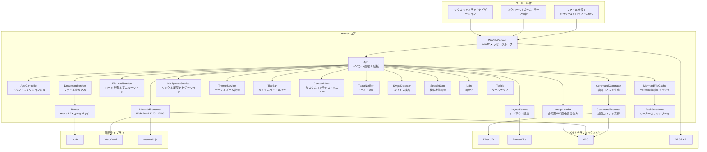

### 2.2 レイヤー構成

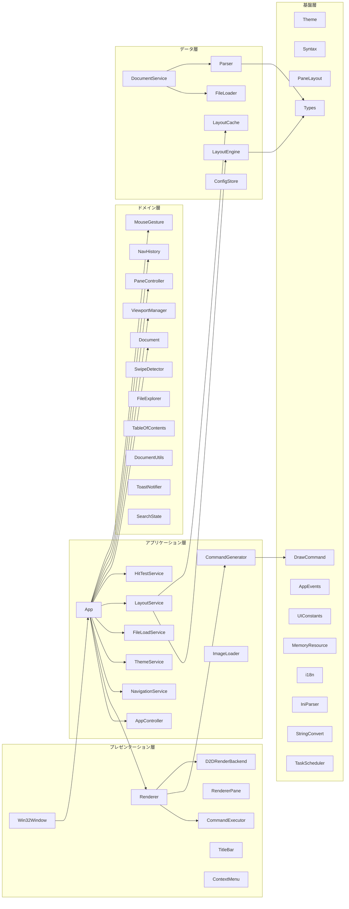

---

## 3. コンポーネント詳細

### 3.1 Win32Window — ウィンドウ管理

#### 3.1.1 責務

`Win32Window` はWin32 APIの薄いラッパーとして機能し、以下を担当する。

1. **ウィンドウ生成** — `WNDCLASSEXW` の登録、Win32ウィンドウの作成
2. **メッセージループ** — `GetMessageW` / `TranslateMessage` / `DispatchMessageW`
3. **メッセージルーティング** — Win32メッセージを `App` のイベントハンドラに委譲

#### 3.1.2 クラス構造

```cpp
class Win32Window {
public:
    bool Create(HINSTANCE hInstance, int nCmdShow);
    int  RunMessageLoop();

    void LoadMarkdownFile(std::wstring_view path);
    void LoadHelpDocument();
    std::pmr::wstring LoadLastFilePath() const;
    void ShowDirectory(std::wstring_view dir_path);

private:
    static LRESULT CALLBACK WndProc(HWND, UINT, WPARAM, LPARAM);
    LRESULT HandleMessage(UINT msg, WPARAM wParam, LPARAM lParam);
    LRESULT OnNcCalcSize(WPARAM wParam, LPARAM lParam);
    LRESULT OnNcHitTest(LPARAM lParam);
    void UpdateDwmFrame();

    HWND hwnd_ = nullptr;
    App  app_;
};
```

### 3.2 App — アプリケーション統括

#### 3.2.1 責務

`App` はアプリケーション全体のコントローラとして機能し、以下を統括する。

1. **イベント処理** — マウス・キーボード入力を `AppController` 経由でアクションに変換し実行
2. **描画トリガー** — `InvalidateRect` による再描画要求
3. **サービス統括** — 各サービスの生成・接続・ライフサイクル管理
4. **状態管理** — `ViewportManager` を通じたスクロール・選択・ズーム管理

#### 3.2.2 クラス構造

```cpp
class App {
public:
    bool Init(HWND hwnd);
    void LoadMarkdownFile(std::wstring_view path);
    void LoadHelpDocument();
    std::pmr::wstring LoadLastFilePath() const;
    void ShowDirectory(std::wstring_view dir_path);

    // Win32Window から呼び出されるイベントハンドラ
    void OnPaint();
    void OnResize(UINT width, UINT height);
    void OnKeyDown(WPARAM key);
    void OnMouseWheel(int px, int py, short delta, bool ctrl);
    void OnMouseHWheel(short delta);
    void OnDropFiles(HDROP hDrop);
    void OnDpiChanged(UINT dpi, const RECT* suggested);
    void OnLButtonDown(int px, int py);
    void OnLButtonUp(int px, int py);
    void OnLButtonDblClk(int px, int py);
    void OnMouseMove(int px, int py);
    void OnMouseHover(int px, int py);
    bool OnRButtonDown(int px, int py);
    bool OnRButtonUp(int px, int py);
    void OnRButtonMove(int px, int py);
    void OnXButtonBack();
    void OnXButtonForward();
    void OnContextMenu(int screen_x, int screen_y);
    void HandleTimer(UINT_PTR timer_id);
    void OnAppLoadFile();
    void OnAppImageLoaded();
    void OnCaptureChanged();
    void OnDestroy();
    void OnEnterSizeMove();
    void OnExitSizeMove();
    void OnActivate(bool active);
    // ...

private:
    // Win32ハンドル
    HWND               hwnd_ = nullptr;
    float              cached_dpi_scale_ = 1.0f;
    HCURSOR            cursor_arrow_, cursor_hand_;
    HCURSOR            cursor_ibeam_, cursor_sizewe_;

    // コアサービス
    Renderer           renderer_;
    MermaidRenderer    mermaid_renderer_;
    ImageLoader        image_loader_;
    FileLoader         file_loader_;
    DocumentService    doc_service_;
    AppController      controller_;
    ConfigService      config_;
    ThemeService       theme_service_;
    FileLoadService    file_load_service_;

    // ドメイン状態
    Document           doc_;
    LayoutCache        layout_cache_;
    ViewportManager    viewport_;
    std::optional<LayoutService> layout_service_;

    // カスタムタイトルバー
    TitleBar           titlebar_;

    // 3ペイン状態
    FileExplorer       file_explorer_;
    PaneController     panes_;
    NavHistory         nav_history_;
    NavigationService  nav_service_;
    MouseGesture       gesture_;
    SwipeDetector      swipe_detector_;
    HitTestService     hit_test_;

    // カスタムコンテキストメニュー
    ContextMenu        ctx_menu_;

    // トースト通知
    ToastNotifier      toast_;

    // 検索
    SearchState        search_state_;

    // ツールチップ
    Tooltip            tooltip_;

    // タスクスケジューラ & Mermaidファイルキャッシュ
    TaskScheduler      scheduler_;
    MermaidFileCache   file_cache_;
};
```

#### 3.2.3 メッセージハンドリング

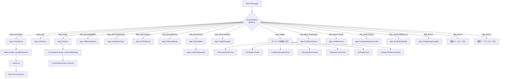

#### 3.2.4 キーボードショートカット

| キー | 動作 | 備考 |
|:-----|:-----|:-----|
| `F1` | ヘルプ表示 | 内蔵ヘルプドキュメントを表示 |
| `Ctrl+O` | ファイルを開く | OpenFileDialog 表示 |
| `Ctrl+A` | 全選択 | 全ノードのテキストを選択 |
| `Ctrl+C` | コピー | 選択テキストをクリップボードへ |
| `Ctrl+1` | ファイルペイン切替 | 左ペインの表示/非表示 |
| `Ctrl+2` | TOCペイン切替 | 中央ペインの表示/非表示 |
| `Ctrl++` | ズームイン | 17段階のズーム |
| `Ctrl+-` | ズームアウト | 同上 |
| `Ctrl+0` | ズームリセット | 100%に戻す |
| `Ctrl+マウスホイール` | ズームイン/アウト | ホイール方向で増減 |
| `Alt+←` | ナビゲーション戻る | ブラウザスタイル |
| `Alt+→` | ナビゲーション進む | ブラウザスタイル |
| `Ctrl+F` | 検索バー表示 | インクリメンタル検索を開く |
| `Ctrl+G` | 次の検索結果 | 次の一致へジャンプ |
| `Ctrl+Shift+G` | 前の検索結果 | 前の一致へジャンプ |
| `F3` | 次の検索結果 | `Ctrl+G` と同等 |
| `Shift+F3` | 前の検索結果 | `Ctrl+Shift+G` と同等 |
| `F5` | 再読み込み | 現在のファイルを再パース |
| `↑` / `↓` | 1行スクロール | 上下移動 |
| `Home` | 先頭へ移動 | scroll_y = 0 |
| `End` | 末尾へ移動 | scroll_y = max_scroll |
| `PageUp` | 1ページ上 | ビューポート高さ分 |
| `PageDown` | 1ページ下 | 同上 |
| `Esc` | 選択解除 | テキスト選択をクリア |

#### 3.2.5 マウスジェスチャ

| 操作 | 動作 | 備考 |
|:-----|:-----|:-----|
| 右ドラッグ左 | ナビゲーション戻る | 30px以上の水平移動 |
| 右ドラッグ右 | ナビゲーション進む | 30px以上の水平移動 |
| 右クリック（移動なし） | コンテキストメニュー | ダークモード切替 |
| Xボタン戻る | ナビゲーション戻る | マウスの戻るボタン |
| Xボタン進む | ナビゲーション進む | マウスの進むボタン |
| ダブルクリック | 単語選択 | カーソル位置の単語 |
| タッチパッド水平スワイプ | ナビゲーション戻る/進む | `SwipeDetector` による検出 |

#### 3.2.6 AppController — イベント→アクション変換

`AppController` はステートレスなイベント→アクションマッパーである。ユーザー入力イベントを受け取り、対応する高レベルアクションのリストを返す。

```cpp
class AppController {
public:
    ActionList HandleKeyDown(const KeyDownEvent& event) const;
    ActionList HandleMouseWheel(const MouseWheelEvent& event) const;
};
```

アクション型は `std::variant` で定義される:

```cpp
using AppAction = std::variant<
    KeyScrollAction, DirectScrollByAction, ScrollPaneAction,
    CopyClipboardAction, SelectAllAction, ClearSelectionAction,
    TogglePaneAction, ZoomAction,
    ReloadFileAction, OpenFileAction, ToggleDarkModeAction,
    NavigateBackAction, NavigateForwardAction,
    ShowHelpAction,
    OpenSearchBarAction, CloseSearchBarAction,
    SearchNextAction, SearchPrevAction
>;
```

---

### 3.3 Parser — Markdownパーサ

#### 3.3.1 パイプライン

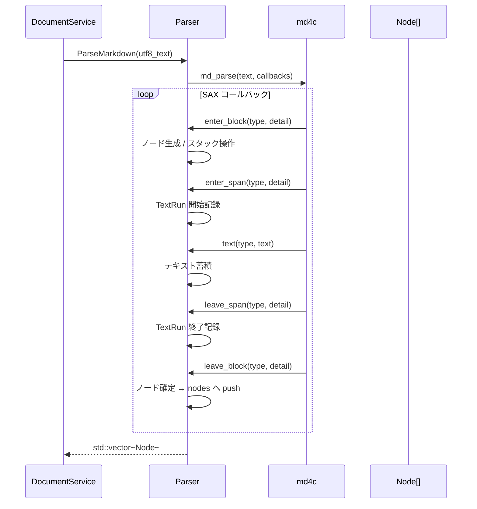

#### 3.3.2 対応する Markdown 要素

以下のすべての要素をパース・レンダリングできる。

##### ブロック要素

- **見出し** (`# H1` 〜 `###### H6`) — 6段階、アンカーID自動生成
- **段落** — 通常テキスト
- **コードブロック** — フェンス記法 (`` ``` ``), 言語指定対応
- **引用** (`>`) — ネスト対応
- **水平線** (`---`, `***`, `___`)
- **順序付きリスト** (`1.`, `2.`, ...)
- **順序なしリスト** (`-`, `*`, `+`)
- **タスクリスト** (`- [ ]`, `- [x]`)
- **テーブル** — GFM拡張、列アライメント対応

##### インライン要素

- **太字** (`**bold**`) → **太字の例**
- **斜体** (`*italic*`) → *斜体の例*
- **取り消し線** (`~~strike~~`) → ~~取り消し線の例~~
- **インラインコード** (`` `code` ``) → `inline code`
- **リンク** (`[text](url)`) → [mendo GitHub](https://github.com/example)
- **画像** (``) → 非同期読み込み・表示
- **太字+斜体** (`***both***`) → ***太字かつ斜体***

#### 3.3.3 アンカーID生成ルール

見出しテキストからGitHub互換のアンカーIDを生成する。

```cpp
// GenerateAnchorId の変換ルール
// 1. 全角英数字 → 半角英数字
// 2. 大文字 → 小文字
// 3. スペース・アンダースコア → ハイフン
// 4. 英数字・ハイフン・CJK文字以外を除去
// 5. 連続ハイフンを単一ハイフンに圧縮
// 6. 先頭・末尾のハイフンを除去

// 例:
// "Hello World"     → "hello-world"
// "C++ コード例"    → "c-コード例"
// "第1章: 概要"     → "第1章-概要"
```

---

### 3.4 LayoutEngine — テキスト計測

#### 3.4.1 概要

`LayoutEngine` は `ITextMeasurer` インターフェースを通じて各ノードのテキスト幅・高さを計測し、Y座標を決定する。計測結果は `LayoutCache` に格納される。**遅延レイアウト**方式で、ダーティフラグが立ったノードのみ再計算する。

#### 3.4.2 レイアウト計算フロー

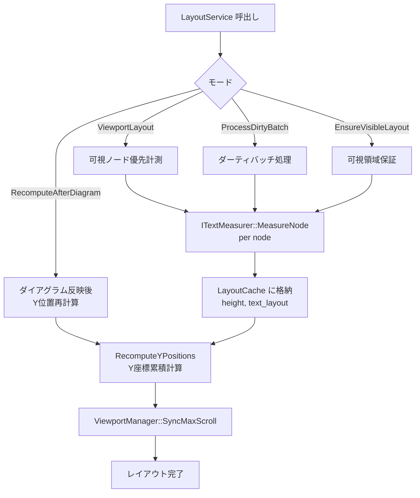

#### 3.4.3 ITextMeasurer インターフェース

```cpp
class ITextMeasurer {
public:
    virtual bool Init(const Theme& theme) = 0;
    virtual bool RecreateFormats() = 0;
    virtual void UpdateTheme(const Theme& theme) noexcept = 0;
    virtual void MeasureNode(Node& node, NodeLayoutEntry& entry, float max_width) = 0;
    virtual void MeasureTable(Node& node, NodeLayoutEntry& entry, float max_width) = 0;
};
```

本番実装は `DWriteTextMeasurer` が DirectWrite の `IDWriteTextLayout` を使用する。テスト時にはモックに差し替え可能。

#### 3.4.4 テキストフォーマット

| 用途 | フォントファミリ | 既定サイズ (DIP) |
|:-----|:----------------|:-----------------|
| H1 | Yu Gothic UI | 32 |
| H2 | Yu Gothic UI | 26 |
| H3 | Yu Gothic UI | 22 |
| H4 | Yu Gothic UI | 18 |
| H5 | Yu Gothic UI | 16 |
| H6 | Yu Gothic UI | 14 |
| 本文 | Yu Gothic UI | 16 |
| コード | Consolas | 14 |

> **Note**: すべてのフォントサイズはズーム倍率 (`Theme::zoom`) で乗算される。

#### 3.4.5 テーブルレイアウト

テーブルは特殊なレイアウト処理を行う。

1. **列幅計算** (`ITextMeasurer::MeasureTable`)
   - 各セルの最小幅を `IDWriteTextLayout` で計測
   - 列ごとに最大値を取得
   - 合計が描画幅を超える場合は比率で圧縮
2. **セル配置**
   - アライメント（左寄せ/中央/右寄せ）を `DWRITE_TEXT_ALIGNMENT` で適用
3. **行高さ計算**
   - 各行の最大セル高さを行全体の高さとする

---

### 3.5 Renderer — Direct2D 描画

#### 3.5.1 Command パターン

レンダリングは **Command パターン** に分離されている。

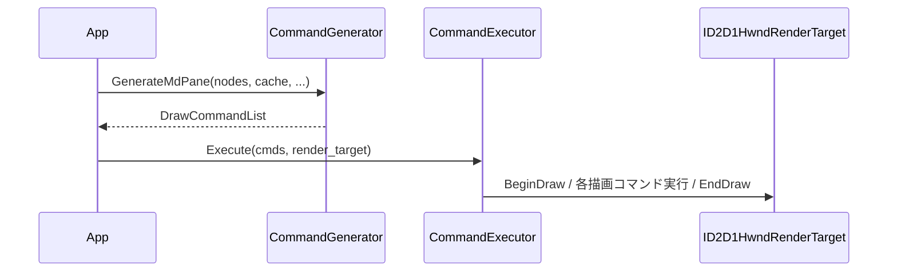

#### 3.5.2 DrawCommand 型

描画コマンドは `std::variant` で定義される:

```cpp
using DrawCommand = std::variant<
    ClearCmd, FillRectCmd, FillRoundedRectCmd,
    DrawLineCmd, DrawTextLayoutCmd, DrawTextCmd,
    DrawBitmapCmd, FillEllipseCmd, DrawEllipseCmd,
    PushClipCmd, PopClipCmd, SetTransformCmd
>;
```

#### 3.5.3 IRenderBackend インターフェース

Direct2D / DirectWrite のファクトリ・レンダーターゲット・DPI管理を抽象化する。

```cpp
class IRenderBackend {
public:
    virtual bool Init(HWND hwnd) = 0;
    virtual void Resize(UINT width, UINT height) = 0;
    virtual void SetDpi(float dpi) = 0;
    virtual float GetDpi() const noexcept = 0;
    virtual bool RecreateRenderTarget() = 0;
    virtual ID2D1Factory* GetD2DFactory() const noexcept = 0;
    virtual ID2D1HwndRenderTarget* GetRenderTarget() const noexcept = 0;
    virtual IDWriteFactory* GetDWriteFactory() const noexcept = 0;
    virtual HWND GetHwnd() const noexcept = 0;
};
```

本番実装は `D2DRenderBackend` が担当する。

#### 3.5.4 描画順序

描画は以下の**レイヤー順**で行われる（後から描くものが手前に表示される）。

1. 背景クリア
2. Markdownコンテンツ描画（`CommandGenerator` が生成）
   - コードブロック背景 → テキスト → シンタックスハイライト
   - 引用ブロック左バー
   - テーブルグリッド線（奇数行ストライプ）
   - 水平線
   - リスト記号（バレット / 番号 / チェックボックス）
   - Mermaidダイアグラムビットマップ
3. テキスト選択ハイライト（半透明オーバーレイ）
4. ファイルペイン（オフスクリーンキャッシュビットマップ経由）
5. TOCペイン（同上）
6. スプリッタ
7. スクロールバー
8. ナビゲーションボタン（戻る/進むオーバーレイ）
9. コピーボタン（コードブロックホバー時）
10. マウスジェスチャトレイル & 方向オーバーレイ
11. スワイプオーバーレイ（`SwipeDetector` による方向表示）
12. 検索バー（`SearchState` — 下部ドッキング）
13. カスタムタイトルバー（`TitleBar`）
14. コンテキストメニュー（`ContextMenu` — モーダルポップアップ）
15. トースト通知（`ToastNotifier`）
16. ローディングアニメーション

---

### 3.6 Theme — テーマシステム

#### 3.6.1 テーマ構造

```cpp
struct Theme {
    // カラーパレット
    D2D1_COLOR_F bg_color, text_color, heading_color;
    D2D1_COLOR_F code_bg_color, code_text_color;
    D2D1_COLOR_F link_color, hr_color;
    D2D1_COLOR_F blockquote_bar_color, blockquote_text_color;

    // GitHub Alerts 色（各5種: Note, Tip, Important, Warning, Caution）
    D2D1_COLOR_F alert_color[ALERT_TYPE_COUNT];     // バー・ラベル色
    D2D1_COLOR_F alert_bg_color[ALERT_TYPE_COUNT];  // 背景色

    // シンタックスハイライト色
    D2D1_COLOR_F syntax_keyword, syntax_type;
    D2D1_COLOR_F syntax_string, syntax_number;
    D2D1_COLOR_F syntax_comment, syntax_preprocessor;
    D2D1_COLOR_F syntax_function;

    // タイトルバー
    D2D1_COLOR_F titlebar_bg_color, titlebar_text_color;
    D2D1_COLOR_F titlebar_button_hover_color, titlebar_button_active_color;

    // ペイン
    D2D1_COLOR_F pane_bg_color, splitter_color;
    D2D1_COLOR_F pane_item_hover_color, pane_item_active_color;

    // 検索バー
    D2D1_COLOR_F search_bar_bg_color, search_bar_border_color;
    D2D1_COLOR_F search_input_bg_color, search_input_text_color;
    D2D1_COLOR_F search_highlight_color;          // 全一致箇所（黄色半透明）
    D2D1_COLOR_F search_highlight_current_color;  // 現在の一致（オレンジ）
    D2D1_COLOR_F search_no_match_bg_color;        // 一致なし時の背景

    // フォント
    std::wstring font_family;      // "Yu Gothic UI"
    std::wstring monospace_font;   // "Consolas"

    // フォントサイズ (DIP)
    float font_size_body;       // 16
    float font_size_h[6];       // {32, 26, 22, 18, 16, 14}
    float font_size_code;       // 14

    // スペーシング
    float margin_left, margin_right, margin_top;
    float paragraph_spacing;
    float list_item_spacing;
    float heading_spacing_above, heading_spacing_below;
    float code_block_spacing_above;
    float code_block_padding;
    float indent_width;
    float blockquote_bar_width;
    float list_bullet_offset;
    float hr_thickness;
    float h2_underline_thickness;  // H2見出し下線の太さ

    // ペインレイアウト
    float pane_item_height;    // 28
    float pane_header_height;  // 32
    float splitter_width;      // 4
    float pane_font_size;

    // ズーム
    float zoom;                // 1.0

    // メソッド
    float GetHeadingSize(int level) const noexcept;
    float GetHeadingUnderlineThickness(int level) const noexcept;
    bool IsDark() const noexcept;
    void ApplyZoom(float new_zoom) noexcept;
    constexpr float ContentWidth(float viewport_width) const noexcept;
};
```

#### 3.6.2 ThemeService — テーマ管理サービス

`ThemeService` はダークモード状態の管理とテーマ生成・永続化を担当する。Win32依存なし。

```cpp
class ThemeService {
public:
    explicit ThemeService(ConfigService& config) noexcept;

    bool IsDarkMode() const noexcept;
    Theme CreateTheme() const;
    Theme CreateTheme(int zoom_index) const;
    bool ToggleDarkMode();

    void SaveDarkMode();
    void LoadDarkMode();
    void SaveZoomLevel(int zoom_index);
    int LoadZoomIndex() const;
};
```

#### 3.6.3 ズームシステム

17段階の離散的なズームレベルをサポートする。

| インデックス | 倍率 | インデックス | 倍率 |
|:------------|:------|:------------|:------|
| 0 | 0.25x | 9 | 1.25x |
| 1 | 0.33x | 10 | 1.50x |
| 2 | 0.50x | 11 | 1.75x |
| 3 | 0.67x | 12 | 2.00x |
| 4 | 0.75x | 13 | 2.50x |
| 5 | 0.80x | 14 | 3.00x |
| 6 | 0.90x | 15 | 4.00x |
| 7 | **1.00x** | 16 | 5.00x |
| 8 | 1.10x | | |

> **デフォルト**: インデックス7（1.00x）。ズーム設定は `ThemeService` 経由で `ConfigService` に永続化される。

---

### 3.7 Syntax — シンタックスハイライト

#### 3.7.1 対応言語

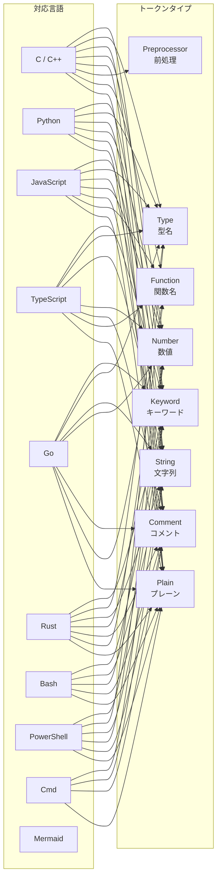

#### 3.7.2 トークン化例

以下のC++コードを例にトークン化を示す。

```cpp
#include <iostream>       // Preprocessor + Plain
using namespace std;      // Keyword + Plain

int main() {              // Type + Function + Plain
    std::string msg = "Hello"; // Type + Plain + String
    int x = 42;           // Type + Plain + Number
    // comment            // Comment
    return 0;             // Keyword + Number
}
```

各トークンタイプに対応するカラーは `Theme` が保持し、ライト/ダークモードで切り替わる。

---

### 3.8 FileLoader — ファイル入出力

#### 3.8.1 ファイル読み込み

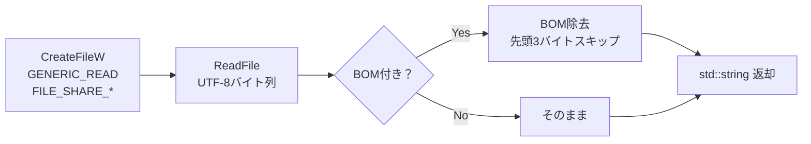

- 共有モード: `FILE_SHARE_READ | FILE_SHARE_WRITE | FILE_SHARE_DELETE`
- 他プロセスが編集中でも読み取り可能

#### 3.8.2 ファイル監視

- **方式**: ポーリング（250msインターバルの `WM_TIMER`）
- **検出方法**: ファイルの最終書き込み時刻を比較
- **デバウンス**: 変更検出後、一定時間（数百ms）待機してから再読み込み
- **用途**: エディタでMarkdownを編集しながらリアルタイムプレビュー

#### 3.8.3 DocumentService — ファイル読み込みオーケストレーション

```cpp
class DocumentService {
public:
    explicit DocumentService(FileLoader& loader) noexcept;

    bool LoadFile(const std::pmr::wstring& path, Document& doc);
    bool ReloadFile(Document& doc);
    void StartWatching(const std::pmr::wstring& path, FileLoader::ChangeCallback cb);
    void StopWatching() noexcept;
    void CheckForChanges();
    void ResetDebounceTick() noexcept;
    static bool NeedsLoadingAnimation(const std::pmr::wstring& path) noexcept;
};
```

#### 3.8.4 FileLoadService — ロード制御 & アニメーション

```cpp
class FileLoadService {
public:
    explicit constexpr FileLoadService(DocumentService& doc_service) noexcept;

    constexpr bool IsLoading() const noexcept;
    constexpr float GetLoadingAngle() const noexcept;
    void StartLoading(std::wstring_view path);
    void StopLoading() noexcept;
    void TickLoadingAnimation() noexcept;
    bool ExecuteLoad(Document& doc, LayoutCache& cache);
    constexpr std::wstring_view GetLoadingPath() const noexcept;
    constexpr void SetLoadingPath(std::wstring_view path);
};
```

#### 3.8.5 対応ファイル形式

ファイルオープンダイアログのフィルタ:

| フィルタ名 | 拡張子 |
|:----------|:-------|
| Markdown files | `*.md`, `*.markdown`, `*.mkd` |
| Text files | `*.txt` |
| All files | `*.*` |

---

### 3.9 MermaidRenderer — ダイアグラム描画

#### 3.9.1 アーキテクチャ

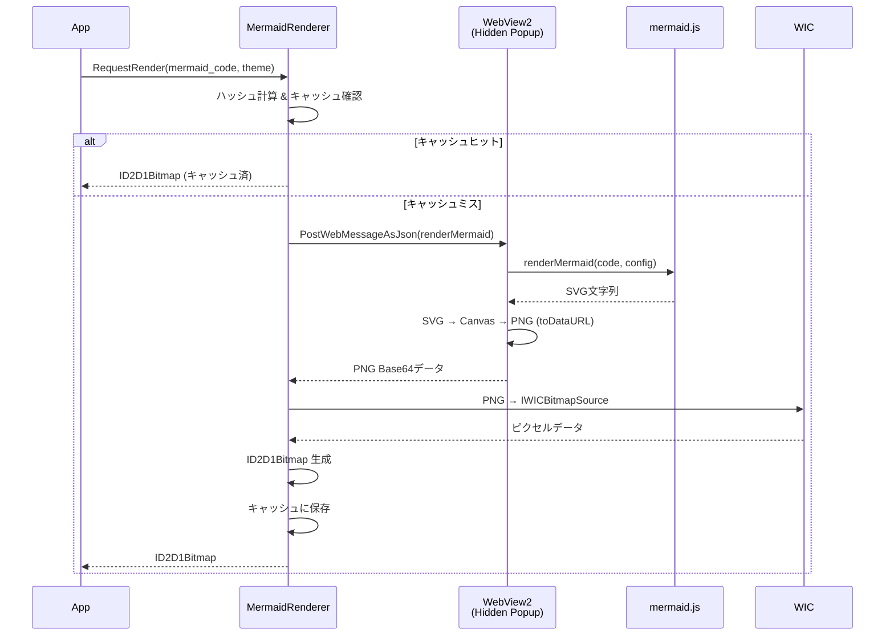

#### 3.9.2 永続キャッシュ

`MermaidFileCache` と連携し、レンダリング結果を PNG としてファイルシステムに永続化する。キャッシュヒット時は WebView2 を経由せず即座にビットマップを返す。詳細は [3.26 MermaidFileCache](#326-mermaidfilecache--mermaid-ダイアグラム永続キャッシュ) を参照。

#### 3.9.3 初期化

1. 非表示ポップアップウィンドウを作成
2. WebView2環境を非同期初期化
3. gzip圧縮された `mermaid.min.js` をリソースから展開
4. HTMLテンプレートに埋め込み、`NavigateToString()` で読み込み

---

### 3.10 NavigationService — ナビゲーション管理

#### 3.10.1 概要

ブラウザスタイルの戻る/進むナビゲーションを提供する。リンククリックの解釈と履歴管理を担当する。

```cpp
class NavigationService {
public:
    explicit NavigationService(NavHistory& history) noexcept;

    struct NavigateResult {
        enum class Type { None, Anchor, ExternalUrl, LoadFile };
        Type type = Type::None;
        std::wstring target;
        float scroll_y = 0.0f;
    };

    NavigateResult HandleLinkClick(const std::wstring& url,
                                   const std::wstring& current_file);
    NavigateResult GoBack(const std::wstring& current_file, float scroll_y);
    NavigateResult GoForward(const std::wstring& current_file, float scroll_y);
    void PushHistory(const std::wstring& file, float scroll_y);
    bool CanGoBack() const noexcept;
    bool CanGoForward() const noexcept;
};
```

#### 3.10.2 NavHistory — 履歴スタック

```cpp
struct NavEntry {
    std::wstring file_path;
    float scroll_y = 0.0f;
};

class NavHistory {
public:
    void Push(const NavEntry& current);
    bool GoBack(const NavEntry& current, NavEntry& out);
    bool GoForward(const NavEntry& current, NavEntry& out);
    bool CanGoBack() const noexcept;
    bool CanGoForward() const noexcept;

    static constexpr size_t MAX_HISTORY = 50;
};
```

#### 3.10.3 ナビゲーションフロー

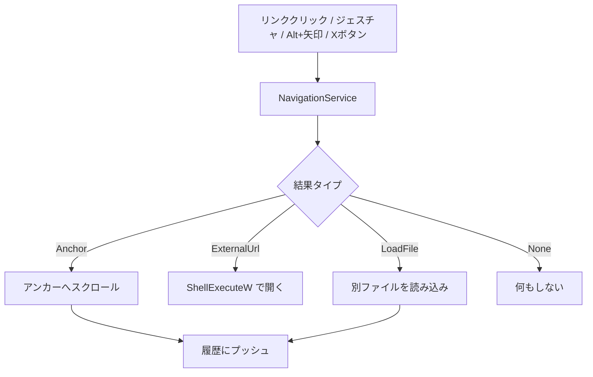

---

### 3.11 MouseGesture — マウスジェスチャ

#### 3.11.1 状態遷移

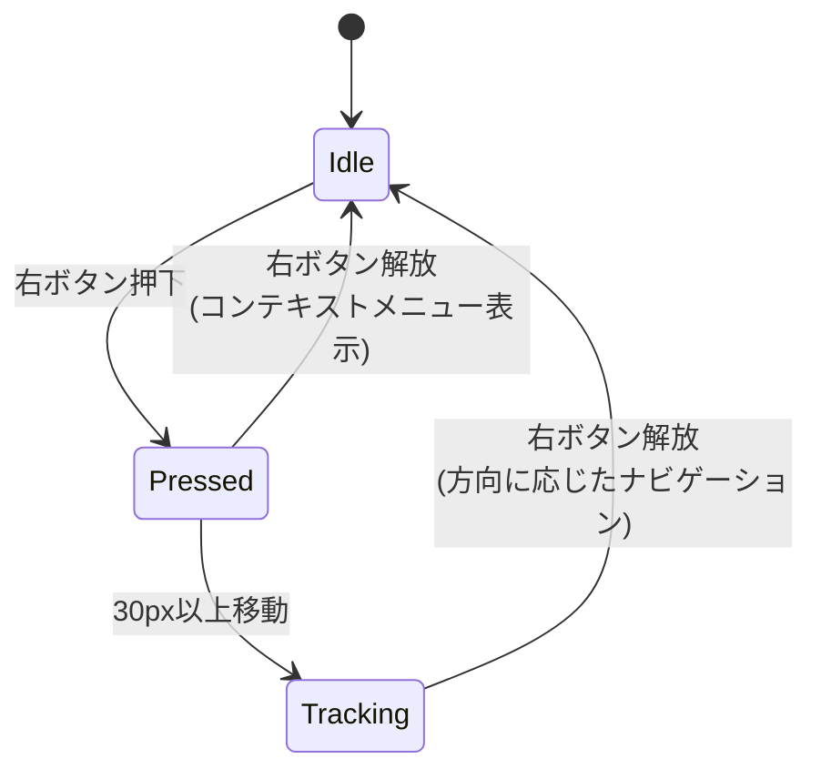

#### 3.11.2 パラメータ

| パラメータ | 値 | 説明 |
|:----------|:---|:-----|
| `GESTURE_THRESHOLD` | 30px | ジェスチャ開始の移動距離閾値 |
| `MIN_POINT_DISTANCE` | 2px | トレイル軌跡のサンプリング最小距離 |
| `TRAIL_MAX_POINTS` | 512 | トレイル軌跡の最大ポイント数 |

---

### 3.12 ViewportManager — ビューポート管理

#### 3.12.1 概要

スクロール・選択・ズームの純粋な状態管理。Win32依存なし。

```cpp
class ViewportManager {
public:
    // スクロール
    float GetScrollY() const noexcept;
    float GetScrollTarget() const noexcept;
    float GetMaxScroll() const noexcept;
    bool IsSmoothScrolling() const noexcept;
    void ScrollTo(float position) noexcept;
    void SmoothScrollBy(float delta) noexcept;
    bool UpdateSmoothScroll(float dt_ms) noexcept;
    bool UpdateSmoothScroll() noexcept;         // 16ms基準のオーバーロード
    void StopSmoothScroll() noexcept;
    void SyncMaxScroll(float total_height, float viewport_height) noexcept;
    int FindFirstVisibleNode(const LayoutCache& cache, size_t count) const noexcept;
    void AnchorCompensateScroll(int anchor_idx, float anchor_y_before,
                                const LayoutCache& cache) noexcept;

    // 選択
    const TextSelection& GetSelection() const noexcept;
    TextSelection& GetSelectionMut() noexcept;
    void SetSelection(const TextSelection& sel) noexcept;
    void ClearSelection() noexcept;
    void SelectAll(const std::pmr::vector<Node>& nodes) noexcept;

    // ズーム
    int GetZoomIndex() const noexcept;
    void SetZoomIndex(int idx) noexcept;
    float GetCurrentZoom() const noexcept;
    float ZoomIn() noexcept;
    float ZoomOut() noexcept;
    float ZoomReset() noexcept;

    static constexpr float SCROLL_SPEED = 0.25f;
    static constexpr float SCROLL_EPSILON = 1.5f;
    static constexpr float SCROLL_REFERENCE_DT = 16.0f; // 基準フレーム時間（ms）
    static constexpr float MAX_DELTA_MS = 100.0f;       // デルタタイム上限（ms）
    static constexpr float MAX_SCROLL_SPEED = 10.0f;    // スクロール速度上限（px/ms）
};
```

#### 3.12.2 スムーズスクロール

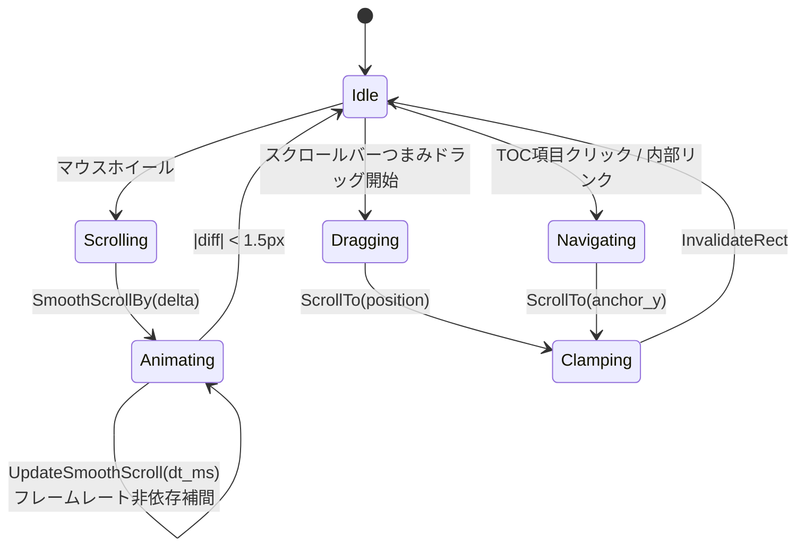

スムーズスクロールはフレームレート非依存の指数イージングを使用する。各フレームでの移動量は `diff * (1 - (1 - 0.25)^(dt_ms / 16))` で計算され、最大速度 `10px/ms` でクランプされる。

---

### 3.13 PaneController — ペイン管理

#### 3.13.1 概要

3ペインの表示状態・幅・スクロール・ホバー・ドラッグをすべて管理する。Win32依存なし。

```cpp
class PaneController {
public:
    enum class DragTarget { None, Splitter1, Splitter2,
                            FileScrollbar, TocScrollbar };

    // 表示切替
    void ToggleFilePane() noexcept;
    void ToggleTocPane() noexcept;

    // 幅
    float GetFilePaneWidth() const noexcept;
    float GetTocPaneWidth() const noexcept;

    // スクロール
    bool ScrollFilePaneBy(float delta, float max_scroll) noexcept;
    bool ScrollTocPaneBy(float delta, float max_scroll) noexcept;

    // ドラッグ
    void StartDrag(DragTarget t) noexcept;
    void EndDrag() noexcept;
    void DragSplitter1To(float dip_x, float total_width, float splitter_w) noexcept;
    void DragSplitter2To(float dip_x, float total_width, float splitter_w) noexcept;

    // レイアウト計算
    PaneLayout ComputeLayout(float total_w, float total_h, float splitter_w) const noexcept;
    PaneZone DetectZone(float dip_x, float total_w, float total_h, float splitter_w) const noexcept;

    static constexpr float PANE_MIN_WIDTH = 100.0f;
    static constexpr float MD_PANE_MIN_WIDTH = 200.0f;
};
```

#### 3.13.2 ペイン構成

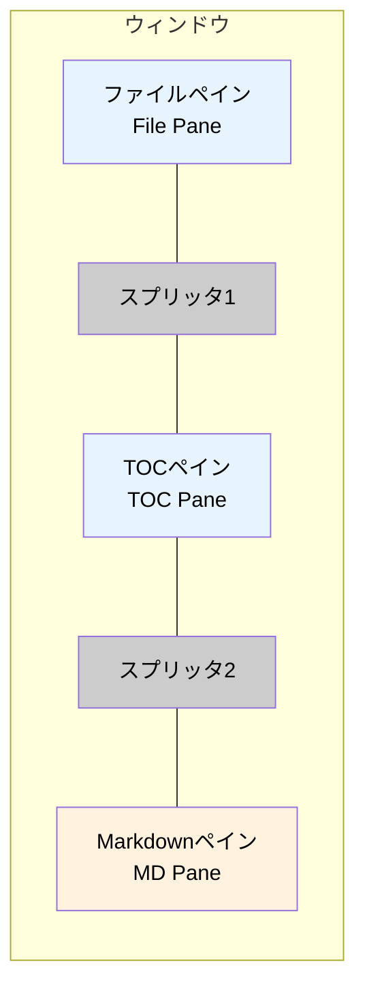

| ペイン | 既定幅 | 可変 | 内容 |
|:-------|:------|:-----|:-----|
| ファイルペイン | 220px | ドラッグ可（最小100px） | ディレクトリ内のファイル一覧 |
| TOCペイン | 220px | ドラッグ可（最小100px） | 見出しベースの目次 |
| Markdownペイン | 残り全幅 | フレックス（最小200px） | Markdownコンテンツ |
| スプリッタ | 4px | 固定 | ペイン間の境界線 |

#### 3.13.3 ゾーン判定

`DetectZone()` メソッドはマウス座標からどのゾーンにいるかを判定する。

```
┌─────────┬──┬─────────┬──┬──────────────────────────┐
│  FILE   │SP│   TOC   │SP│       MARKDOWN           │
│  PANE   │L1│  PANE   │L2│        PANE              │
│         │  │         │  │                          │
│ ←220px→ │4 │ ←220px→ │4 │     ←残り全幅→           │
└─────────┴──┴─────────┴──┴──────────────────────────┘
```

---

### 3.14 HitTestService — ヒットテスト

#### 3.14.1 概要

マウス座標からコンテンツの当たり判定を行う。

```cpp
class HitTestService {
public:
    struct HitResult {
        int node_index = -1;
        uint32_t text_pos = 0;
    };

    // Mdペイン内のヒットテスト
    HitResult HitTest(const std::vector<Node>& nodes,
                      const LayoutCache& cache, ...) const noexcept;

    // テーブルセル内のヒットテスト
    HitResult HitTestTable(const Node& node, const NodeLayoutEntry& entry,
                           ...) const noexcept;

    // ナビゲーションボタンのヒットテスト
    enum class NavButtonHover { None, Back, Forward };
    NavButtonHover NavButtonHitTest(float dip_x, float dip_y,
                                     const PaneRect& md_rect) const noexcept;
};
```

---

### 3.15 ConfigStore / ConfigService — 設定永続化

#### 3.15.1 保存先・形式

```
%LOCALAPPDATA%\mendo\config.ini
```

設定は **INI形式** のファイルに一元管理される。`IniParser` で読み書きし、セクション＋キーの2階層でアクセスする。

#### 3.15.2 保存項目

| セクション | キー | 型 | 既定値 | 説明 |
|:-----------|:-----|:---|:------|:-----|
| `View` | `DarkMode` | `bool` | `false` | ダークモード |
| `View` | `ZoomLevel` | `int` | `7` (1.00x) | ズームインデックス |
| `Session` | `LastFile` | `wstring` | 空文字列 | 最後に開いたファイルパス |
| `Session` | `ScrollNode` | `int` | `0` | スクロール位置（ノードインデックス） |
| `Session` | `ScrollOffset` | `int` | `0` | スクロール位置（オフセット） |
| `Session` | `ScrollY` | `int` | `0` | スクロール位置（Y座標） |
| `Pane` | `ShowFile` | `bool` | `true` | ファイルペイン表示 |
| `Pane` | `ShowToc` | `bool` | `true` | TOCペイン表示 |
| `Pane` | `FileWidth` | `int` | `220` (DIP) | ファイルペイン幅 |
| `Pane` | `TocWidth` | `int` | `220` (DIP) | TOCペイン幅 |
| `Window` | `X` | `int` | `0` | ウィンドウX座標 |
| `Window` | `Y` | `int` | `0` | ウィンドウY座標 |
| `Window` | `Width` | `int` | `0` | ウィンドウ幅 |
| `Window` | `Height` | `int` | `0` | ウィンドウ高さ |
| `Window` | `Maximized` | `bool` | `false` | 最大化状態 |
| `General` | `Language` | `wstring` | 空（OS検出） | UI言語（`ja` / `en`） |

#### 3.15.3 ConfigStore（名前空間関数）

```cpp
namespace config {
    void SetConfigDirOverride(const std::filesystem::path& dir); // テスト用
    std::filesystem::path GetConfigDir();
    std::filesystem::path GetConfigPath(std::wstring_view filename);

    void Load();   // INIファイルをメモリに読み込み（起動時1回）
    void Save();   // メモリ上のデータをディスクに書き込み
    void Clear() noexcept; // テスト用

    void SetBool(std::string_view section, std::string_view key, bool value);
    bool GetBool(std::string_view section, std::string_view key, bool default_value = false);
    void SetInt(std::string_view section, std::string_view key, int value);
    int GetInt(std::string_view section, std::string_view key, int default_value, int min_val, int max_val);
    void SetWString(std::string_view section, std::string_view key, std::wstring_view value);
    std::pmr::wstring GetWString(std::string_view section, std::string_view key);
}
```

#### 3.15.4 ConfigService

`ConfigService` は `ConfigStore` の名前空間関数をラップし、テスト時のモック差し替えを可能にする。

```cpp
class ConfigService {
public:
    void SaveBool(std::string_view section, std::string_view key, bool value);
    bool LoadBool(std::string_view section, std::string_view key, bool default_value = false) const;
    void SaveInt(std::string_view section, std::string_view key, int value);
    int LoadInt(std::string_view section, std::string_view key, int def, int min_v, int max_v) const;
    void SaveWString(std::string_view section, std::string_view key, std::wstring_view value);
    std::pmr::wstring LoadWString(std::string_view section, std::string_view key) const;
    void Flush(); // メモリ上のデータをディスクに書き出す
};
```

---

### 3.16 TitleBar — カスタムタイトルバー

#### 3.16.1 概要

`TitleBar` はWin32の標準タイトルバーを置き換えるカスタムタイトルバーを管理する。ヘルプボタン、ダークモード切替ボタン、検索ボタン、ファイルペイン/TOCペインのトグルボタン、最小化/最大化/閉じるボタンを含む。

```cpp
enum class TitleBarHitZone {
    None, Caption, Help, ThemeToggle, Search,
    FileToggle, TocToggle,
    Minimize, Maximize, Close
};

struct TitleBarButton {
    D2D1_RECT_F rect{};
    bool hovered = false;
};

class TitleBar {
public:
    static constexpr float BASE_HEIGHT = 32.0f;
    static constexpr float BUTTON_WIDTH = 32.0f;
    static constexpr float ICON_LEFT_MARGIN = 8.0f;
    static constexpr float ICON_SIZE = 24.0f;
    static constexpr float ICON_RIGHT_GAP = 4.0f;
    static constexpr float BUTTON_GAP = 2.0f;
    static constexpr float CAPTION_BTN_WIDTH = 46.0f;

    float GetHeight() const noexcept;
    void UpdateLayout(float window_width_dip) noexcept;
    TitleBarHitZone HitTest(float dip_x, float dip_y) const noexcept;
    bool SetHovered(TitleBarHitZone zone) noexcept;
    TitleBarHitZone GetHovered() const noexcept;

    const TitleBarButton& GetHelpButton() const noexcept;
    const TitleBarButton& GetThemeToggleButton() const noexcept;
    const TitleBarButton& GetSearchButton() const noexcept;
    const TitleBarButton& GetFileToggleButton() const noexcept;
    const TitleBarButton& GetTocToggleButton() const noexcept;
    const TitleBarButton& GetMinimizeButton() const noexcept;
    const TitleBarButton& GetMaximizeButton() const noexcept;
    const TitleBarButton& GetCloseButton() const noexcept;
    const D2D1_RECT_F& GetIconRect() const noexcept;
    const D2D1_RECT_F& GetTitleTextRect() const noexcept;
};
```

---

### 3.17 SwipeDetector — スワイプ検出

#### 3.17.1 概要

`SwipeDetector` はタッチパッドの水平スワイプジェスチャ（`WM_MOUSEHWHEEL`）を検出し、ナビゲーション操作（戻る/進む）に変換する。`MouseGesture` がマウスの右ドラッグを処理するのに対し、`SwipeDetector` はタッチパッドの2本指スワイプを担当する。

```cpp
enum class SwipeResult { None, Back, Forward };

class SwipeDetector {
public:
    static constexpr int TRIGGER_THRESHOLD = 400;
    static constexpr int AXIS_LOCK_MS = 200;
    static constexpr int RESET_TIMEOUT_MS = 500;
    static constexpr int COMMIT_TIMEOUT_MS = 150;

    void OnHWheel(int delta, uint64_t now_ms) noexcept;
    SwipeResult Commit() noexcept;
    void NotifyVScroll(uint64_t now_ms) noexcept;
    void Reset() noexcept;
    bool IsOverlayVisible() const noexcept;
    int GetOverlayDirection() const noexcept;
    float GetOverlayAlpha() const noexcept;
};
```

#### 3.17.2 パラメータ

| パラメータ | 値 | 説明 |
|:----------|:---|:-----|
| `TRIGGER_THRESHOLD` | 400 | スワイプ発火の累積デルタ閾値 |
| `AXIS_LOCK_MS` | 200ms | 垂直スクロール後の軸ロック期間 |
| `RESET_TIMEOUT_MS` | 500ms | 入力なしでリセットするタイムアウト |
| `COMMIT_TIMEOUT_MS` | 150ms | スワイプ確定までの待機時間 |

---

### 3.18 ToastNotifier — トースト通知

#### 3.18.1 概要

`ToastNotifier` は短期間表示されるフェードアウト型の通知メッセージを管理する。ファイルが外部で削除された場合などに使用される。

```cpp
class ToastNotifier {
public:
    static constexpr float INITIAL_ALPHA = 2.5f;
    static constexpr float FADE_SPEED = 0.03f;

    void Show(std::wstring_view message);
    bool Tick() noexcept;
    void Reset() noexcept;
    bool IsVisible() const noexcept;
    float GetRenderAlpha() const noexcept;
    std::wstring_view GetMessage() const noexcept;
};
```

#### 3.18.2 フェードアニメーション

初期アルファ値2.5（1.0を超える部分は完全不透明を維持する猶予時間として機能）から `FADE_SPEED` ずつ減算し、0以下で非表示になる。描画時のアルファはclamp(0, 1)で適用される。

---

### 3.19 ContextMenu — カスタムコンテキストメニュー

#### 3.19.1 概要

`ContextMenu` はWin32のシステムメニューの代わりに、Direct2Dで自前描画するカスタムコンテキストメニューを提供する。戻る/進むボタンの横並び表示に対応する。

```cpp
struct ContextMenuParams {
    int screen_x = 0;
    int screen_y = 0;
    float dpi_scale = 1.0f;
    bool can_go_back = false;
    bool can_go_forward = false;
    bool has_file = false;
    bool has_selection = false;
    bool dark_mode_checked = false;
    bool file_pane_checked = false;
    bool toc_pane_checked = false;
    bool show_file_items = false;       // MdPaneの場合のみtrue
    const Theme* theme = nullptr;
};

class ContextMenu {
public:
    enum class ItemType { NavRow, Separator, Text };

    void Init(ID2D1Factory* d2d_factory, IDWriteFactory* dwrite_factory);
    int Show(HWND owner, const ContextMenuParams& params);
    int HitTest(float x, float y) const;
    int NavHitTest(float x, float y) const;
};
```

#### 3.19.2 メニュー構成

```
┌──────────────────────────────────┐
│ ← [戻る]  [進む] →               │  NavRow（横並び）
├──────────────────────────────────┤
│ エディタで開く                    │  ※ MdPaneのみ表示
├──────────────────────────────────┤
│ コピー                           │  ※ MdPaneのみ / 選択なしで無効
├──────────────────────────────────┤
│ ☑ ダークモード                    │  トグル
├──────────────────────────────────┤
│ ☑ ファイルペイン                  │  トグル
├──────────────────────────────────┤
│ ☑ 目次ペイン                     │  トグル
└──────────────────────────────────┘
```

`show_file_items` が `false` の場合（ペイン上での右クリック）、「エディタで開く」と「コピー」は非表示になる。

#### 3.19.3 定数

| 定数 | 値 | 説明 |
|:-----|:---|:-----|
| `ITEM_HEIGHT` | 28px | テキスト項目の高さ |
| `NAV_BTN_SIZE` | 28px | 戻る/進むボタンのサイズ |
| `NAV_BTN_GAP` | 16px | ナビゲーションボタン間のギャップ |
| `SEPARATOR_HEIGHT` | 9px | セパレータの高さ |
| `PAD_X` | 28px | 左右パディング |
| `MENU_CORNER` | 8px | メニューの角丸半径 |

---

### 3.20 ImageLoader — 非同期画像読み込み

#### 3.20.1 概要

`ImageLoader` はWIC（Windows Imaging Component）を使用した非同期画像読み込みを担当する。ワーカースレッドでデコードを行い、UIスレッドでD2Dビットマップに変換する。

```cpp
class ImageLoader {
public:
    void Init(ID2D1RenderTarget* rt);
    void InitAsync(HWND hwnd, UINT msg_id);
    bool LoadImage(const std::wstring& path, DiagramEntry& out);
    bool GetCachedImage(const std::wstring& path, DiagramEntry& out);
    void RequestLoadAsync(const std::wstring& path);
    void ProcessCompletedDecodes();
    void CancelPending();
    void ClearCache();
    void Shutdown();
};
```

#### 3.20.2 対応画像形式

WICが対応する形式すべてをデコード可能。主な形式は以下の通り。

| 形式 | 拡張子 |
|:-----|:------|
| PNG | `.png` |
| JPEG | `.jpg`, `.jpeg` |
| BMP | `.bmp` |

#### 3.20.3 非同期処理フロー

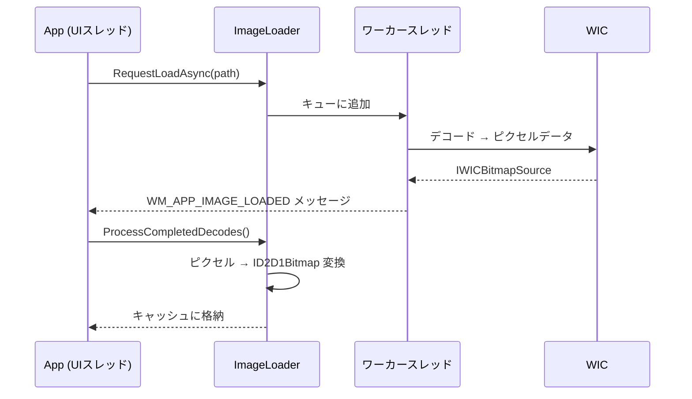

---

### 3.21 UIConstants — UI定数

`ui_constants.h` にはUI全体で共有される定数とヘルパー関数を集約する。

| 定数グループ | 内容 |
|:------------|:-----|
| Spinner | ローディングスピナーの半径・ドット数・回転速度 |
| Table | セルパディング・ボーダー幅 |
| NavButton | 戻る/進むボタンのサイズ・マージン・角丸 |
| CopyButton | コードブロックコピーボタンのサイズ・マージン |
| ScrollSnap | ピクセルスナップ関数 |
| PaneButton | ペイン閉じる/更新ボタンの矩形計算 |

---

### 3.22 MemoryResource — PMRメモリ管理

`memory_resource.h` はアプリケーション全体で使用するPMR（Polymorphic Memory Resource）を提供する。

```cpp
std::pmr::synchronized_pool_resource& GetGlobalPoolResource();
void InitGlobalMemoryResource();

class MonotonicResource {
public:
    explicit MonotonicResource(std::size_t initial_size = 16 * 1024);
    std::pmr::memory_resource* resource() noexcept;
    void Reset();
};
```

`std::pmr::wstring` や `std::pmr::vector` の使用により、頻繁なヒープアロケーションを抑制している。

---

### 3.23 SearchState — 検索機能

#### 3.23.1 概要

`SearchState` はプラットフォーム非依存の検索状態管理を担当する。クエリ文字列、一致リスト、現在選択中の一致インデックス、大文字小文字区別、ハイライト切替を管理する。

```cpp
struct SearchMatch {
    int node_index;
    uint32_t start;
    uint32_t length;
    int table_row = -1;  // テーブルセル内の一致
    int table_col = -1;
};

class SearchState {
public:
    bool IsVisible() const noexcept;
    void Show() noexcept;
    void Hide() noexcept;
    void Reset() noexcept;

    const std::wstring& GetQuery() const noexcept;
    const std::vector<SearchMatch>& GetMatches() const noexcept;
    int GetCurrentMatchIndex() const noexcept;
    int GetMatchCount() const noexcept;

    bool IsCaseSensitive() const noexcept;
    void ToggleCaseSensitive() noexcept;
    bool IsHighlightEnabled() const noexcept;
    void ToggleHighlightEnabled() noexcept;

    void SetQuery(std::wstring_view query);
    void ExecuteSearch(const std::pmr::vector<Node>& nodes);
    bool NextMatch() noexcept;   // ラップ時 true
    bool PrevMatch() noexcept;   // ラップ時 true
    void SetCurrentMatchNear(float scroll_y, const LayoutCache& cache) noexcept;
};
```

#### 3.23.2 検索バーUI

検索バーはビューポート下部にドッキングされ、以下のコントロールを含む。

- テキスト入力（IME対応）
- 前へ / 次へ ボタン
- 大文字小文字区別トグル
- ハイライト切替トグル
- 閉じるボタン
- 一致件数表示（`X / Y`）

#### 3.23.3 ハイライト色

| 対象 | 色 | アルファ |
|:-----|:---|:--------|
| 現在の一致 | `#FF8C00` (オレンジ) | 60% |
| その他の一致 | `#FFEB00` (黄色) | 40% |
| 一致なし入力背景 | `#FFD0D0` (薄赤) | — |

---

### 3.24 i18n — 国際化

#### 3.24.1 概要

`i18n` 名前空間はUI文字列のローカライズを提供する。日本語（`ja`）と英語（`en`）の2言語をサポートする。

```cpp
namespace i18n {
    enum class Lang : uint8_t { Ja, En };

    struct Strings {
        std::wstring_view tooltip_help;
        std::wstring_view tooltip_theme_toggle;
        std::wstring_view tooltip_search;
        // ... 25+ のUI文字列 ...
        UINT help_resource_id;
    };

    void Init(std::wstring_view config_lang) noexcept;
    const Strings& S() noexcept;
    std::wstring_view GetLangKey() noexcept;
}
```

言語が未設定の場合、OS の UI 言語（`GetUserDefaultUILanguage`）から自動検出する。`i18n::S()` でグローバルに文字列セットにアクセスできる。

---

### 3.25 IniParser — INI ファイルパーサ

ヘッダオンリーの軽量INIパーサ。`[Section]` と `Key=Value` 形式をサポートし、`;` / `#` コメントを無視する。

```cpp
namespace ini {
    using IniData = std::map<std::string,
                             std::map<std::string, std::string, std::less<>>,
                             std::less<>>;

    IniData Parse(std::string_view text);
    std::string Serialize(const IniData& data);
}
```

`ConfigStore` が内部で使用する。

---

### 3.26 MermaidFileCache — Mermaid ダイアグラム永続キャッシュ

#### 3.26.1 概要

`MermaidFileCache` はレンダリング済みの Mermaid ダイアグラム（PNG）をファイルシステムに永続化する。量子化幅（100px 単位）、LRU エビクション、バックグラウンド非同期書き込みをサポートする。

```cpp
class MermaidFileCache {
public:
    void Init(float current_dpr, TaskScheduler& scheduler);
    bool Lookup(uint64_t key, CacheEntry& entry, std::vector<uint8_t>& png_data);
    bool LookupDimensions(uint64_t key, CacheEntry& entry) const noexcept;
    void StoreAsync(uint64_t key, float css_width, float css_height,
                    std::vector<uint8_t> png_data);
    void SaveIndex();
    void ClearAll();
    void Shutdown();
    size_t EntryCount() const noexcept;
    uint64_t TotalSize() const noexcept;
};
```

#### 3.26.2 キャッシュパラメータ

| パラメータ | 値 | 説明 |
|:----------|:---|:-----|
| 最大エントリ数 | 4096 | LRU エビクション閾値 |
| 最大合計サイズ | 1GB | ディスク使用量上限 |
| インデックスマジック | `MEMC` | バイナリインデックスファイル識別子 |
| インデックスバージョン | 1 | フォーマットバージョン |

DPR（デバイスピクセル比）の不一致を検出した場合、キャッシュ全体をクリアする。

---

### 3.27 TaskScheduler — タスクスケジューラ

汎用ワーカースレッドプール。`MermaidFileCache` の非同期書き込みなどに使用する。

```cpp
class TaskScheduler {
public:
    void Init(int thread_count);
    void Post(std::function<void()> task);  // スレッドセーフ
    void Shutdown();
};
```

各ワーカースレッドは `CoInitializeEx(COINIT_MULTITHREADED)` を自動呼び出しする。`Init()` / `Shutdown()` は UI スレッドから、`Post()` は任意スレッドから呼び出し可能。

---

### 3.28 Tooltip — ツールチップ

#### 3.28.1 概要

`Tooltip` は Win32 の `TOOLTIPS_CLASS` を `TTF_TRACK` モードでラップし、マウスホバー時のツールチップを表示する。

```cpp
struct TooltipTarget {
    enum class Zone : uint8_t {
        None, TitleBarButton, SearchBarButton, FilePaneItem,
        FilePaneButton, TocPaneItem, TocPaneButton, MdLink,
        MdImage, CopyButton, NavButton
    };
    Zone zone = Zone::None;
    std::wstring text;
    bool operator==(const TooltipTarget&) const = default;
    bool IsEmpty() const noexcept;
};

class Tooltip {
public:
    void Init(HWND parent);
    bool Update(const TooltipTarget& target, POINT screen_pos);
    void Show();
    void Hide();
    void ApplyDarkMode(bool dark);
    void ResetTarget() noexcept;
};
```

最大幅 600px、カーソルから 20px 下にオフセット、DPI スケーリング対応。

---

### 3.29 StringConvert — 文字列変換ユーティリティ

UTF-8 ↔ ワイド文字変換のヘッダオンリーユーティリティ。

```cpp
namespace string_convert {
    std::pmr::wstring Utf8ToWide(std::string_view utf8);
    std::string WideToUtf8(std::wstring_view wide);
}
```

Windows の `MultiByteToWideChar` / `WideCharToMultiByte` を使用。変換失敗時は空文字列を返す。

---

### 3.30 Profiler — パフォーマンス計測

デバッグモード用のスコープタイマー。`OutputDebugString` で経過時間を出力する。

```cpp
class ScopedProfileTimer {
    explicit ScopedProfileTimer(const wchar_t* label) noexcept;
    ~ScopedProfileTimer() noexcept; // 経過時間を出力
};

#define MENDO_PROFILE(label) ScopedProfileTimer ...
```

`MENDO_PROFILE_ENABLED = 0` で無効化される。RAII ベースで自動スコープ計測。

---

## 4. データ構造

### 4.1 Node

アプリケーションの中核となるデータ構造。パーサの出力で、ドメインデータのみを保持する（レイアウト情報は `LayoutCache` に分離）。

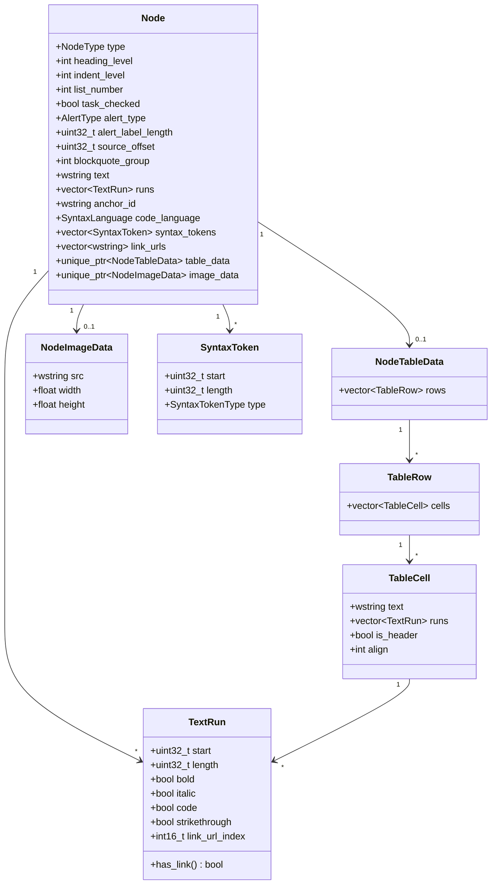

### 4.2 LayoutCache

レイアウト情報を Node から分離して管理する。

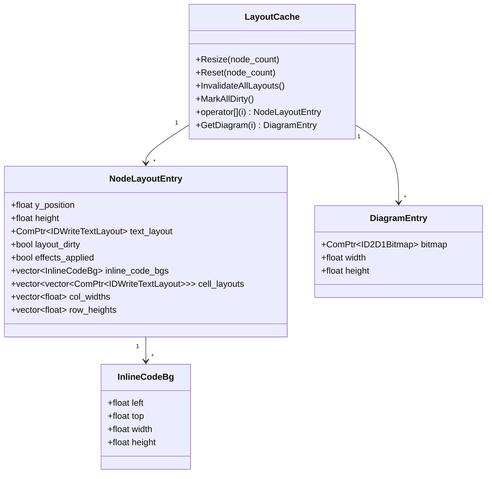

### 4.3 Document

パースされたドキュメントとそのメタデータを保持する。

```cpp
class Document {
public:
    static Document FromMarkdown(const std::string& utf8, std::wstring path);

    const std::vector<Node>& GetNodes() const noexcept;
    std::vector<Node>& GetNodesMut() noexcept;
    const std::wstring& GetFilePath() const noexcept;
    const TableOfContents& GetToc() const noexcept;
    bool IsEmpty() const noexcept;
    std::wstring GetDirectory() const;

    void ReplaceContent(std::vector<Node> new_nodes);
    void ReplaceFromMarkdown(const std::string& utf8);
};
```

### 4.4 NodeType 列挙型

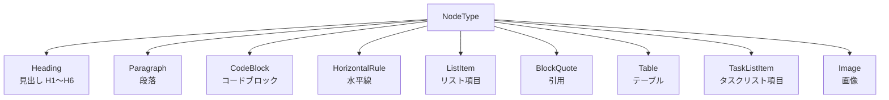

### 4.5 AlertType 列挙型

GitHub Alerts記法（`> [!NOTE]` 等）に対応するアラート種別。

```cpp
enum class AlertType : uint8_t {
    None = 0,
    Note = 1,
    Tip = 2,
    Important = 3,
    Warning = 4,
    Caution = 5
};
constexpr size_t ALERT_TYPE_COUNT = 5;
```

各種別に対応するバー色・背景色は `Theme::alert_color[]` / `Theme::alert_bg_color[]` で定義される。

### 4.6 TextSelection

```cpp
struct TextSelection {
    int      start_node = -1;
    uint32_t start_pos = 0;
    int      end_node = -1;
    uint32_t end_pos = 0;
    bool     active = false;

    constexpr void Clear() noexcept;
    static constexpr TextSelection MakeOrdered(
        int node_a, uint32_t pos_a,
        int node_b, uint32_t pos_b) noexcept;
};
```

---

## 5. 処理フロー

### 5.1 アプリケーション起動

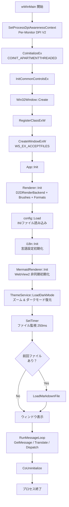

### 5.2 ファイル読み込みから描画まで

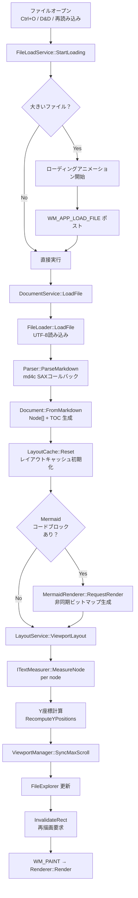

### 5.3 描画フロー

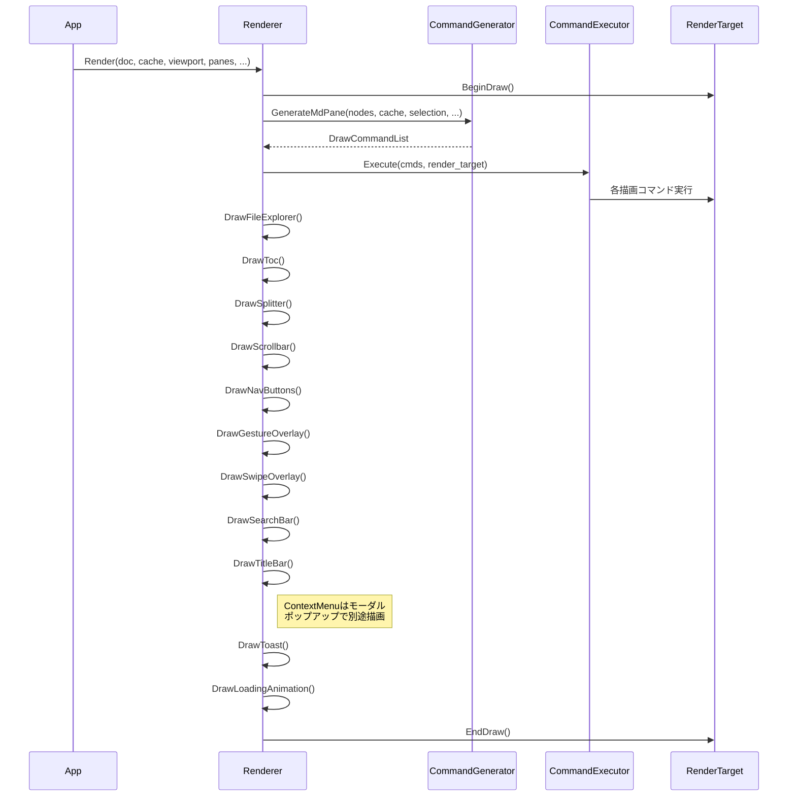

---

## 6. ビルドシステム

### 6.1 CMake 構成

```mermaid
graph TD
    ROOT[CMakeLists.txt] --> CORE[mendo_core<br>STATIC LIBRARY]
    ROOT --> EXE[mendo<br>WIN32 EXECUTABLE]
    ROOT --> TEST[mendo_tests<br>単一テストバイナリ]

    CORE --> MD4C[md4c<br>third_party]
    EXE --> CORE
    EXE --> WV2[WebView2 SDK<br>v1.0.2903.40]
    EXE --> WIL[WIL<br>v1.0.240803.1]
    EXE --> RC[mendo.rc<br>リソース]
    EXE --> RB[D2DRenderBackend]
    TEST --> CORE
    TEST --> GTEST[Google Test v1.17.0<br>FetchContent]

    CORE --> D2D1[d2d1.lib]
    CORE --> DWRITE[dwrite.lib]
    CORE --> WIC_LIB[windowscodecs.lib]
    CORE --> SHLWAPI[shlwapi.lib]
    CORE --> COMCTL[comctl32.lib]
```

### 6.2 ビルドコマンド

**通常ビルド:**

```bash
cmake -B build
cmake --build build --config Release
```

**テストなしビルド:**

```bash
cmake -B build -DMENDO_BUILD_TESTS=OFF
cmake --build build --config Release
```

**テスト実行:**

```bash
ctest --test-dir build --output-on-failure -C Release
```

### 6.3 ビルドターゲット

| ターゲット | 種別 | 説明 |
|:-----------|:-----|:-----|
| `mendo_core` | 静的ライブラリ | テスト可能なコアロジック（WinMain・ウィンドウ・レンダラを含まない） |
| `mendo` | 実行ファイル (WIN32) | メインアプリケーション |
| `mendo_tests` | テスト | 全テストを含む単一バイナリ（39テストソース） |

### 6.4 MSVC ビルド最適化

| オプション | 用途 |
|:----------|:-----|
| `/MP` | マルチプロセッサコンパイル |
| `/GL` | Whole Program Optimization (Release) |
| `/Gy` | Function-Level Linking (Release) |
| `/LTCG` | Link-Time Code Generation (Release) |
| `/OPT:REF` | 未参照関数/データの除去 (Release) |
| `/OPT:ICF` | 同一COMDATの統合 (Release) |

---

## 7. テスト仕様

### 7.1 テストフレームワーク

- **Google Test** v1.17.0（FetchContentで自動取得）
- 単一テストバイナリ `mendo_tests` に全テストをリンク
- `gtest_add_tests` で CTest に登録

### 7.2 テストソースファイル（39ファイル）

```mermaid
pie title テストカバレッジ（ファイル数ベース）
    "テスト済みモジュール" : 39
    "UIコード（テスト対象外）" : 7
```

> **テスト対象外**: `main.cpp`, `window.cpp`, `app.cpp`, `renderer.cpp`, `renderer_pane.cpp`, `d2d_render_backend.cpp`, `mermaid.cpp` はWin32 / Direct2D / WebView2依存のためユニットテスト対象外。

### 7.3 テストソース一覧

| テストファイル | 対象モジュール |
|:--------------|:-------------|
| `test_parser.cpp` | Markdownパーサ |
| `test_layout.cpp` | レイアウトエンジン |
| `test_syntax.cpp` | シンタックスハイライト |
| `test_theme.cpp` | テーマ定義 |
| `test_file_loader.cpp` | ファイル読み込み |
| `test_file_explorer.cpp` | ファイルエクスプローラ |
| `test_toc.cpp` | 目次生成 |
| `test_pane_layout.cpp` | ペインレイアウト計算 |
| `test_document_utils.cpp` | テキスト操作ユーティリティ |
| `test_config_store.cpp` | 設定永続化 |
| `test_mermaid_util.cpp` | Mermaidユーティリティ |
| `test_anchor.cpp` | アンカーID生成 |
| `test_types.cpp` | 型・データ構造 |
| `test_document.cpp` | Document クラス |
| `test_document_service.cpp` | DocumentService |
| `test_viewport_manager.cpp` | ViewportManager |
| `test_text_measurer.cpp` | ITextMeasurer |
| `test_draw_command.cpp` | DrawCommand |
| `test_app_controller.cpp` | AppController |
| `test_pane_controller.cpp` | PaneController |
| `test_nav_history.cpp` | NavHistory |
| `test_navigation_service.cpp` | NavigationService |
| `test_nav_button_format.cpp` | ナビゲーションボタン定数 |
| `test_mouse_gesture.cpp` | MouseGesture |
| `test_theme_service.cpp` | ThemeService |
| `test_file_load_service.cpp` | FileLoadService |
| `test_layout_cache.cpp` | LayoutCache |
| `test_copy_button.cpp` | コピーボタン矩形計算 |
| `test_swipe_detector.cpp` | SwipeDetector |
| `test_titlebar.cpp` | TitleBar |
| `test_toast_notifier.cpp` | ToastNotifier |
| `test_ui_constants.cpp` | UIConstants |
| `test_context_menu.cpp` | ContextMenu |
| `test_image.cpp` | ImageLoader |
| `test_help.cpp` | ヘルプドキュメント |
| `test_search_state.cpp` | SearchState |
| `test_ini_parser.cpp` | IniParser |
| `test_locale.cpp` | i18n ロケール |
| `test_mermaid_file_cache.cpp` | MermaidFileCache |

### 7.4 主要テストケース

#### Parser テスト

- [x] 見出し（H1〜H6）のパース
- [x] 段落テキストのパース
- [x] 太字・斜体・取り消し線・インラインコード
- [x] リンクのパースとURL抽出
- [x] コードブロック（言語指定あり/なし）
- [x] 順序付き/なしリスト（ネストあり）
- [x] タスクリスト
- [x] テーブル（アライメント含む）
- [x] 引用ブロック
- [x] 水平線
- [x] Mermaidコードブロック検出

#### Layout テスト

- [x] フォーマット生成（全見出しレベル + 本文 + コード）
- [x] Y座標の累積計算
- [x] ダーティフラグによる差分計算

#### Syntax テスト

- [x] C++キーワード・型のトークン化
- [x] Python文字列・コメントの検出
- [x] JavaScript関数名の検出
- [x] 言語自動検出（info string解析）

#### ナビゲーションテスト

- [x] NavHistory の Push / GoBack / GoForward
- [x] 履歴上限（MAX_HISTORY = 50）
- [x] NavigationService のリンク種別判定
- [x] MouseGesture の状態遷移と方向検出

#### コンテキストメニューテスト

- [x] メニュー項目の構築（MdPane / 非MdPane）
- [x] ナビゲーション行のレイアウト
- [x] ヒットテスト

#### 画像テスト

- [x] 画像パスの解決
- [x] キャッシュの動作確認

#### ヘルプテスト

- [x] ヘルプパス判定（`IsHelpPath`）
- [x] ヘルプドキュメントの読み込み

#### 検索テスト

- [x] 検索バーの表示/非表示切替
- [x] クエリによるテキスト検索と一致件数
- [x] 次/前の一致へのナビゲーション（ラップアラウンド）
- [x] 大文字小文字区別の切替
- [x] テーブルセル内の検索
- [x] スクロール位置に基づく最近接一致の選択

#### IniParser テスト

- [x] セクション・キー・値のパースとシリアライズ
- [x] コメント行の無視
- [x] 空白のトリミング

#### ローカライズテスト

- [x] 日本語・英語の文字列セット初期化
- [x] OS言語からの自動検出

#### Mermaid キャッシュテスト

- [x] キャッシュの保存と読み込み
- [x] LRU エビクション
- [x] DPR 不一致時のクリア

#### ビューポートテスト

- [x] スムーズスクロールの補間計算（フレームレート非依存）
- [x] ズームイン/アウト/リセット
- [x] 選択の全選択/クリア
- [x] max_scroll の同期

---

## 8. DPI対応仕様

### 8.1 DPI認識レベル

**Per-Monitor DPI Awareness V2** を採用。

```mermaid
flowchart LR
    START[アプリ起動] --> SET[SetProcessDpiAwarenessContext<br>DPI_AWARENESS_CONTEXT_PER_MONITOR_AWARE_V2]
    SET --> INIT[初期DPIでリソース作成]
    INIT --> MOVE{モニタ間<br>移動？}
    MOVE -->|Yes| WM[WM_DPICHANGED 受信]
    WM --> RESIZE[ウィンドウサイズ変更<br>SetWindowPos]
    RESIZE --> RECREATE[リソース再作成<br>RenderTarget / Brushes / Formats]
    RECREATE --> RELAYOUT[LayoutCache::MarkAllDirty<br>全ノード再レイアウト]
    RELAYOUT --> REPAINT[再描画]
    REPAINT --> MOVE
    MOVE -->|No| WAIT[メッセージ待ち]
    WAIT --> MOVE
```

### 8.2 DIP変換

すべての座標・サイズはDIP（Device Independent Pixel）で管理する。

```
物理ピクセル = DIP × (DPI / 96.0)
```

---

## 9. 非機能要件

### 9.1 パフォーマンス目標

| 項目 | 目標値 |
|:-----|:------|
| 小規模ファイル（< 100行）の初回表示 | < 50ms |
| 大規模ファイル（> 10,000行）の初回表示 | < 500ms |
| スクロール時のフレームレート | 60fps |
| メモリ使用量（1万行ファイル表示時） | < 100MB |
| ファイル変更検出の応答時間 | < 500ms |

### 9.2 対応環境

| 項目 | 要件 |
|:-----|:-----|
| OS | Windows 10 1809 以降 / Windows 11 |
| アーキテクチャ | x64 |
| ランタイム | WebView2 Runtime（Mermaid描画に必要） |
| コンパイラ | MSVC (C++23) |
| ビルドツール | CMake 3.20+ |

---

## 10. 付録

### 付録A: ファイル一覧

```
src/
├── main.cpp                # エントリポイント (wWinMain)
├── window.h                # Win32Window 宣言
├── window.cpp              # Win32Window 実装 (薄い Win32 ラッパー)
├── app.h                   # App 宣言
├── app.cpp                 # App 実装 (アプリケーション統括)
├── app_navigate.cpp        # App ナビゲーション処理
├── app_mouse.cpp           # App マウスイベント処理
├── app_scroll.cpp          # App スクロール処理
├── app_controller.h        # AppController 宣言 (イベント→アクション変換)
├── app_controller.cpp      # AppController 実装
├── app_events.h            # イベント型 & アクション型定義
├── renderer.h              # Renderer 宣言
├── renderer.cpp            # Direct2D 描画実装
├── renderer_pane.cpp       # ペイン描画
├── render_backend.h        # IRenderBackend インターフェース
├── d2d_render_backend.h    # D2DRenderBackend 宣言
├── d2d_render_backend.cpp  # D2DRenderBackend 実装
├── draw_command.h          # DrawCommand variant 型定義
├── command_generator.h     # CommandGenerator 宣言
├── command_generator.cpp   # 描画コマンド生成
├── command_executor.h      # CommandExecutor 宣言
├── command_executor.cpp    # 描画コマンド実行
├── parser.h                # Parser 宣言
├── parser.cpp              # Markdown パース実装
├── layout.h                # LayoutEngine 宣言
├── layout.cpp              # テキスト計測実装
├── layout_service.h        # LayoutService 宣言
├── layout_service.cpp      # レイアウト統括
├── layout_cache.h          # LayoutCache 宣言 (レイアウトデータ分離)
├── text_measurer.h         # ITextMeasurer インターフェース
├── dwrite_measurer.h       # DWriteTextMeasurer 宣言
├── dwrite_measurer.cpp     # DirectWrite テキスト計測実装
├── types.h                 # コアデータ構造 (Node, TextRun, etc.)
├── document.h              # Document 宣言
├── document.cpp            # Document 実装
├── document_service.h      # DocumentService 宣言
├── document_service.cpp    # ファイル読み込みオーケストレーション
├── theme.h                 # Theme 宣言
├── theme.cpp               # テーマ定義
├── theme_service.h         # ThemeService 宣言
├── theme_service.cpp       # テーマ管理サービス
├── syntax.h                # Syntax 宣言
├── syntax.cpp              # シンタックスハイライト実装
├── file_loader.h           # FileLoader 宣言
├── file_loader.cpp         # ファイル I/O 実装
├── file_load_service.h     # FileLoadService 宣言
├── file_load_service.cpp   # ファイルロード制御 & アニメーション
├── file_explorer.h         # FileExplorer 宣言
├── file_explorer.cpp       # ファイルブラウザ実装
├── toc.h                   # TableOfContents 宣言
├── toc.cpp                 # 目次生成実装
├── pane.h                  # ペインデータ構造 (PaneRect, ScrollState)
├── pane_layout.h           # PaneLayout / PaneZone 宣言
├── pane_layout.cpp         # ペインレイアウト計算
├── pane_controller.h       # PaneController 宣言
├── pane_controller.cpp     # ペイン状態管理
├── document_utils.h        # DocumentUtils 宣言
├── document_utils.cpp      # テキスト操作ユーティリティ
├── viewport_manager.h      # ViewportManager 宣言 (スクロール/選択/ズーム)
├── navigation_service.h    # NavigationService 宣言
├── navigation_service.cpp  # リンク & 履歴ナビゲーション
├── nav_history.h           # NavHistory 宣言
├── nav_history.cpp         # ブラウザスタイル履歴
├── mouse_gesture.h         # MouseGesture 宣言 (右ドラッグジェスチャ)
├── swipe_detector.h        # SwipeDetector 宣言 (タッチパッドスワイプ検出)
├── titlebar.h              # TitleBar 宣言 (カスタムタイトルバー)
├── toast_notifier.h        # ToastNotifier 宣言 (トースト通知)
├── context_menu.h          # ContextMenu 宣言 (カスタムコンテキストメニュー)
├── context_menu.cpp        # ContextMenu 実装
├── image_loader.h          # ImageLoader 宣言 (非同期画像読み込み)
├── image_loader.cpp        # ImageLoader 実装
├── ui_constants.h          # UI定数 & ヘルパー関数
├── memory_resource.h       # PMRメモリリソース管理
├── utility.h               # ユーティリティ関数
├── hit_test_service.h      # HitTestService 宣言
├── hit_test_service.cpp    # ヒットテスト
├── config_store.h          # ConfigStore 宣言
├── config_store.cpp        # 設定永続化実装
├── config_service.h        # ConfigService 宣言 (設定ラッパー)
├── mermaid.h               # MermaidRenderer 宣言
├── mermaid.cpp             # WebView2 ダイアグラム描画
├── mermaid_util.h          # Mermaid ヘルパー宣言
├── mermaid_util.cpp        # Mermaid ヘルパー実装
├── mermaid_file_cache.h    # MermaidFileCache 宣言 (永続ダイアグラムキャッシュ)
├── mermaid_file_cache.cpp  # MermaidFileCache 実装
├── search_state.h          # SearchState 宣言 (検索状態管理)
├── search_state.cpp        # SearchState 実装
├── i18n.h                  # 国際化 (日本語/英語UI文字列)
├── ini_parser.h            # INIファイルパーサ (ヘッダオンリー)
├── task_scheduler.h        # TaskScheduler 宣言 (ワーカースレッドプール)
├── task_scheduler.cpp      # TaskScheduler 実装
├── tooltip.h               # Tooltip 宣言 (ホバーツールチップ)
├── string_convert.h        # UTF-8 ↔ ワイド文字変換 (ヘッダオンリー)
├── profiler.h              # パフォーマンス計測マクロ (デバッグ用)
└── resource.h              # リソース ID
```

### 付録B: 依存ライブラリ

| ライブラリ | バージョン | 用途 | ライセンス |
|:-----------|:----------|:-----|:----------|
| md4c | latest | Markdown パース | MIT |
| WebView2 SDK | 1.0.2903.40 | Mermaid描画用ブラウザコントロール | BSD |
| WIL | 1.0.240803.1 | Windows実装ヘルパー | MIT |
| Google Test | 1.17.0 | ユニットテスト | BSD-3-Clause |
| mermaid.js | latest | ダイアグラム描画 | MIT |

### 付録C: Markdown表示サンプル

本節は mendo の表示テストを兼ねている。

---

#### C.1 見出しレベルテスト

# 見出しレベル1
## 見出しレベル2
### 見出しレベル3
#### 見出しレベル4
##### 見出しレベル5
###### 見出しレベル6

---

#### C.2 テキスト装飾テスト

これは **太字** のテストです。
これは *斜体* のテストです。
これは ***太字かつ斜体*** のテストです。
これは ~~取り消し線~~ のテストです。
これは `インラインコード` のテストです。
これは **太字の中に *斜体* を含む**テストです。

---

#### C.3 リンクテスト

- 外部リンク: [GitHub](https://github.com)
- 内部アンカー: [はじめに](#1-はじめに)
- URLそのまま: https://example.com

---

#### C.4 リストテスト

##### 順序なしリスト

- 項目 A
  - サブ項目 A-1
  - サブ項目 A-2
    - サブサブ項目 A-2-a
    - サブサブ項目 A-2-b
  - サブ項目 A-3
- 項目 B
- 項目 C

##### 順序付きリスト

1. 第一ステップ
2. 第二ステップ
   1. サブステップ 2-1
   2. サブステップ 2-2
3. 第三ステップ

##### タスクリスト

- [x] 設計完了
- [x] Parser 実装
- [x] Renderer 実装
- [x] テスト作成
- [x] サービスアーキテクチャへのリファクタリング
- [x] ナビゲーション機能
- [x] マウスジェスチャ
- [x] カスタムタイトルバー
- [x] トースト通知
- [x] タッチパッドスワイプ検出
- [x] カスタムコンテキストメニュー
- [x] 非同期画像読み込み
- [x] ヘルプドキュメント
- [x] 検索機能
- [x] 国際化 (i18n)
- [x] Mermaid ファイルキャッシュ
- [x] ツールチップ
- [ ] パフォーマンス最適化
- [ ] ドキュメント整備

---

#### C.5 引用テスト

> これは引用ブロックです。
> 複数行にわたる引用を表示できます。

> **ネストされた引用:**
>
> > 内側の引用です。
> > Direct2D は高速な2Dグラフィックスを提供します。

---

#### C.6 コードブロックテスト

##### C++ コード

```cpp
#include <windows.h>
#include <d2d1.h>
#include <dwrite.h>
#include <string>
#include <vector>

// Direct2D レンダーターゲットの初期化
HRESULT InitializeD2D(HWND hwnd, ID2D1HwndRenderTarget** ppRT) {
    ID2D1Factory* pFactory = nullptr;
    HRESULT hr = D2D1CreateFactory(
        D2D1_FACTORY_TYPE_SINGLE_THREADED,
        &pFactory
    );

    if (SUCCEEDED(hr)) {
        RECT rc;
        GetClientRect(hwnd, &rc);

        D2D1_SIZE_U size = D2D1::SizeU(
            rc.right - rc.left,
            rc.bottom - rc.top
        );

        hr = pFactory->CreateHwndRenderTarget(
            D2D1::RenderTargetProperties(),
            D2D1::HwndRenderTargetProperties(hwnd, size),
            ppRT
        );
    }

    if (pFactory) pFactory->Release();
    return hr;
}

int main() {
    std::vector<std::string> items = {"alpha", "beta", "gamma"};
    for (const auto& item : items) {
        // 各アイテムの処理
        std::cout << item << std::endl;
    }
    return 0;
}
```

##### Python コード

```python
import hashlib
from pathlib import Path
from typing import Optional

class MarkdownParser:
    """Markdownファイルのパーサクラス"""

    def __init__(self, path: str):
        self.path = Path(path)
        self._cache: dict[str, str] = {}

    def parse(self) -> list[dict]:
        """ファイルを読み込みパースする"""
        content = self.path.read_text(encoding="utf-8")
        lines = content.splitlines()

        nodes = []
        for i, line in enumerate(lines):
            if line.startswith("# "):
                nodes.append({
                    "type": "heading",
                    "level": 1,
                    "text": line[2:],
                    "line": i + 1
                })
            elif line.startswith("```"):
                # コードブロックの開始/終了
                pass

        return nodes

    def get_hash(self) -> Optional[str]:
        """ファイルのSHA-256ハッシュを返す"""
        if not self.path.exists():
            return None
        data = self.path.read_bytes()
        return hashlib.sha256(data).hexdigest()

# 使用例
if __name__ == "__main__":
    parser = MarkdownParser("README.md")
    for node in parser.parse():
        print(f"[L{node['line']}] {node['type']}: {node['text']}")
```

##### JavaScript コード

```javascript
/**
 * Mermaidダイアグラムのレンダリング
 * WebView2経由で呼び出される
 */
async function renderMermaid(code, config) {
    const { mermaid } = await import('./mermaid.esm.min.mjs');

    mermaid.initialize({
        startOnLoad: false,
        theme: config.darkMode ? 'dark' : 'default',
        securityLevel: 'strict',
        fontFamily: '"Yu Gothic UI", sans-serif',
    });

    try {
        const { svg } = await mermaid.render('diagram', code);

        // SVG → Canvas → PNG 変換
        const canvas = document.createElement('canvas');
        const ctx = canvas.getContext('2d');
        const img = new Image();

        return new Promise((resolve, reject) => {
            img.onload = () => {
                canvas.width = img.naturalWidth * 2;
                canvas.height = img.naturalHeight * 2;
                ctx.scale(2, 2);
                ctx.drawImage(img, 0, 0);
                resolve(canvas.toDataURL('image/png'));
            };
            img.onerror = reject;
            img.src = `data:image/svg+xml;charset=utf-8,${encodeURIComponent(svg)}`;
        });
    } catch (error) {
        console.error('Mermaid render failed:', error.message);
        return null;
    }
}
```

##### TypeScript コード

```typescript
import { readFileSync } from 'fs';
import * as path from 'path';

interface MarkdownNode {
    type: 'heading' | 'paragraph' | 'code_block';
    level?: number;
    text: string;
    language?: string;
}

type ParseResult = {
    nodes: MarkdownNode[];
    metadata: Record<string, unknown>;
};

class MarkdownLoader {
    private cache = new Map<string, ParseResult>();

    constructor(private readonly basePath: string) {}

    async load(filename: string): Promise<ParseResult> {
        const fullPath = path.join(this.basePath, filename);
        const cached = this.cache.get(fullPath);
        if (cached !== undefined) {
            return cached;
        }

        const content: string = readFileSync(fullPath, 'utf-8');
        const nodes: MarkdownNode[] = this.parse(content);
        const result: ParseResult = { nodes, metadata: {} };
        this.cache.set(fullPath, result);
        return result;
    }

    private parse(content: string): MarkdownNode[] {
        const lines = content.split('\n');
        const nodes: MarkdownNode[] = [];
        for (const line of lines) {
            if (line.startsWith('# ')) {
                nodes.push({ type: 'heading', level: 1, text: line.slice(2) });
            } else if (line.trim().length > 0) {
                nodes.push({ type: 'paragraph', text: line });
            }
        }
        return nodes;
    }
}

// 使用例
const loader = new MarkdownLoader('./docs');
loader.load('README.md').then((result) => {
    console.log(`ノード数: ${result.nodes.length}`);
});
```

##### Go コード

```go
package main

import (
	"bufio"
	"fmt"
	"os"
	"strings"
)

// MarkdownNode はMarkdownドキュメントの1要素を表す
type MarkdownNode struct {
	Type  string
	Level int
	Text  string
}

// ParseMarkdown はMarkdownテキストをパースしてノードのスライスを返す
func ParseMarkdown(content string) []MarkdownNode {
	var nodes []MarkdownNode
	scanner := bufio.NewScanner(strings.NewReader(content))

	for scanner.Scan() {
		line := scanner.Text()
		switch {
		case strings.HasPrefix(line, "# "):
			nodes = append(nodes, MarkdownNode{
				Type:  "heading",
				Level: 1,
				Text:  line[2:],
			})
		case strings.HasPrefix(line, "```"):
			// コードブロック開始/終了
			lang := strings.TrimPrefix(line, "```")
			nodes = append(nodes, MarkdownNode{
				Type: "code_fence",
				Text: lang,
			})
		default:
			if len(strings.TrimSpace(line)) > 0 {
				nodes = append(nodes, MarkdownNode{
					Type: "paragraph",
					Text: line,
				})
			}
		}
	}
	return nodes
}

func main() {
	data, err := os.ReadFile("README.md")
	if err != nil {
		fmt.Fprintf(os.Stderr, "読み込みエラー: %v\n", err)
		os.Exit(1)
	}

	nodes := ParseMarkdown(string(data))
	for i, node := range nodes {
		fmt.Printf("[%d] %s: %s\n", i, node.Type, node.Text)
	}
}
```

##### Rust コード

```rust
use std::fs;
use std::io::{self, BufRead};
use std::path::Path;
use std::collections::HashMap;

/// Markdownノードの種類
#[derive(Debug, Clone)]
enum NodeType {
    Heading(u8),
    Paragraph,
    CodeBlock(String),
}

/// パースされたMarkdownノード
#[derive(Debug, Clone)]
struct MarkdownNode {
    node_type: NodeType,
    text: String,
}

/// Markdownパーサ
struct Parser {
    cache: HashMap<String, Vec<MarkdownNode>>,
}

impl Parser {
    fn new() -> Self {
        Parser {
            cache: HashMap::new(),
        }
    }

    /// ファイルを読み込みパースする
    fn parse_file(&mut self, path: &Path) -> io::Result<&Vec<MarkdownNode>> {
        let key = path.to_string_lossy().to_string();
        if !self.cache.contains_key(&key) {
            let content = fs::read_to_string(path)?;
            let nodes = self.parse(&content);
            self.cache.insert(key.clone(), nodes);
        }
        Ok(self.cache.get(&key).unwrap())
    }

    fn parse(&self, content: &str) -> Vec<MarkdownNode> {
        let mut nodes = Vec::new();
        for line in content.lines() {
            if let Some(text) = line.strip_prefix("# ") {
                nodes.push(MarkdownNode {
                    node_type: NodeType::Heading(1),
                    text: text.to_string(),
                });
            } else if !line.trim().is_empty() {
                nodes.push(MarkdownNode {
                    node_type: NodeType::Paragraph,
                    text: line.to_string(),
                });
            }
        }
        nodes
    }
}

fn main() -> io::Result<()> {
    let mut parser = Parser::new();
    let path = Path::new("README.md");
    let nodes = parser.parse_file(path)?;

    for (i, node) in nodes.iter().enumerate() {
        println!("[{}] {:?}: {}", i, node.node_type, node.text);
    }
    Ok(())
}
```

##### Bash コード

```bash
#!/bin/bash
# Markdownファイルの見出しを抽出するスクリプト

set -euo pipefail

readonly SCRIPT_DIR="$(cd "$(dirname "${BASH_SOURCE[0]}")" && pwd)"
readonly DEFAULT_EXT="*.md"

# 使い方を表示
usage() {
    echo "Usage: $(basename "$0") [-d directory] [-l level] [-h]"
    echo "  -d  検索ディレクトリ (デフォルト: カレント)"
    echo "  -l  見出しレベル (1-6, デフォルト: 全て)"
    echo "  -h  ヘルプ表示"
    exit 0
}

# 見出しを抽出する関数
extract_headings() {
    local file="$1"
    local level="${2:-}"

    if [[ ! -f "$file" ]]; then
        echo "エラー: ファイルが見つかりません: $file" >&2
        return 1
    fi

    local pattern="^#{1,6} "
    if [[ -n "$level" ]]; then
        pattern="^#{${level}} "
    fi

    grep -nE "$pattern" "$file" | while IFS=: read -r lineno content; do
        local depth="${content%%[! #]*}"
        depth="${#depth}"
        printf "  L%-4d [H%d] %s\n" "$lineno" "$depth" "${content#*# }"
    done
}

# メイン処理
main() {
    local dir="."
    local level=""

    while getopts "d:l:h" opt; do
        case "$opt" in
            d) dir="$OPTARG" ;;
            l) level="$OPTARG" ;;
            h) usage ;;
            *) usage ;;
        esac
    done

    echo "=== Markdown見出し一覧 ==="
    find "$dir" -name "$DEFAULT_EXT" -type f | sort | while read -r file; do
        echo ""
        echo "📄 $file"
        extract_headings "$file" "$level"
    done
}

main "$@"
```

##### PowerShell コード

```powershell
#Requires -Version 5.1
<#
.SYNOPSIS
    Markdownファイルの解析ユーティリティ
.DESCRIPTION
    指定ディレクトリ内のMarkdownファイルから見出しとリンクを抽出する
#>

[CmdletBinding()]
param(
    [Parameter(Position = 0)]
    [string]$Path = ".",

    [ValidateRange(1, 6)]
    [int]$HeadingLevel = 0,

    [switch]$IncludeLinks
)

class MarkdownInfo {
    [string]$File
    [System.Collections.Generic.List[hashtable]]$Headings
    [System.Collections.Generic.List[hashtable]]$Links

    MarkdownInfo([string]$file) {
        $this.File = $file
        $this.Headings = [System.Collections.Generic.List[hashtable]]::new()
        $this.Links = [System.Collections.Generic.List[hashtable]]::new()
    }
}

function Get-MarkdownHeadings {
    [CmdletBinding()]
    param(
        [Parameter(Mandatory, ValueFromPipeline)]
        [string]$FilePath,

        [int]$Level = 0
    )

    process {
        $info = [MarkdownInfo]::new($FilePath)
        $lineNum = 0

        foreach ($line in Get-Content -Path $FilePath -Encoding UTF8) {
            $lineNum++

            # 見出しの検出
            if ($line -match '^(#{1,6})\s+(.+)$') {
                $depth = $Matches[1].Length
                if ($Level -eq 0 -or $depth -eq $Level) {
                    $info.Headings.Add(@{
                        Line  = $lineNum
                        Level = $depth
                        Text  = $Matches[2]
                    })
                }
            }

            # リンクの検出
            if ($line -match '\[([^\]]+)\]\(([^)]+)\)') {
                $info.Links.Add(@{
                    Line = $lineNum
                    Text = $Matches[1]
                    Url  = $Matches[2]
                })
            }
        }

        Write-Output $info
    }
}

# メイン処理
$mdFiles = Get-ChildItem -Path $Path -Filter "*.md" -Recurse -File
Write-Host "=== Markdown解析結果 ===" -ForegroundColor Cyan

foreach ($file in $mdFiles) {
    $result = $file.FullName | Get-MarkdownHeadings -Level $HeadingLevel
    Write-Host "`n$($result.File)" -ForegroundColor Green

    foreach ($h in $result.Headings) {
        $indent = "  " * $h.Level
        Write-Host "${indent}[H$($h.Level)] L$($h.Line): $($h.Text)"
    }

    if ($IncludeLinks -and $result.Links.Count -gt 0) {
        Write-Host "  --- リンク ---" -ForegroundColor Yellow
        foreach ($link in $result.Links) {
            Write-Host "  L$($link.Line): [$($link.Text)]($($link.Url))"
        }
    }
}
```

##### Cmd (バッチ) コード

```cmd
@echo off
rem Markdownファイルの見出しを簡易抽出するバッチスクリプト
setlocal enabledelayedexpansion

set "TARGET_DIR=%~1"
if "%TARGET_DIR%"=="" set "TARGET_DIR=."

echo === Markdown 見出し抽出ツール ===
echo 対象ディレクトリ: %TARGET_DIR%
echo.

set "FILE_COUNT=0"
set "HEADING_COUNT=0"

for /r "%TARGET_DIR%" %%f in (*.md) do (
    set /a FILE_COUNT+=1
    echo ファイル: %%f
    set "LINE_NUM=0"

    for /f "usebackq delims=" %%l in ("%%f") do (
        set /a LINE_NUM+=1
        set "LINE=%%l"

        rem 見出し行の判定（#で始まる行）
        if "!LINE:~0,2!"=="# " (
            echo   L!LINE_NUM!: [H1] !LINE:~2!
            set /a HEADING_COUNT+=1
        )
        if "!LINE:~0,3!"=="## " (
            echo   L!LINE_NUM!: [H2] !LINE:~3!
            set /a HEADING_COUNT+=1
        )
        if "!LINE:~0,4!"=="### " (
            echo   L!LINE_NUM!: [H3] !LINE:~4!
            set /a HEADING_COUNT+=1
        )
    )
    echo.
)

echo === 結果 ===
echo ファイル数: %FILE_COUNT%
echo 見出し数:   %HEADING_COUNT%

endlocal
exit /b 0
```

---

#### C.7 テーブルテスト

##### 基本テーブル

| 列1 | 列2 | 列3 |
|-----|-----|-----|
| A1 | B1 | C1 |
| A2 | B2 | C2 |
| A3 | B3 | C3 |

##### アライメント指定テーブル

| 左寄せ | 中央寄せ | 右寄せ |
|:-------|:-------:|-------:|
| apple | banana | cherry |
| 123 | 456 | 789 |
| short | medium length text | extraordinarily long text |

##### テーブル内リンク

| 名前 | リンク | 備考 |
|:-----|:-------|:-----|
| GitHub | [github.com](https://github.com) | 外部リンク |
| はじめに | [1. はじめに](#1-はじめに) | 内部アンカーリンク |
| **太字リンク** | [**Bold Link**](https://example.com) | 太字+リンク |
| 複合 | 前文 [リンク](https://example.com) 後文 | テキスト中のリンク |

##### 大きなテーブル

| # | コンポーネント | 主要ファイル | 依存先 | テスト |
|:--|:--------------|:------------|:------|:------|
| 1 | Win32Window | window.h/cpp | App | なし |
| 2 | App | app.h/cpp | 全サービス | なし |
| 3 | AppController | app_controller.h/cpp | AppEvents | あり |
| 4 | Renderer | renderer.h/cpp | D2D, CommandExecutor | なし |
| 5 | CommandGenerator | command_generator.h/cpp | DrawCommand, Types | あり |
| 6 | CommandExecutor | command_executor.h/cpp | D2D | なし |
| 7 | Parser | parser.h/cpp | md4c, Types | あり |
| 8 | LayoutEngine | layout.h/cpp | ITextMeasurer, Types | あり |
| 9 | LayoutService | layout_service.h/cpp | LayoutEngine, ViewportManager | なし |
| 10 | Document | document.h/cpp | Parser, Types | あり |
| 11 | DocumentService | document_service.h/cpp | FileLoader, Document | あり |
| 12 | Theme | theme.h/cpp | なし | あり |
| 13 | ThemeService | theme_service.h/cpp | ConfigService, Theme | あり |
| 14 | Syntax | syntax.h/cpp | なし | あり |
| 15 | FileLoader | file_loader.h/cpp | Win32 API | あり |
| 16 | FileLoadService | file_load_service.h/cpp | DocumentService | あり |
| 17 | FileExplorer | file_explorer.h/cpp | Win32 API | あり |
| 18 | TOC | toc.h/cpp | Types | あり |
| 19 | PaneController | pane_controller.h/cpp | PaneLayout | あり |
| 20 | ViewportManager | viewport_manager.h | LayoutCache | あり |
| 21 | NavigationService | navigation_service.h/cpp | NavHistory | あり |
| 22 | NavHistory | nav_history.h/cpp | なし | あり |
| 23 | MouseGesture | mouse_gesture.h | なし | あり |
| 24 | HitTestService | hit_test_service.h/cpp | Types, LayoutCache | なし |
| 25 | ConfigStore | config_store.h/cpp | Win32 API | あり |
| 26 | MermaidRenderer | mermaid.h/cpp | WebView2, WIC | ユーティリティのみ |
| 27 | TitleBar | titlebar.h | なし | あり |
| 28 | SwipeDetector | swipe_detector.h | なし | あり |
| 29 | ToastNotifier | toast_notifier.h | なし | あり |
| 30 | UIConstants | ui_constants.h | なし | あり |
| 31 | ContextMenu | context_menu.h/cpp | D2D, Theme | あり |
| 32 | ImageLoader | image_loader.h/cpp | WIC, D2D | あり |
| 33 | MemoryResource | memory_resource.h | PMR | なし |
| 34 | SearchState | search_state.h/cpp | Types, LayoutCache | あり |
| 35 | i18n | i18n.h | なし | あり |
| 36 | IniParser | ini_parser.h | なし | あり |
| 37 | MermaidFileCache | mermaid_file_cache.h/cpp | TaskScheduler | あり |
| 38 | TaskScheduler | task_scheduler.h/cpp | なし | なし |
| 39 | Tooltip | tooltip.h | Win32 API | なし |
| 40 | StringConvert | string_convert.h | Win32 API | なし |
| 41 | Profiler | profiler.h | Win32 API | なし |

---

#### C.8 水平線テスト

上のテキスト

---

中間のテキスト

***

下のテキスト

___

最後のテキスト

---

#### C.9 Mermaid ダイアグラムテスト

##### フローチャート

```mermaid
flowchart TD
    A[開始] --> B{条件分岐}
    B -->|Yes| C[処理A]
    B -->|No| D[処理B]
    C --> E[結果出力]
    D --> E
    E --> F[終了]
```

##### シーケンス図

```mermaid
sequenceDiagram
    actor User as ユーザー
    participant App as mendo
    participant FS as ファイルシステム

    User->>App: ファイルをドロップ
    App->>FS: ファイル読み込み
    FS-->>App: UTF-8テキスト
    App->>App: Markdownパース
    App->>App: レイアウト計算
    App->>App: Direct2D描画
    App-->>User: 画面表示
```

##### クラス図

```mermaid
classDiagram
    class Win32Window {
        -HWND hwnd_
        -App app_
        +Create() bool
        +RunMessageLoop() int
    }

    class App {
        -Renderer renderer_
        -Document doc_
        -ViewportManager viewport_
        -PaneController panes_
        +Init(hwnd) bool
        +OnPaint()
        +LoadMarkdownFile(path)
    }

    class Renderer {
        -IRenderBackend* backend_
        -CommandExecutor executor_
        +Init(hwnd) HRESULT
        +Render(doc, cache, viewport, ...)
    }

    class Parser {
        +ParseMarkdown(text) vector~Node~
    }

    class LayoutEngine {
        -ITextMeasurer* measurer_
        +ComputeLayout(nodes, cache, width)
    }

    Win32Window --> App
    App --> Renderer
    App --> Parser
    App --> LayoutEngine
```

##### 状態遷移図

```mermaid
stateDiagram-v2
    [*] --> 初期状態
    初期状態 --> ファイル表示中 : ファイルを開く
    ファイル表示中 --> ファイル表示中 : スクロール / ズーム
    ファイル表示中 --> テキスト選択中 : マウスドラッグ
    テキスト選択中 --> ファイル表示中 : マウスリリース
    ファイル表示中 --> ジェスチャ中 : 右ドラッグ開始
    ジェスチャ中 --> ファイル表示中 : ナビゲーション実行 / 中止
    ファイル表示中 --> ファイル表示中 : ファイル変更検出 → 再読み込み
    ファイル表示中 --> 初期状態 : ファイルを閉じる
    初期状態 --> [*]
```

##### ガントチャート

```mermaid
gantt
    title mendo 開発タイムライン
    dateFormat  YYYY-MM-DD
    section 基盤
    プロジェクトセットアップ      :done, a1, 2025-01-01, 7d
    Win32ウィンドウ基盤           :done, a2, after a1, 14d
    Direct2D/DirectWrite初期化    :done, a3, after a2, 7d

    section コア機能
    Markdownパーサ統合            :done, b1, after a3, 14d
    テキストレイアウトエンジン    :done, b2, after b1, 14d
    レンダリングエンジン          :done, b3, after b2, 21d

    section 拡張機能
    シンタックスハイライト        :done, c1, after b3, 7d
    Mermaidダイアグラム           :done, c2, after c1, 14d
    3ペインレイアウト             :done, c3, after c2, 7d
    テーマ・ズーム                :done, c4, after c3, 7d

    section リファクタリング
    サービスアーキテクチャ        :done, e1, after c4, 14d
    Command パターン              :done, e2, after e1, 7d
    ナビゲーション & ジェスチャ   :done, e3, after e2, 7d

    section UI拡張
    カスタムタイトルバー          :done, f1, after e3, 7d
    トースト通知                  :done, f2, after f1, 3d
    タッチパッドスワイプ          :done, f3, after f2, 3d
    カスタムコンテキストメニュー  :done, f4, after f3, 5d
    非同期画像読み込み            :done, f5, after f4, 5d
    ヘルプドキュメント            :done, f6, after f5, 3d
    PMRメモリ最適化               :done, f7, after f6, 7d

    section 品質
    ユニットテスト整備            :done, d1, after f7, 14d
    パフォーマンス最適化          :active, d2, after d1, 14d
    ドキュメント整備              :active, d3, after d1, 7d
```

---

#### C.10 複合テスト

以下は複数の書式が混在する段落のテストです。

**Direct2D** は Microsoft が提供する *ハードウェアアクセラレーション対応* の2Dグラフィックス API であり、`ID2D1RenderTarget` インターフェースを通じて図形やテキストの描画を行う。詳しくは [Microsoft Docs](https://docs.microsoft.com) を参照。~~古いGDI+ベースの描画~~ は本アプリケーションでは使用しない。

> **注意**: mendo は `IDWriteTextLayout` の ***カスタムレンダラ*** を使用して、リンクの下線やインラインコードの背景色などを実現している。通常の `DrawTextLayout` 呼び出しでは不十分なケースに対応するためである。

コードブロック内の `#include <d2d1.h>` のような記述と、本文中の `d2d1.h` というインラインコードの区別が正しく表示されることを確認する。

---

## GitHub Alerts

GitHub Alerts記法を用いたコールアウトの表示テスト。各Alert種別ごとに色分けされたバー・ラベル・背景が描画されることを確認する。

> [!NOTE]
> これは補足情報です。ユーザーが流し読みしていても気づけるよう、重要な補足事項をここに記載します。

> [!TIP]
> `Ctrl+O` でファイルを開くことができます。**ドラッグ＆ドロップ**にも対応しています。

> [!IMPORTANT]
> mendo は **Direct2D / DirectWrite** を前提としたレンダリングを行うため、Windows 7 SP1 以降が必要です。

> [!WARNING]
> 非常に大きなMarkdownファイル（数十MB以上）を開くと、初回パースに時間がかかる場合があります。

> [!CAUTION]
> 設定ファイルを手動で編集する場合、不正なJSONを記述するとアプリケーションが設定をリセットします。**編集前にバックアップを取ってください。**

### 複数段落のAlert

> [!NOTE]
> Alert内に複数段落を含めることができます。
>
> 2段落目のテキストもAlert内に表示されます。`インラインコード`や**太字**などの書式も使用可能です。

### 通常の引用ブロックとの共存

> これは通常の引用ブロックです。Alertではないため、従来どおり灰色のバーで表示されます。

> [!TIP]
> 通常の引用ブロックとAlertは同じ文書内で共存できます。

---
