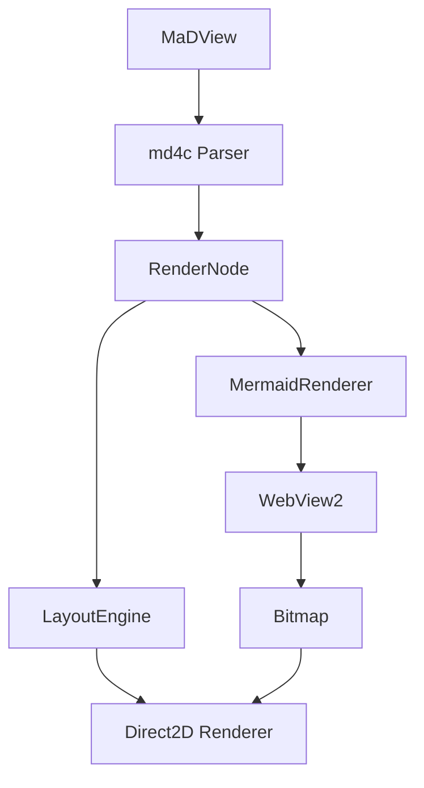

# mdviewer テスト

これは **mdviewer** のテストファイルです。*斜体*や`インラインコード`も確認します。

## 見出しレベル2

### 見出しレベル3

#### 見出しレベル4

##### 見出しレベル5

###### 見出しレベル6

---

## リスト

- 箇条書き項目1
- 箇条書き項目2
- 箇条書き項目3

1. 番号付きリスト1
2. 番号付きリスト2
3. 番号付きリスト3

## タスクリスト

- [x] 完了したタスク
- [ ] 未完了のタスク
- [x] これも完了

## コードブロック

```cpp
#include <iostream>

int main() {
    std::cout << "Hello, World!" << std::endl;
    return 0;
}
```

## 引用

> これは引用ブロックです。
> 複数行にわたる引用も対応しています。

## テキスト装飾

**太字テキスト** と *斜体テキスト* と ~~取り消し線~~ と `コード` を混在させることができます。

これは [リンクテスト](https://example.com) です。

## リンクテスト

- 外部リンク: [Google](https://www.google.com) をクリックするとブラウザが開きます
- 内部リンク: [コードブロック](#コードブロック) をクリックするとその見出しにジャンプします
- 内部リンク: [リスト](#リスト) へジャンプ
- 内部リンク: [引用](#引用) へジャンプ

## 長い段落テスト

Lorem ipsum dolor sit amet, consectetur adipiscing elit. Sed do eiusmod tempor incididunt ut labore et dolore magna aliqua. Ut enim ad minim veniam, quis nostrud exercitation ullamco laboris nisi ut aliquip ex ea commodo consequat. Duis aute irure dolor in reprehenderit in voluptate velit esse cillum dolore eu fugiat nulla pariatur. Excepteur sint occaecat cupidatat non proident, sunt in culpa qui officia deserunt mollit anim id est laborum.

日本語のテキストも正しくレイアウトされることを確認します。DirectWriteによるテキストレンダリングは、ClearTypeアンチエイリアシングにより非常に美しい表示を実現します。ウィンドウのリサイズに応じてテキストが自動的にリフローされます。

## テーブル

| 機能 | 状態 | 備考 |
|------|:----:|-----:|
| 見出し | 対応済 | H1〜H6 |
| 太字・斜体 | 対応済 | **太字** *斜体* |
| コードブロック | 対応済 | 構文ハイライトなし |
| リスト | 対応済 | 箇条書き・番号 |
| テーブル | 対応済 | この表 |
| リンク | 対応済 | 外部・内部 |

## Mermaidダイアグラム


