# MaDView ソフトウェア詳細仕様書

> **文書バージョン**: 1.0.0
> **最終更新日**: 2026-03-16
> **対象ソフトウェア**: MaDView v1.0

---

## 1. はじめに

### 1.1 本文書の目的

本文書は **MaDView**（Mad + MD + D + View）の詳細なソフトウェア仕様を記述する。本アプリケーションは、Webブラウザを使わず **Direct2D / DirectWrite** による自前レンダリングで高速なMarkdown表示を実現するWindows向けネイティブビュアーである。

### 1.2 対象読者

- 開発者・コントリビュータ
- テスト担当者
- プロジェクト管理者

### 1.3 用語定義

| 略語 | 正式名称 | 説明 |
|:-----|:---------|:-----|
| D2D | Direct2D | Microsoftの2Dグラフィックス API |
| DWrite | DirectWrite | テキストレイアウト・描画 API |
| md4c | Markdown for C | SAX型コールバック方式のCパーサ |
| WIC | Windows Imaging Component | 画像デコード・エンコードAPI |
| DPI | Dots Per Inch | 画面解像度の単位 |
| DIP | Device Independent Pixel | 論理ピクセル単位 |
| TOC | Table of Contents | 目次 |
| SAX | Simple API for XML | イベント駆動型パーサ方式 |

---

## 2. システム概要

### 2.1 アーキテクチャ全体像

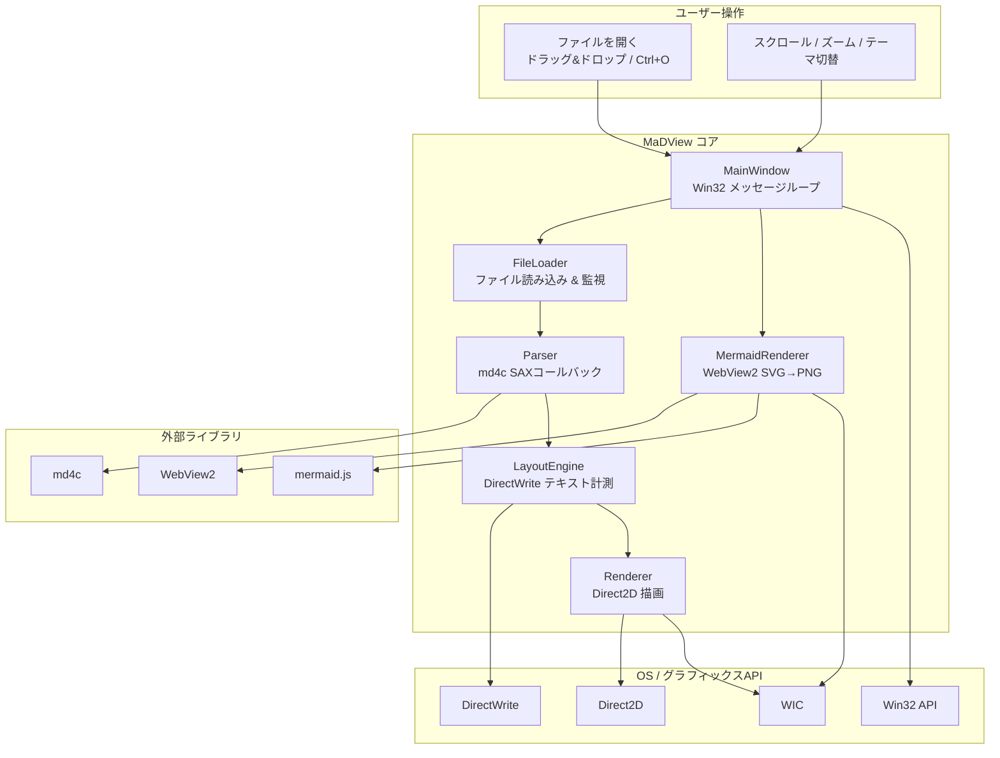

### 2.2 レイヤー構成

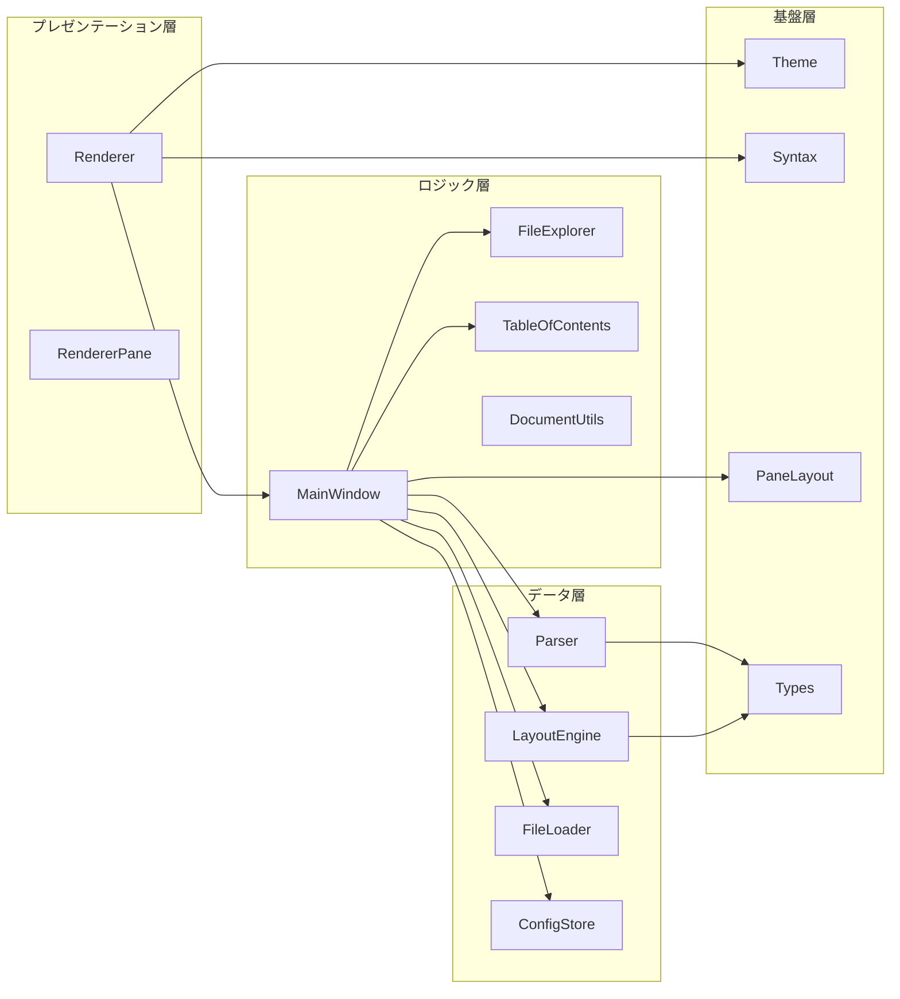

---

## 3. コンポーネント詳細

### 3.1 MainWindow — ウィンドウ管理

#### 3.1.1 責務

`MainWindow` はアプリケーション全体のコントローラとして機能し、以下を統括する。

1. **ウィンドウ生成と管理** — `WNDCLASSEXW` の登録、Win32ウィンドウの作成
2. **メッセージループ** — `GetMessageW` / `TranslateMessage` / `DispatchMessageW`
3. **入力処理** — マウスクリック、ホイール、キーボードショートカット
4. **描画トリガー** — `InvalidateRect` による再描画要求
5. **状態管理** — スクロール位置、ズームレベル、ペインの表示状態

#### 3.1.2 クラス構造

```cpp
class MainWindow {
public:
    // ライフサイクル
    bool Create(HINSTANCE hInstance, int nCmdShow);
    int  RunMessageLoop();

    // ファイル操作
    void LoadMarkdownFile(const std::wstring& path);

private:
    // Win32 コールバック
    static LRESULT CALLBACK WndProc(HWND, UINT, WPARAM, LPARAM);
    LRESULT HandleMessage(UINT msg, WPARAM wParam, LPARAM lParam);

    // 描画
    void OnPaint();
    void OnResize(UINT width, UINT height);

    // 入力
    void OnKeyDown(WPARAM key);
    void OnMouseWheel(short delta);
    void OnLButtonDown(int x, int y);
    void OnLButtonUp(int x, int y);
    void OnMouseMove(int x, int y);

    // レイアウト
    void UpdateLayoutAndScroll();
    int  HitTest(float x, float y);

    // メンバ
    HWND                     hwnd_;
    Renderer                 renderer_;
    MermaidRenderer          mermaid_renderer_;
    FileLoader               file_loader_;
    FileExplorer             file_explorer_;
    TableOfContents          toc_;
    std::vector<RenderNode>  nodes_;
    float                    scroll_y_;
    float                    max_scroll_;
    TextSelection            selection_;
    bool                     dark_mode_;
    int                      zoom_index_;
    // ... (省略)
};
```

#### 3.1.3 メッセージハンドリング

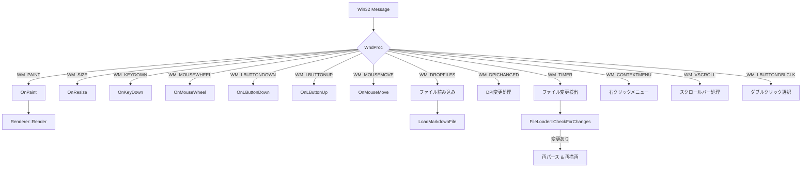

#### 3.1.4 キーボードショートカット

| キー | 動作 | 備考 |
|:-----|:-----|:-----|
| `Ctrl+O` | ファイルを開く | OpenFileDialog 表示 |
| `Ctrl+A` | 全選択 | 全ノードのテキストを選択 |
| `Ctrl+C` | コピー | 選択テキストをクリップボードへ |
| `Ctrl+1` | ファイルペイン切替 | 左ペインの表示/非表示 |
| `Ctrl+2` | TOCペイン切替 | 中央ペインの表示/非表示 |
| `Ctrl++` | ズームイン | 17段階のズーム |
| `Ctrl+-` | ズームアウト | 同上 |
| `Ctrl+0` | ズームリセット | 100%に戻す |
| `F5` | 再読み込み | 現在のファイルを再パース |
| `Home` | 先頭へ移動 | scroll_y = 0 |
| `End` | 末尾へ移動 | scroll_y = max_scroll |
| `PageUp` | 1ページ上 | ビューポート高さ分 |
| `PageDown` | 1ページ下 | 同上 |

---

### 3.2 Parser — Markdownパーサ

#### 3.2.1 パイプライン

```mermaid
sequenceDiagram
    participant MW as MainWindow
    participant P as Parser
    participant MD as md4c
    participant N as RenderNode[]

    MW->>P: ParseMarkdown(utf8_text)
    P->>MD: md_parse(text, callbacks)
    loop SAX コールバック
        MD->>P: enter_block(type, detail)
        P->>P: ノード生成 / スタック操作
        MD->>P: enter_span(type, detail)
        P->>P: TextRun 開始記録
        MD->>P: text(type, text)
        P->>P: テキスト蓄積
        MD->>P: leave_span(type, detail)
        P->>P: TextRun 終了記録
        MD->>P: leave_block(type, detail)
        P->>P: ノード確定 → nodes へ push
    end
    P-->>MW: std::vector&lt;RenderNode&gt;
```

#### 3.2.2 対応する Markdown 要素

以下のすべての要素をパース・レンダリングできる。

##### ブロック要素

- **見出し** (`# H1` 〜 `###### H6`) — 6段階、アンカーID自動生成
- **段落** — 通常テキスト
- **コードブロック** — フェンス記法 (`` ``` ``), 言語指定対応
- **引用** (`>`) — ネスト対応
- **水平線** (`---`, `***`, `___`)
- **順序付きリスト** (`1.`, `2.`, ...)
- **順序なしリスト** (`-`, `*`, `+`)
- **タスクリスト** (`- [ ]`, `- [x]`)
- **テーブル** — GFM拡張、列アライメント対応

##### インライン要素

- **太字** (`**bold**`) → **太字の例**
- **斜体** (`*italic*`) → *斜体の例*
- **取り消し線** (`~~strike~~`) → ~~取り消し線の例~~
- **インラインコード** (`` `code` ``) → `inline code`
- **リンク** (`[text](url)`) → [MaDView GitHub](https://github.com/example)
- **太字+斜体** (`***both***`) → ***太字かつ斜体***

#### 3.2.3 アンカーID生成ルール

見出しテキストからGitHub互換のアンカーIDを生成する。

```cpp
// GenerateAnchorId の変換ルール
// 1. 全角英数字 → 半角英数字
// 2. 大文字 → 小文字
// 3. スペース・アンダースコア → ハイフン
// 4. 英数字・ハイフン・CJK文字以外を除去
// 5. 連続ハイフンを単一ハイフンに圧縮
// 6. 先頭・末尾のハイフンを除去

// 例:
// "Hello World"     → "hello-world"
// "C++ コード例"    → "c-コード例"
// "第1章: 概要"     → "第1章-概要"
```

---

### 3.3 LayoutEngine — テキスト計測

#### 3.3.1 概要

`LayoutEngine` は DirectWrite の `IDWriteTextLayout` を用いて各ノードのテキスト幅・高さを計測し、Y座標を決定する。**遅延レイアウト**方式で、ダーティフラグが立ったノードのみ再計算する。

#### 3.3.2 レイアウト計算フロー

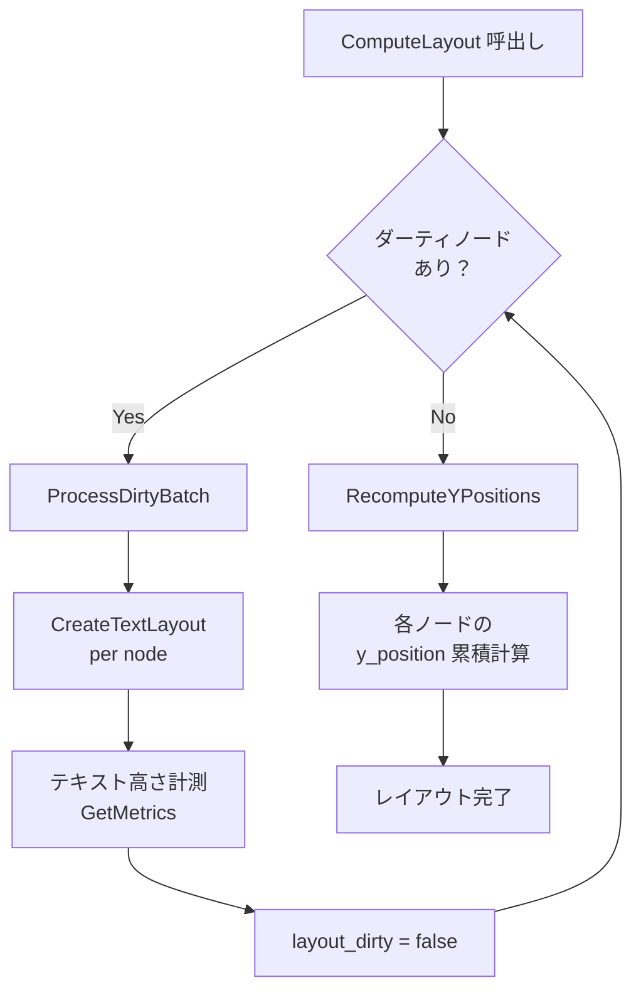

#### 3.3.3 テキストフォーマット

| 用途 | フォントファミリ | 既定サイズ (DIP) |
|:-----|:----------------|:-----------------|
| H1 | Yu Gothic UI | 32 |
| H2 | Yu Gothic UI | 26 |
| H3 | Yu Gothic UI | 22 |
| H4 | Yu Gothic UI | 18 |
| H5 | Yu Gothic UI | 16 |
| H6 | Yu Gothic UI | 14 |
| 本文 | Yu Gothic UI | 16 |
| コード | Consolas | 14 |

> **Note**: すべてのフォントサイズはズーム倍率 (`Theme::zoom_factor`) で乗算される。

#### 3.3.4 テーブルレイアウト

テーブルは特殊なレイアウト処理を行う。

1. **列幅計算** (`ComputeColumnWidths`)
   - 各セルの最小幅を `IDWriteTextLayout` で計測
   - 列ごとに最大値を取得
   - 合計が描画幅を超える場合は比率で圧縮
2. **セル配置**
   - アライメント（左寄せ/中央/右寄せ）を `DWRITE_TEXT_ALIGNMENT` で適用
3. **行高さ計算**
   - 各行の最大セル高さを行全体の高さとする

---

### 3.4 Renderer — Direct2D 描画

#### 3.4.1 レンダリングパイプライン

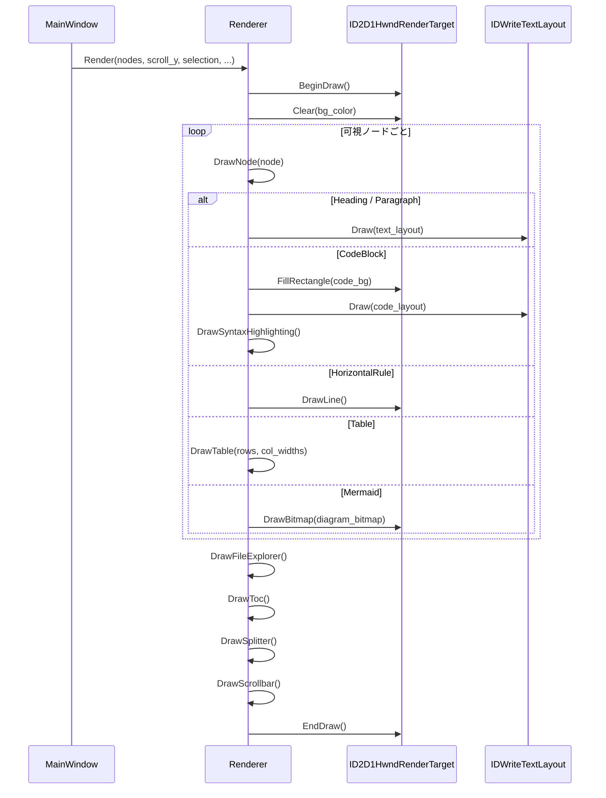

#### 3.4.2 ブラシ一覧

Rendererが保持する Direct2D ブラシは以下の通り。

| ブラシ名 | 用途 | ライト時の色 | ダーク時の色 |
|:---------|:-----|:------------|:------------|
| `bg_brush_` | 背景 | `#FFFFFF` | `#1E1E1E` |
| `text_brush_` | 本文テキスト | `#24292E` | `#D4D4D4` |
| `heading_brush_` | 見出し | `#24292E` | `#FFFFFF` |
| `code_bg_brush_` | コードブロック背景 | `#F6F8FA` | `#2D2D2D` |
| `code_text_brush_` | コードテキスト | `#24292E` | `#D4D4D4` |
| `link_brush_` | リンクテキスト | `#0366D6` | `#58A6FF` |
| `hr_brush_` | 水平線 | `#E1E4E8` | `#484848` |
| `blockquote_brush_` | 引用バー | `#DFE2E5` | `#484848` |
| `selection_brush_` | 選択範囲 | `#0078D7` (α=0.3) | `#264F78` (α=0.5) |

加えてシンタックスハイライト用のブラシが各トークンタイプごとに存在する。

#### 3.4.3 描画順序

描画は以下の**レイヤー順**で行われる（後から描くものが手前に表示される）。

1. 背景クリア
2. Markdownコンテンツ描画
   - コードブロック背景 → テキスト → シンタックスハイライト
   - 引用ブロック左バー
   - テーブルグリッド線
   - 水平線
   - リスト記号（バレット / 番号 / チェックボックス）
   - Mermaidダイアグラムビットマップ
3. テキスト選択ハイライト（半透明オーバーレイ）
4. ファイルペイン（オフスクリーンキャッシュビットマップ経由）
5. TOCペイン（同上）
6. スプリッタ
7. スクロールバー

---

### 3.5 Theme — テーマシステム

#### 3.5.1 テーマ構造

```cpp
struct Theme {
    // カラーパレット
    D2D1_COLOR_F bg, text, heading;
    D2D1_COLOR_F code_bg, code_text;
    D2D1_COLOR_F link, hr, blockquote_bar;
    D2D1_COLOR_F selection;

    // シンタックスハイライト色
    D2D1_COLOR_F syntax_keyword, syntax_type;
    D2D1_COLOR_F syntax_string, syntax_number;
    D2D1_COLOR_F syntax_comment, syntax_preprocessor;
    D2D1_COLOR_F syntax_function;

    // フォント
    std::wstring font_family;      // "Yu Gothic UI"
    std::wstring monospace_font;   // "Consolas"

    // フォントサイズ (DIP)
    float font_size_body;     // 16
    float font_size_h1;       // 32
    float font_size_h2;       // 26
    float font_size_h3;       // 22
    float font_size_h4;       // 18
    float font_size_h5;       // 16
    float font_size_h6;       // 14
    float font_size_code;     // 14

    // スペーシング
    float margin_left, margin_right;
    float paragraph_spacing;
    float heading_spacing;
    float code_block_padding;
    float indent_width;

    // ペイン
    float pane_item_height;    // 28
    float pane_header_height;  // 32
    float splitter_width;      // 4

    // ズーム
    float zoom_factor;         // 1.0
    void ApplyZoom(float factor);
};
```

#### 3.5.2 ズームシステム

17段階の離散的なズームレベルをサポートする。

| インデックス | 倍率 | インデックス | 倍率 |
|:------------|:------|:------------|:------|
| 0 | 0.25x | 9 | 1.25x |
| 1 | 0.33x | 10 | 1.50x |
| 2 | 0.50x | 11 | 1.75x |
| 3 | 0.67x | 12 | 2.00x |
| 4 | 0.75x | 13 | 2.50x |
| 5 | 0.80x | 14 | 3.00x |
| 6 | 0.90x | 15 | 4.00x |
| 7 | **1.00x** | 16 | 5.00x |
| 8 | 1.10x | | |

> **デフォルト**: インデックス7（1.00x）。ズーム設定は `ConfigStore` で永続化される。

---

### 3.6 Syntax — シンタックスハイライト

#### 3.6.1 対応言語

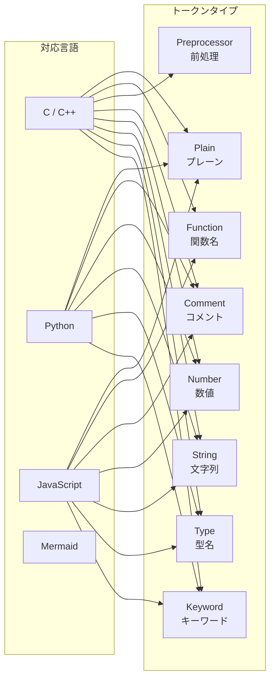

#### 3.6.2 トークン化例

以下のC++コードを例にトークン化を示す。

```cpp
#include <iostream>       // Preprocessor + Plain
using namespace std;      // Keyword + Plain

int main() {              // Type + Function + Plain
    std::string msg = "Hello"; // Type + Plain + String
    int x = 42;           // Type + Plain + Number
    // comment            // Comment
    return 0;             // Keyword + Number
}
```

各トークンタイプに対応するカラーは `Theme` が保持し、ライト/ダークモードで切り替わる。

---

### 3.7 FileLoader — ファイル入出力

#### 3.7.1 ファイル読み込み

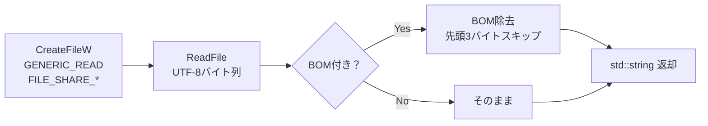

- 共有モード: `FILE_SHARE_READ | FILE_SHARE_WRITE | FILE_SHARE_DELETE`
- 他プロセスが編集中でも読み取り可能

#### 3.7.2 ファイル監視

- **方式**: ポーリング（250msインターバルの `WM_TIMER`）
- **検出方法**: ファイルの最終書き込み時刻を比較
- **デバウンス**: 変更検出後、一定時間（数百ms）待機してから再読み込み
- **用途**: エディタでMarkdownを編集しながらリアルタイムプレビュー

#### 3.7.3 対応ファイル形式

ファイルオープンダイアログのフィルタ:

| フィルタ名 | 拡張子 |
|:----------|:-------|
| Markdown files | `*.md`, `*.markdown`, `*.mkd` |
| Text files | `*.txt` |
| All files | `*.*` |

---

### 3.8 MermaidRenderer — ダイアグラム描画

#### 3.8.1 アーキテクチャ

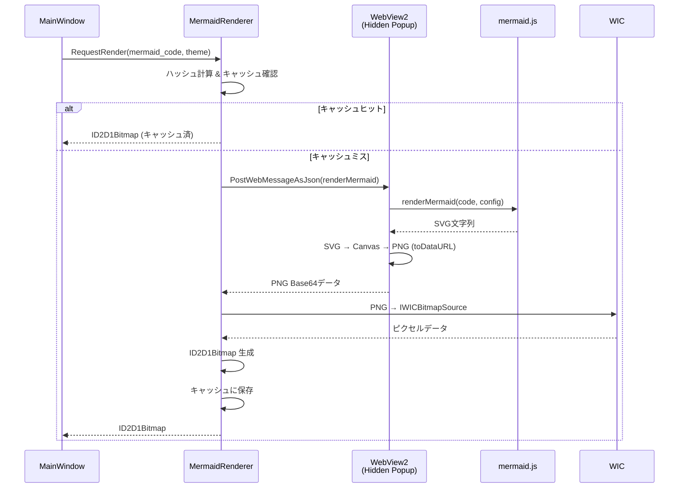

#### 3.8.2 初期化

1. 非表示ポップアップウィンドウを作成
2. WebView2環境を非同期初期化
3. gzip圧縮された `mermaid.min.js` をリソースから展開
4. HTMLテンプレートに埋め込み、`NavigateToString()` で読み込み

---

### 3.9 PaneLayout — 3ペインレイアウト

#### 3.9.1 ペイン構成

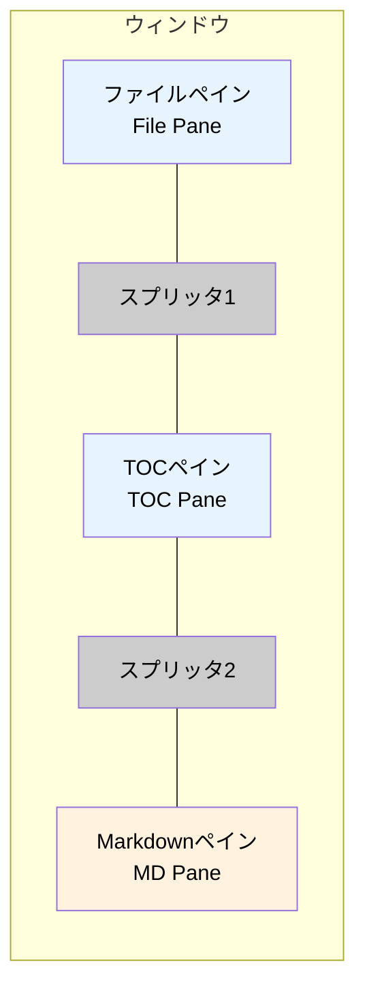

| ペイン | 既定幅 | 可変 | 内容 |
|:-------|:------|:-----|:-----|
| ファイルペイン | 200px | ドラッグ可 | ディレクトリ内のファイル一覧 |
| TOCペイン | 200px | ドラッグ可 | 見出しベースの目次 |
| Markdownペイン | 残り全幅 | フレックス | Markdownコンテンツ |
| スプリッタ | 4px | 固定 | ペイン間の境界線 |

#### 3.9.2 ゾーン判定

`DetectPaneZone()` 関数はマウス座標からどのゾーンにいるかを判定する。

```
┌─────────┬──┬─────────┬──┬──────────────────────────┐
│  FILE   │SP│   TOC   │SP│       MARKDOWN           │
│  PANE   │L1│  PANE   │L2│        PANE              │
│         │  │         │  │                          │
│ ←200px→ │4 │ ←200px→ │4 │     ←残り全幅→           │
└─────────┴──┴─────────┴──┴──────────────────────────┘
```

---

### 3.10 ConfigStore — 設定永続化

#### 3.10.1 保存先

```
%LOCALAPPDATA%\MaDView\
```

#### 3.10.2 保存項目

| 項目 | 型 | 既定値 |
|:-----|:---|:------|
| ダークモード | `bool` | `false` |
| ズームインデックス | `int` | `7` (1.00x) |
| 最後に開いたファイルパス | `wstring` | 空文字列 |

---

## 4. データ構造

### 4.1 RenderNode

アプリケーションの中核となるデータ構造。パーサの出力かつレンダラの入力。

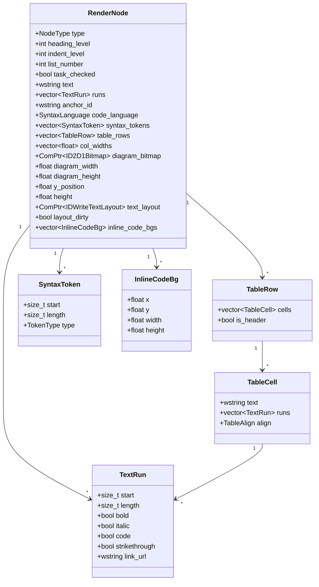

### 4.2 NodeType 列挙型

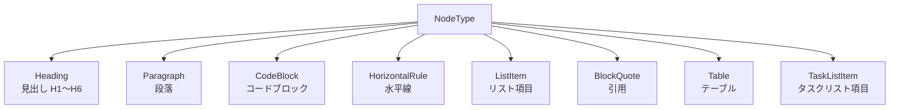

### 4.3 TextSelection

```cpp
struct TextSelection {
    int  start_node;      // 選択開始ノードインデックス
    int  start_position;  // 選択開始文字位置
    int  end_node;        // 選択終了ノードインデックス
    int  end_position;    // 選択終了文字位置

    bool IsEmpty() const;
    bool IsReversed() const;
    std::pair<int, int> OrderedStart() const;
    std::pair<int, int> OrderedEnd() const;
};
```

---

## 5. 処理フロー

### 5.1 アプリケーション起動

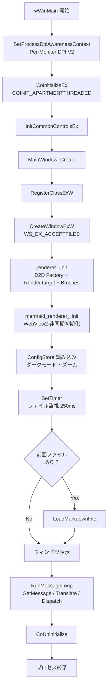

### 5.2 ファイル読み込みから描画まで

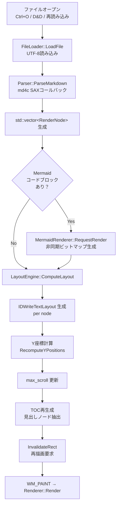

### 5.3 スクロール処理

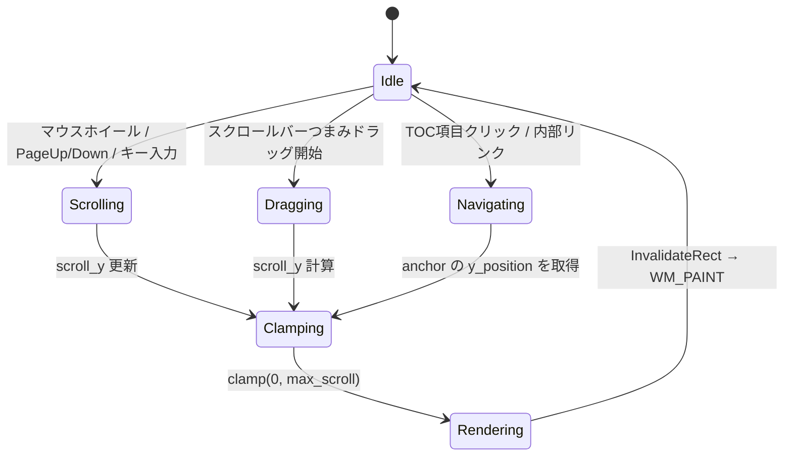

---

## 6. ビルドシステム

### 6.1 CMake 構成

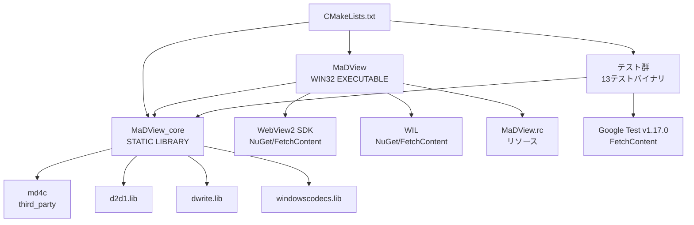

### 6.2 ビルドコマンド

**通常ビルド:**

```bash
cmake -B build
cmake --build build --config Release
```

**テストなしビルド:**

```bash
cmake -B build -DMADVIEW_BUILD_TESTS=OFF
cmake --build build --config Release
```

**テスト実行:**

```bash
ctest --test-dir build --output-on-failure -C Release
```

### 6.3 ビルドターゲット

| ターゲット | 種別 | 説明 |
|:-----------|:-----|:-----|
| `MaDView_core` | 静的ライブラリ | テスト可能なコアロジック（WinMainを含まない） |
| `MaDView` | 実行ファイル (WIN32) | メインアプリケーション |
| `test_parser` | テスト | Markdownパーサのテスト |
| `test_layout` | テスト | レイアウトエンジンのテスト |
| `test_syntax` | テスト | シンタックスハイライトのテスト |
| `test_theme` | テスト | テーマのテスト |
| `test_file_loader` | テスト | ファイル読み込みのテスト |
| `test_file_explorer` | テスト | ファイルエクスプローラのテスト |
| `test_toc` | テスト | 目次生成のテスト |
| `test_pane_layout` | テスト | ペインレイアウトのテスト |
| `test_document_utils` | テスト | ドキュメントユーティリティのテスト |
| `test_config_store` | テスト | 設定永続化のテスト |
| `test_mermaid_util` | テスト | Mermaidユーティリティのテスト |
| `test_anchor` | テスト | アンカーID生成のテスト |
| `test_types` | テスト | 型・データ構造のテスト |

---

## 7. テスト仕様

### 7.1 テストフレームワーク

- **Google Test** v1.17.0（FetchContentで自動取得）
- テストバイナリはビルドディレクトリ配下に生成
- CTestで一括実行可能

### 7.2 テストカバレッジ

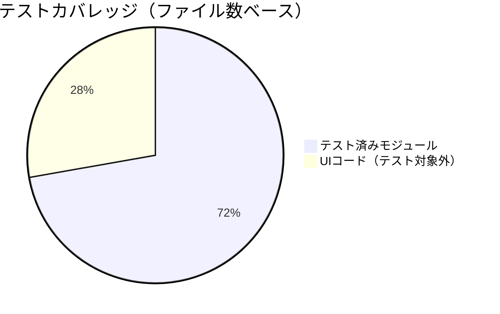

> **テスト対象外**: `main.cpp`, `window.cpp`, `window_input.cpp`, `window_scroll.cpp`, `renderer.cpp` はWin32 / Direct2D依存のためユニットテスト対象外。

### 7.3 主要テストケース

#### Parser テスト

- [x] 見出し（H1〜H6）のパース
- [x] 段落テキストのパース
- [x] 太字・斜体・取り消し線・インラインコード
- [x] リンクのパースとURL抽出
- [x] コードブロック（言語指定あり/なし）
- [x] 順序付き/なしリスト（ネストあり）
- [x] タスクリスト
- [x] テーブル（アライメント含む）
- [x] 引用ブロック
- [x] 水平線
- [x] Mermaidコードブロック検出

#### Layout テスト

- [x] フォーマット生成（全見出しレベル + 本文 + コード）
- [x] Y座標の累積計算
- [x] ダーティフラグによる差分計算

#### Syntax テスト

- [x] C++キーワード・型のトークン化
- [x] Python文字列・コメントの検出
- [x] JavaScript関数名の検出
- [x] 言語自動検出（info string解析）

---

## 8. DPI対応仕様

### 8.1 DPI認識レベル

**Per-Monitor DPI Awareness V2** を採用。

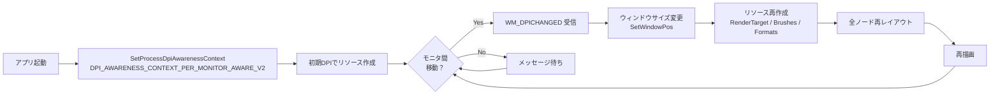

### 8.2 DIP変換

すべての座標・サイズはDIP（Device Independent Pixel）で管理する。

```
物理ピクセル = DIP × (DPI / 96.0)
```

---

## 9. 非機能要件

### 9.1 パフォーマンス目標

| 項目 | 目標値 |
|:-----|:------|
| 小規模ファイル（< 100行）の初回表示 | < 50ms |
| 大規模ファイル（> 10,000行）の初回表示 | < 500ms |
| スクロール時のフレームレート | 60fps |
| メモリ使用量（1万行ファイル表示時） | < 100MB |
| ファイル変更検出の応答時間 | < 500ms |

### 9.2 対応環境

| 項目 | 要件 |
|:-----|:-----|
| OS | Windows 10 1809 以降 / Windows 11 |
| アーキテクチャ | x64 |
| ランタイム | WebView2 Runtime（Mermaid描画に必要） |
| コンパイラ | MSVC (C++23) |
| ビルドツール | CMake 3.20+ |

---

## 10. 付録

### 付録A: ファイル一覧

```
src/
├── main.cpp              # エントリポイント (wWinMain)
├── window.h              # MainWindow 宣言
├── window.cpp            # MainWindow 実装
├── window_input.cpp      # 入力処理
├── window_scroll.cpp     # スクロール処理
├── window_config.cpp     # 設定管理
├── renderer.h            # Renderer 宣言
├── renderer.cpp          # Direct2D 描画実装
├── renderer_pane.cpp     # ペイン描画
├── parser.h              # Parser 宣言
├── parser.cpp            # Markdown パース実装
├── layout.h              # LayoutEngine 宣言
├── layout.cpp            # テキスト計測実装
├── types.h               # コアデータ構造
├── theme.h               # Theme 宣言
├── theme.cpp             # テーマ定義
├── syntax.h              # Syntax 宣言
├── syntax.cpp            # シンタックスハイライト実装
├── file_loader.h         # FileLoader 宣言
├── file_loader.cpp       # ファイル I/O 実装
├── file_explorer.h       # FileExplorer 宣言
├── file_explorer.cpp     # ファイルブラウザ実装
├── toc.h                 # TableOfContents 宣言
├── toc.cpp               # 目次生成実装
├── pane.h                # ペインデータ構造
├── pane_layout.h         # PaneLayout 宣言
├── pane_layout.cpp       # ペインレイアウト実装
├── document_utils.h      # DocumentUtils 宣言
├── document_utils.cpp    # テキスト操作ユーティリティ
├── mermaid.h             # MermaidRenderer 宣言
├── mermaid.cpp           # WebView2 ダイアグラム描画
├── mermaid_util.h        # Mermaid ヘルパー宣言
├── mermaid_util.cpp      # Mermaid ヘルパー実装
├── config_store.h        # ConfigStore 宣言
├── config_store.cpp      # 設定永続化実装
└── resource.h            # リソース ID
```

### 付録B: 依存ライブラリ

| ライブラリ | バージョン | 用途 | ライセンス |
|:-----------|:----------|:-----|:----------|
| md4c | latest | Markdown パース | MIT |
| WebView2 SDK | latest | Mermaid描画用ブラウザコントロール | BSD |
| WIL | latest | Windows実装ヘルパー | MIT |
| Google Test | 1.17.0 | ユニットテスト | BSD-3-Clause |
| mermaid.js | latest | ダイアグラム描画 | MIT |

### 付録C: Markdown表示サンプル

本節は MaDView の表示テストを兼ねている。

---

#### C.1 見出しレベルテスト

# 見出しレベル1
## 見出しレベル2
### 見出しレベル3
#### 見出しレベル4
##### 見出しレベル5
###### 見出しレベル6

---

#### C.2 テキスト装飾テスト

これは **太字** のテストです。
これは *斜体* のテストです。
これは ***太字かつ斜体*** のテストです。
これは ~~取り消し線~~ のテストです。
これは `インラインコード` のテストです。
これは **太字の中に *斜体* を含む**テストです。

---

#### C.3 リンクテスト

- 外部リンク: [GitHub](https://github.com)
- 内部アンカー: [はじめに](#1-はじめに)
- URLそのまま: https://example.com

---

#### C.4 リストテスト

##### 順序なしリスト

- 項目 A
  - サブ項目 A-1
  - サブ項目 A-2
    - サブサブ項目 A-2-a
    - サブサブ項目 A-2-b
  - サブ項目 A-3
- 項目 B
- 項目 C

##### 順序付きリスト

1. 第一ステップ
2. 第二ステップ
   1. サブステップ 2-1
   2. サブステップ 2-2
3. 第三ステップ

##### タスクリスト

- [x] 設計完了
- [x] Parser 実装
- [x] Renderer 実装
- [x] テスト作成
- [ ] パフォーマンス最適化
- [ ] ドキュメント整備

---

#### C.5 引用テスト

> これは引用ブロックです。
> 複数行にわたる引用を表示できます。

> **ネストされた引用:**
>
> > 内側の引用です。
> > Direct2D は高速な2Dグラフィックスを提供します。

---

#### C.6 コードブロックテスト

##### C++ コード

```cpp
#include <windows.h>
#include <d2d1.h>
#include <dwrite.h>
#include <string>
#include <vector>

// Direct2D レンダーターゲットの初期化
HRESULT InitializeD2D(HWND hwnd, ID2D1HwndRenderTarget** ppRT) {
    ID2D1Factory* pFactory = nullptr;
    HRESULT hr = D2D1CreateFactory(
        D2D1_FACTORY_TYPE_SINGLE_THREADED,
        &pFactory
    );

    if (SUCCEEDED(hr)) {
        RECT rc;
        GetClientRect(hwnd, &rc);

        D2D1_SIZE_U size = D2D1::SizeU(
            rc.right - rc.left,
            rc.bottom - rc.top
        );

        hr = pFactory->CreateHwndRenderTarget(
            D2D1::RenderTargetProperties(),
            D2D1::HwndRenderTargetProperties(hwnd, size),
            ppRT
        );
    }

    if (pFactory) pFactory->Release();
    return hr;
}

int main() {
    std::vector<std::string> items = {"alpha", "beta", "gamma"};
    for (const auto& item : items) {
        // 各アイテムの処理
        std::cout << item << std::endl;
    }
    return 0;
}
```

##### Python コード

```python
import hashlib
from pathlib import Path
from typing import Optional

class MarkdownParser:
    """Markdownファイルのパーサクラス"""

    def __init__(self, path: str):
        self.path = Path(path)
        self._cache: dict[str, str] = {}

    def parse(self) -> list[dict]:
        """ファイルを読み込みパースする"""
        content = self.path.read_text(encoding="utf-8")
        lines = content.splitlines()

        nodes = []
        for i, line in enumerate(lines):
            if line.startswith("# "):
                nodes.append({
                    "type": "heading",
                    "level": 1,
                    "text": line[2:],
                    "line": i + 1
                })
            elif line.startswith("```"):
                # コードブロックの開始/終了
                pass

        return nodes

    def get_hash(self) -> Optional[str]:
        """ファイルのSHA-256ハッシュを返す"""
        if not self.path.exists():
            return None
        data = self.path.read_bytes()
        return hashlib.sha256(data).hexdigest()

# 使用例
if __name__ == "__main__":
    parser = MarkdownParser("README.md")
    for node in parser.parse():
        print(f"[L{node['line']}] {node['type']}: {node['text']}")
```

##### JavaScript コード

```javascript
/**
 * Mermaidダイアグラムのレンダリング
 * WebView2経由で呼び出される
 */
async function renderMermaid(code, config) {
    const { mermaid } = await import('./mermaid.esm.min.mjs');

    mermaid.initialize({
        startOnLoad: false,
        theme: config.darkMode ? 'dark' : 'default',
        securityLevel: 'strict',
        fontFamily: '"Yu Gothic UI", sans-serif',
    });

    try {
        const { svg } = await mermaid.render('diagram', code);

        // SVG → Canvas → PNG 変換
        const canvas = document.createElement('canvas');
        const ctx = canvas.getContext('2d');
        const img = new Image();

        return new Promise((resolve, reject) => {
            img.onload = () => {
                canvas.width = img.naturalWidth * 2;
                canvas.height = img.naturalHeight * 2;
                ctx.scale(2, 2);
                ctx.drawImage(img, 0, 0);
                resolve(canvas.toDataURL('image/png'));
            };
            img.onerror = reject;
            img.src = `data:image/svg+xml;charset=utf-8,${encodeURIComponent(svg)}`;
        });
    } catch (error) {
        console.error('Mermaid render failed:', error.message);
        return null;
    }
}
```

---

#### C.7 テーブルテスト

##### 基本テーブル

| 列1 | 列2 | 列3 |
|-----|-----|-----|
| A1 | B1 | C1 |
| A2 | B2 | C2 |
| A3 | B3 | C3 |

##### アライメント指定テーブル

| 左寄せ | 中央寄せ | 右寄せ |
|:-------|:-------:|-------:|
| apple | banana | cherry |
| 123 | 456 | 789 |
| short | medium length text | extraordinarily long text |

##### 大きなテーブル

| # | コンポーネント | ファイル | 行数（概算） | 依存先 | テスト |
|:--|:--------------|:---------|:------------|:------|:------|
| 1 | MainWindow | window.h/cpp | 800 | Renderer, Parser, Layout | なし |
| 2 | Renderer | renderer.h/cpp | 700 | D2D, DWrite, Theme | なし |
| 3 | Parser | parser.h/cpp | 500 | md4c, Types | あり |
| 4 | LayoutEngine | layout.h/cpp | 400 | DWrite, Types | あり |
| 5 | Theme | theme.h/cpp | 200 | なし | あり |
| 6 | Syntax | syntax.h/cpp | 300 | なし | あり |
| 7 | FileLoader | file_loader.h/cpp | 150 | Win32 API | あり |
| 8 | FileExplorer | file_explorer.h/cpp | 200 | Win32 API | あり |
| 9 | TOC | toc.h/cpp | 100 | Types | あり |
| 10 | PaneLayout | pane_layout.h/cpp | 150 | Types | あり |
| 11 | DocumentUtils | document_utils.h/cpp | 200 | Types | あり |
| 12 | MermaidRenderer | mermaid.h/cpp | 400 | WebView2, WIC | ユーティリティのみ |
| 13 | ConfigStore | config_store.h/cpp | 150 | Win32 API | あり |

---

#### C.8 水平線テスト

上のテキスト

---

中間のテキスト

***

下のテキスト

___

最後のテキスト

---

#### C.9 Mermaid ダイアグラムテスト

##### フローチャート

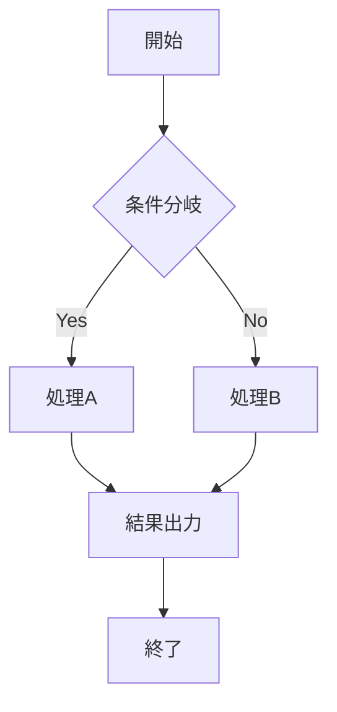

##### シーケンス図

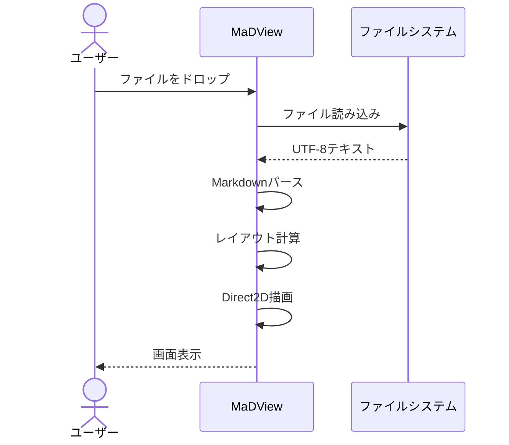

##### クラス図

```mermaid
classDiagram
    class MainWindow {
        -HWND hwnd_
        -Renderer renderer_
        -FileLoader file_loader_
        +Create() bool
        +RunMessageLoop() int
        +LoadMarkdownFile(path)
    }

    class Renderer {
        -ID2D1HwndRenderTarget* rt_
        -IDWriteFactory* dwrite_
        +Init(hwnd) HRESULT
        +Render(nodes, scroll_y)
        -DrawNode(node)
    }

    class Parser {
        +ParseMarkdown(text) vector~RenderNode~
    }

    class LayoutEngine {
        -IDWriteFactory* dwrite_
        +ComputeLayout(nodes, width)
        -CreateTextLayout(node)
    }

    MainWindow --> Renderer
    MainWindow --> Parser
    MainWindow --> LayoutEngine
    Renderer --> LayoutEngine
```

##### 状態遷移図

```mermaid
stateDiagram-v2
    [*] --> 初期状態
    初期状態 --> ファイル表示中 : ファイルを開く
    ファイル表示中 --> ファイル表示中 : スクロール / ズーム
    ファイル表示中 --> テキスト選択中 : マウスドラッグ
    テキスト選択中 --> ファイル表示中 : マウスリリース
    ファイル表示中 --> ファイル表示中 : ファイル変更検出 → 再読み込み
    ファイル表示中 --> 初期状態 : ファイルを閉じる
    初期状態 --> [*]
```

##### ガントチャート

```mermaid
gantt
    title MaDView 開発タイムライン
    dateFormat  YYYY-MM-DD
    section 基盤
    プロジェクトセットアップ      :done, a1, 2025-01-01, 7d
    Win32ウィンドウ基盤           :done, a2, after a1, 14d
    Direct2D/DirectWrite初期化    :done, a3, after a2, 7d

    section コア機能
    Markdownパーサ統合            :done, b1, after a3, 14d
    テキストレイアウトエンジン    :done, b2, after b1, 14d
    レンダリングエンジン          :done, b3, after b2, 21d

    section 拡張機能
    シンタックスハイライト        :done, c1, after b3, 7d
    Mermaidダイアグラム           :done, c2, after c1, 14d
    3ペインレイアウト             :done, c3, after c2, 7d
    テーマ・ズーム                :done, c4, after c3, 7d

    section 品質
    ユニットテスト整備            :done, d1, after c4, 14d
    パフォーマンス最適化          :active, d2, after d1, 14d
    ドキュメント整備              :active, d3, after d1, 7d
```

---

#### C.10 複合テスト

以下は複数の書式が混在する段落のテストです。

**Direct2D** は Microsoft が提供する *ハードウェアアクセラレーション対応* の2Dグラフィックス API であり、`ID2D1RenderTarget` インターフェースを通じて図形やテキストの描画を行う。詳しくは [Microsoft Docs](https://docs.microsoft.com) を参照。~~古いGDI+ベースの描画~~ は本アプリケーションでは使用しない。

> **注意**: MaDView は `IDWriteTextLayout` の ***カスタムレンダラ*** を使用して、リンクの下線やインラインコードの背景色などを実現している。通常の `DrawTextLayout` 呼び出しでは不十分なケースに対応するためである。

コードブロック内の `#include <d2d1.h>` のような記述と、本文中の `d2d1.h` というインラインコードの区別が正しく表示されることを確認する。

---

*本文書は MaDView の詳細仕様を網羅的に記述したものであり、開発・テスト・保守の参照資料として利用されることを想定している。*
